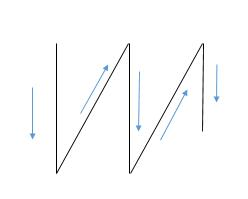
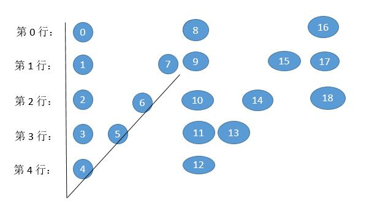

# 006. ZigZag Conversion\(M\)

[006. ZigZag Conversion](https://leetcode-cn.com/problems/zigzag-conversion/)

## 题目描述\(中等\)

The string "PAYPALISHIRING" is written in a zigzag pattern on a given number of rows like this: \(you may want to display this pattern in a fixed font for better legibility\)

```
P   A   H   N

A P L S I I G

Y   I   R
```

And then read line by line: "PAHNAPLSIIGYIR"  
Write the code that will take a string and make this conversion given a number of rows:  
string convert\(string s, int numRows\);

Example 1:

> Input: s = "PAYPALISHIRING", numRows = 3  
> Output: "PAHNAPLSIIGYIR"

Example 2:

```
Input: s = "PAYPALISHIRING", numRows = 4  
Output: "PINALSIGYAHRPI"  
Explanation:
P     I    N
A   L S  I G
Y A   H R
P     I
```



## 思路

1. 依据字符串书写顺序分别写入不同的行
2. 书写规律

## 解决方法

### 顺序写依次存入不同行

```java
    public String convert(String s, int numRows) {
        if (numRows == 1) {
            return s;
        }
        int len = s.length();
        StringBuilder[] rows = new StringBuilder[numRows];
        for (int i = 0; i < numRows; i++) {
            rows[i] = new StringBuilder();
        }
        int asc = -1;
        int curRow = 0;
        for (int i = 0; i < len; i++) {
            rows[curRow].append(s.charAt(i));
            if (curRow == 0 || curRow == numRows - 1) {
                asc = -asc;
            }
            curRow += asc;
        }
        StringBuilder stringBuilder = new StringBuilder();
        for (int i = 0; i < numRows; i++) {
            stringBuilder.append(rows[i].toString());
        }
        return stringBuilder.toString();
    }
```

时间复杂度：O(n)，n 是字符串的长度。

空间复杂度：O(n)，保存每个字符需要的空间。

### Z字形规律

找出按 Z 形排列后字符的规律，然后直接保存起来。



图形其实是有周期的，0，1，2 ... 7 总过 8 个，然后就又开始重复相同的路径。周期的计算就是 cycleLen = 2 × numRows - 2 = 2 × 5 - 2 = 8 个。

我们发现第 0 行和最后一行一个周期内有一个字符，所以第一个字符下标是 0 ，第二个字符下标是 0 + cycleLen = 8，第三个字符下标是 8 + cycleLen = 16 。

其他行都是两个字符。

第 1 个字符和第 0 行的规律是一样的。

第 2 个字符其实就是下一个周期的第 0 行的下标减去当前行。什么意思呢？

我们求一下第 1 行第 1 个周期内的第 2 个字符，下一个周期的第 0 行的下标是 8 ，减去当前行 1 ，就是 7 了。

我们求一下第 1 行第 2 个而周期内的第 2 个字符，下一个周期的第 0 行的下标是 16 ，减去当前行 1 ，就是 15 了。

我们求一下第 2 行第 1 个周期内的第 2 个字符，下一个周期的第 0 行的下标是 8 ，减去当前行 2 ，就是 6 了。

当然期间一定要保证下标小于 n ，防止越界。

```java
    public String convert1(String s, int numRows) {
        if(numRows==1)
            return s;
        int len = s.length();
        int cycle = 2*numRows-2;
        StringBuilder stringBuilder = new StringBuilder();
        for(int i=0;i<numRows;i++) {
            for(int j=0;j+i<len;j+=cycle) {
                stringBuilder.append(s.charAt(j+i));
                if(i!=0&&i!=numRows-1&&j+cycle-i<len) {
                    stringBuilder.append(s.charAt(j+cycle-i));
                }
            }
        }
        return stringBuilder.toString();
    }
```

时间复杂度：O(n)，虽然是两层循环，但第二次循环每次加的是 cycleLen ，无非是把每个字符遍历了 1 次，所以两层循环内执行的次数肯定是字符串的长度。

空间复杂度：O(n)，保存字符串。

