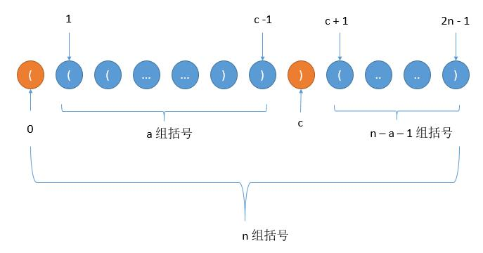

# 022. Generate Parentheses(M)
[022. Generate Parentheses](https://leetcode-cn.com/problems/generate-parentheses/)

## 题目描述\(中等\)

Given n pairs of parentheses, write a function to generate all combinations of well-formed parentheses.

For example, given n = 3, a solution set is:

```
[
  "((()))",
  "(()())",
  "(())()",
  "()(())",
  "()()()"
]
```

## 思路

1. 遍历生成所有字符串，判断有效添加结果集
2. 回溯：不断添加左括号，在右括号小于左括号的情况下添加右括号
3. 递归：递归生成的括号序列组成新的序列

## 解决方法

### 暴力法-遍历判断

列举所有的情况，每一位有左括号和右括号两种情况，总共 2n 位，所以总共 $$2^{2n}$$种情况

```java
    public List<String> generateParenthesis(int n) {
        List<String> list = new ArrayList<>();
        char[] str = new char[n*2];
        generate(str, 0, list);
        return list;
    }
    public void generate(char[] str,int index,List<String> list) {
        if(index==str.length) {
            if(isValid(str)) {
                list.add(String.valueOf(str));
            }
        }
        else {
            str[index]='(';
            generate(str, index+1, list);
            str[index]=')';
            generate(str, index+1, list);
        }
    }
    public boolean isValid(char[] str) {
        int balance = 0;
        for(char c:str) {
            if(c=='(') {
                balance++;
            }
            else {
                balance--;
                if(balance<0)
                    return false;
            }
        }
        return balance==0?true:false;
    }
```

时间复杂度：对每种情况判断是否合法需要 O(n)，所以时间复杂度是 $$ O(2^{2n}*n)$$

空间复杂度：$$ O(2^{2n}n) $$，乘以 n 是因为每个串的长度是 2n。此外这是假设所有情况都符合的时候，但其实不可能都符合。

### 回溯

如果我们还剩一个位置，我们可以开始放一个左括号。 如果它不超过左括号的数量，我们可以放一个右括号。

```java
    public List<String> generateParenthesis(int n) {
        List<String> list = new ArrayList<>();
        backtrack(list, "", 0, 0, n);
        return list;
    }
    public void backtrack(List<String> list,String str,int left,int right,int n) {
        if(str.length()==n*2) {
            list.add(str);
            return;
        }
        if(left<n) {
            backtrack(list, str+'(', left+1, right, n);
        }
        if(right<left) {
            backtrack(list, str+')', left, right+1, n);
        }
    }
```

```java
    public List<String> generateParenthesis(int n) {
        List<String> list = new ArrayList<>();
        char[] str = new char[n*2];
        generate2(list,str, 0,0,0, n);
        return list;
    }
    public void generate(List<String> list,char[] str,Integer index,int left,int right,int n) {
        if(index==n*2) {
            list.add(String.valueOf(str));
            return;
        }
        if(left<n) {
            str[index] = '(';
            generate2(list, str, index+1, left+1, right, n);
        }
        if(right<left) {
            str[index] = ')';
            generate2(list, str, index+1, left, right+1, n);
        }
    }
```

我们的复杂度分析依赖于理解 generateParenthesis(n) 中有多少个元素。这个分析超出了本文的范畴，但事实证明这是第 n 个卡塔兰数 $$ \frac{1}{n+1}\binom{2n}{n} $$，这是由 $$ \frac{4^n}{n\sqrt{n}} $$渐近界定的。

时间复杂度：$$ O(\frac{4^n}{\sqrt{n}}) $$，在回溯过程中，每个有效序列最多需要 n 步。

空间复杂度：$$ O(\frac{4^n}{\sqrt{n}}) $$，如上所述，并使用 O(n)的空间来存储序列。


### 递归(闭合数)

第 0 个位置一定会是左括号，然后接着添加左括号或右括号，过程中左括号数一定大于或等于右括号数，当第一次出现左括号数等于右括号数的时候，假如此时的位置是 c 。那么位置 1 到 c - 1 之间一定是合法序列，此外 c + 1 到最后的 2n -1 也是合法序列。而假设总共是 n 组括号，1 到 c - 1 是 a 组括号， c + 1 到 2n - 1 之间则是 n - 1 - a 组括号，如下图



看起来我们在迭代 a ，其实本质上是在迭代 c ，c = 2a + 1，迭代 a 从 0 到 n - 1 ，就是迭代 c 从 1 到 2n - 1。看起来 c 都是奇数，其实是可以理解的，因为 0 到 c 间都是一组组的括号， 所以 c 一定是奇数。为什么可以迭代 c ，因为上边说到每一个合法序列都对应着一个 c ，遍历 c 的话，就能得到所有的情况

```java
    public List<String> generateParenthesis(int n) {
        List<String> list = new ArrayList<>();
        if(n==0) {
            list.add("");
        }
        for(int a=0;a<n;a++) {
            for(String left:generateParenthesis(a)) {
                for(String right:generateParenthesis(n-1-a)) {
                    list.add("("+left+")"+right);
                }
            }
        }
        return list;
    }
```

时间复杂度：$$ O(\frac{4^n}{\sqrt{n}}) $$
空间复杂度：$$ O(\frac{4^n}{\sqrt{n}}) $$


