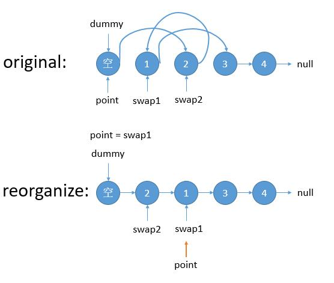
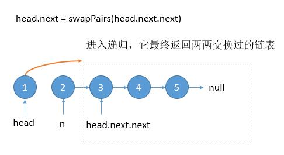
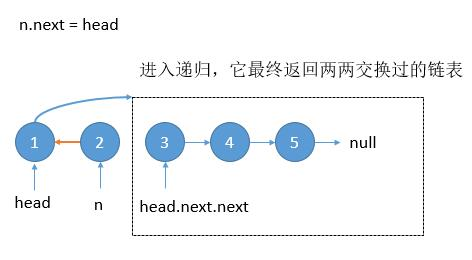

# 024. Swap Nodes in Pairs(M)
[024. Swap Nodes in Pairs](https://leetcode-cn.com/problems/swap-nodes-in-pairs/)

## 题目描述\(中等\)

Given a linked list, swap every two adjacent nodes and return its head.

You may not modify the values in the list's nodes, only nodes itself may be changed.

Example:

```
Given 1->2->3->4, you should return the list as 2->1->4->3.
```

## 思路

1. 迭代：依次交换两个节点连接关系
2. 递归：交换头部两个节点，后续递归调用

## 解决方法

### 迭代




```java
    public ListNode swapPairs(ListNode head) {
        if(head==null||head.next==null)
            return head;
        ListNode start = new ListNode(0);
        ListNode cur=start;
        cur.next = head;
        ListNode first = cur.next;
        ListNode second = first.next;
        while(first!=null&&second!=null) {
            first.next = second.next;
            second.next = first;
            cur.next = second;
            cur = first;
            first = first.next;
            if(first!=null) {
                second = first.next;
            }
        }

        return start.next;
    }
```

时间复杂度：O(n)
空间复杂度：O(1)

### 递归






```java
    public ListNode swapPairs1(ListNode head) {
        if(head==null||head.next==null)
            return head;
        ListNode next = head.next;
        head.next = swapPairs1(next.next);
        next.next= head;
        return next;
    }
```


