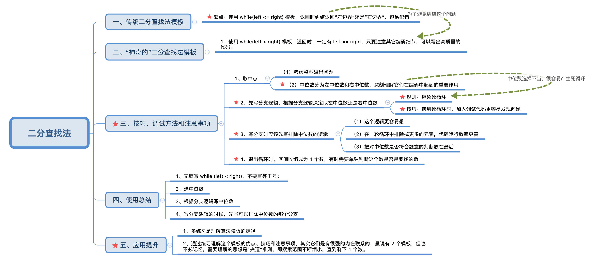

# 035. Search Insert Position(E)
[035. Search Insert Position](https://leetcode-cn.com/problems/search-insert-position/)

## 题目描述\(简单\)

Given a sorted array and a target value, return the index if the target is found. If not, return the index where it would be if it were inserted in order.

You may assume no duplicates in the array.

Example 1:

```
Input: [1,3,5,6], 5
Output: 2
```

Example 2:

```
Input: [1,3,5,6], 2
Output: 1
```

Example 3:

```
Input: [1,3,5,6], 7
Output: 4
```

Example 4:

```
Input: [1,3,5,6], 0
Output: 0
```

## 思路

1. 遍历
2. 二分查找

## 解决方法

### 遍历

```java
    public int searchInsert(int[] nums, int target) {
        int i=0;
        for(;i<nums.length;i++) {
            if(nums[i]==target) {    return i;    }
            else if(nums[i]>target) {    return i;    }
        }
        return i;
    }
```

### 二分查找

插入在相等值的左边，所以查找左边界，存在相等即为左边界，不存在即为小于里的最大值，low==nums.length，即为nums小于target

```java
    public int searchInsert2(int[] nums, int target) {
        int low = 0;
        int high = nums.length;
        while (low < high) {
            int mid = (low + high) / 2;
            if (nums[mid] == target) {
                high = mid;
            } else if (nums[mid] < target) {
                low = mid + 1;
            } else if (nums[mid] > target) {
                high = mid;
            }
        }
        return low;
    }
```


## 二分查找详解




### 取中位数索引


取左中位数
```java
int mid = (left + right) / 2;
//left 和 right 很大的时候，left + right 会发生整型溢出，变成负数

int mid = left + (right - left) / 2;
//在 right 很大、 left 是负数且很小的时候， right - left 也有可能超过 int 类型能表示的最大值，
//只不过一般情况下 left 和 right 表示的是数组索引值，left 是非负数，因此 right - left 溢出的可能性很小。

int mid = (left + right) >>> 1;
//left 和 right 都表示索引值，它们都是非负数，即使相加以后整型溢出，结果还是正确的，
//“位运算”本身就比其它运算符快，因此使用 + 和“无符号右移”可以说是既快又好的做法。
```

取右中位数
```java
int mid = (left + right + 1) / 2;
int mid = left + (right - left + 1) / 2;
int mid = (left + right + 1) >>> 1;
```

> 使用“左边界索引 + 右边界索引”，然后“无符号右移 11 位”是推荐的写法。

### 二分查找模板

- 首先把循环可以进行的条件写成 while(left < right)，在退出循环的时候，一定有 left == right 成立，此时返回 left 或者 right 都可以

    退出循环的时候还有一个数没有看啊（退出循环之前索引 left 或 索引 right 上的值）？
    没有关系，我们就等到退出循环以后来看，甚至经过分析，有时都不用看，就能确定它是目标数值。


- 基本思想

> “排除法”即：在每一轮循环中排除一半以上的元素，于是在对数级别的时间复杂度内，就可以把区间“夹逼” 只剩下 1 个数，而这个数是不是我们要找的数，单独做一次判断就可以了。

> “夹逼法”或者“排除法”是二分查找算法的基本思想，“二分”是手段，在目标元素不确定的情况下，“二分” 也是“最大熵原理”告诉我们的选择。


### 细节

- (1)前提：思考左、右边界，如果左、右边界不包括目标数值，会导致错误结果
    - 如果 left 和 right 表示的是数组的索引，就要考虑“索引是否有效” ，即“索引是否越界” 是重要的定界依据；
    - 左右边界一定要包括目标元素

- (2)中位数先写 int mid = (left + right) >>> 1 ; 根据循环里分支的编写情况，再做调整
    首先要知道：当数组的元素个数是偶数的时候，中位数有左中位数和右中位数之分。
        
    - 当数组的元素个数是偶数的时候：
        - 使用 int mid = left + (right - left) / 2 ; 得到左中位数的索引；
        - 使用 int mid = left + (right - left + 1) / 2 ; 得到右中位数的索引。
    
    - 当数组的元素个数是奇数的时候，以上二者都能选到最中间的那个中位数。
        - int mid = left + (right - left) / 2 ; 等价于 int mid = (left + right) >>> 1；
        - int mid = left + (right - left + 1) / 2 ; 等价于 int mid = (left + right + 1) >>> 1 。
    
    - 什么时候使用左中位数，什么时候使用右中位数呢？选中位数的依据是为了避免死循环，得根据分支的逻辑来选择中位数
    
- (3)先写逻辑上容易想到的分支逻辑，这个分支逻辑通常是排除中位数的逻辑
    
    注意：先写“好想”的分支，排除了中位数之后，通常另一个分支就不排除中位数，而不必具体考虑另一个分支的逻辑的具体意义，且代码几乎是固定的。

- (4)循环内只写两个分支，一个分支排除中位数，另一个分支不排除中位数，循环中不单独对中位数作判断
    
    既然是“夹逼”法，没有必要在每一轮循环开始前单独判断当前中位数是否是目标元素，因此分支数少了一支，代码执行效率更高。
    
    > 不用在每次循环开始单独考虑中位数是否是目标元素，节约了时间，我们只要在退出循环的时候，即左右区间压缩成一个数（索引）的时候，去判断这个索引表示的数是否是目标元素，而不必在二分的逻辑中单独做判断。

    
    
- (5)根据分支逻辑选择中位数的类型，可能是左中位数，也可能是右位数，选择的标准是避免死循环
 
    > 1. 如果分支的逻辑，在选择更改左边界的时候，不能排除中位数，那么中位数就选“右中位数”，只有这样区间才会收缩，否则进入死循环；
    > 2. 同理，如果分支的逻辑，在选择更改右边界的时候，不能排除中位数，那么中位数就选“左中位数”，只有这样区间才会收缩，否则进入死循环。

 
 ```java
     public int binarySearch() {
        int left = 0;
        int right = n - 1;
        while (left < right) {
            // 根据分支逻辑，这里选择左中位数
            int mid = (left + right) >>> 1;
            if (排除中位数逻辑) {
                left = mid + 1;
            } else {
                right = mid;
            }
        }
        return left;
    }
 ```
 
 ```java
 public int binarySearch() {
        int left = 0;
        int right = n - 1;
        while (left < right) {
            // 根据分支逻辑，这里选择左中位数
            int mid = (left + right + 1) >>> 1;
            if (排除中位数逻辑) {
                right = mid - 1;
            } else {
                left = mid;
            }
        }
        return left;
    }

 ```


- (6)退出循环的时候，可能需要对“夹逼”剩下的那个数单独做一次判断，这一步称之为“后处理”

    > 1. 如果你的业务逻辑保证了你要找的数一定在左边界和右边界所表示的区间里出现，那么可以放心地返回 left 或者 right，无需再做判断；

    > 2. 如果你的业务逻辑不能保证你要找的数一定在左边界和右边界所表示的区间里出现，那么只要在退出循环以后，再针对 nums[left] 或者 nums[right] （此时 nums[left] == nums[right]）单独作一次判断，看它是不是你要找的数即可，这一步操作常常叫做“后处理”。
        - 如果你能确定候选区间里目标元素一定存在，则不必做“后处理”。
        - 如果你不能确定候选区间里目标元素一定存在，需要单独做一次判断。

- (7)取中位数的时候，要避免在计算上出现整型溢出；


### 总结

- (1)采用模板原因
> 无脑地写 while left < right: ，这样就不用判断，在退出循环的时候应该返回 left 还是 right，因为返回 left 或者 right 都对；

- (2)技巧
> 先写分支逻辑，并且先写排除中位数的逻辑分支（因为更多时候排除中位数的逻辑容易想，但是前面我也提到过，这并不绝对），另一个分支的逻辑你就不用想了，写出第 1 个分支的反面代码即可（下面的说明中有介绍），再根据分支的情况选择使用左中位数还是右中位数；

    说明：这里再多说一句。如果从代码可读性角度来说，只要是你认为好想的逻辑分支，就把它写在前面，并且加上你的注释，这样方便别人理解，而另一个分支，你就不必考虑它的逻辑了。
    
    > - 如果第 1 个分支的逻辑是“左边界排除中位数”（left = mid + 1），那么第 2 个分支的逻辑就一定是“右边界不排除中位数”（right = mid），反过来也成立；
    > - 如果第 2 个分支的逻辑是“右边界排除中位数”（right = mid - 1），那么第 2 个分支的逻辑就一定是“左边界不排除中位数”（left = mid），反之也成立。

- (3)优点
> 分支条数只有 2 条，代码执行效率更高，不用在每一轮循环中单独判断中位数是否符合题目要求，写分支的逻辑的目的是尽量排除更多的候选元素，而判断中位数是否符合题目要求我们放在最后进行，这就是第 5 点；
    
    说明：每一轮循环开始都单独判断中位数是否符合要求，这个操作不是很有普适性，因为从统计意义上说，中位数直接就是你想找的数的概率并不大，有的时候还要看看左边，还要看看右边。不妨就把它放在最后来看，把候选区间“夹逼”到只剩 1 个元素的时候，视情况单独再做判断即可。


