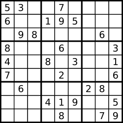

# 036. Valid Sudoku\(M\)

[036. Valid Sudoku](https://leetcode-cn.com/problems/valid-sudoku/)

## 题目描述\(中等\)

Determine if a 9x9 Sudoku board is valid. Only the filled cells need to be validated according to the following rules:

1. Each row must contain the digits 1-9 without repetition.  
2. Each column must contain the digits 1-9 without repetition.  
3. Each of the 9 3x3 sub-boxes of the grid must contain the digits 1-9 without repetition.



A partially filled sudoku which is valid.

The Sudoku board could be partially filled, where empty cells are filled with the character '.'.

Example 1:

```
Input:
[
  ["5","3",".",".","7",".",".",".","."],
  ["6",".",".","1","9","5",".",".","."],
  [".","9","8",".",".",".",".","6","."],
  ["8",".",".",".","6",".",".",".","3"],
  ["4",".",".","8",".","3",".",".","1"],
  ["7",".",".",".","2",".",".",".","6"],
  [".","6",".",".",".",".","2","8","."],
  [".",".",".","4","1","9",".",".","5"],
  [".",".",".",".","8",".",".","7","9"]
]
Output: true
```

Example 2:

```
Input:
[
  ["8","3",".",".","7",".",".",".","."],
  ["6",".",".","1","9","5",".",".","."],
  [".","9","8",".",".",".",".","6","."],
  ["8",".",".",".","6",".",".",".","3"],
  ["4",".",".","8",".","3",".",".","1"],
  ["7",".",".",".","2",".",".",".","6"],
  [".","6",".",".",".",".","2","8","."],
  [".",".",".","4","1","9",".",".","5"],
  [".",".",".",".","8",".",".","7","9"]
]
Output: false
Explanation: Same as Example 1, except with the 5 in the top left corner being 
    modified to 8. Since there are two 8's in the top left 3x3 sub-box, it is invalid.
```

**Note:**

> * A Sudoku board \(partially filled\) could be valid but is not necessarily solvable.
> * Only the filled cells need to be validated according to the mentioned rules.
> * The given board contain only digits 1-9 and the character '.'.
> * The given board size is always 9x9.

## 思路

## 解决方法

### 暴力解法

三条要求，分别判断是否符合

```java
    public boolean isValidSudoku(char[][] board) {
        Set<Character> set = new HashSet<>();
        for (int i = 0; i < board.length; i++) {
            for (int j = 0; j < board[i].length; j++) {
                if (board[i][j] != '.') {
                    if (set.contains(board[i][j])) {
                        return false;
                    } else {
                        set.add(board[i][j]);
                    }
                }
            }
            set.clear();
        }
        for (int j = 0; j < board.length; j++) {
            for (int i = 0; i < board.length; i++) {
                if (board[i][j] != '.') {
                    if (set.contains(board[i][j])) {
                        return false;
                    } else {
                        set.add(board[i][j]);
                    }
                }
            }
            set.clear();
        }
        for (int row = 0; row < board.length; row += 3) {
            for (int col = 0; col < board.length; col += 3) {
                for (int i = 0; i < 3; i++) {
                    for (int j = 0; j < 3; j++) {
                        char c = board[row + i][col + j];
                        if (c != '.') {
                            if (set.contains(c)) {
                                return false;
                            } else {
                                set.add(c);
                            }
                        }
                    }
                }
                set.clear();
            }
        }
        return true;
    }
```

时间复杂度：整个棋盘访问了三次， O\(m \* n\)。

空间复杂度：O\(1\)。

### 遍历一次存储

```java
    public boolean isValidSudoku2(char[][] board) {
        for (int i = 0; i < board.length; i++) {
            HashSet<Character> row = new HashSet<>();
            HashSet<Character> col = new HashSet<>();
            HashSet<Character> cube = new HashSet<>();
            for (int j = 0; j < board[0].length; j++) {
                if (board[i][j] != '.' && !row.add(board[i][j])) {
                    return false;
                }
                if (board[j][i] != '.' && !col.add(board[j][i])) {
                    return false;
                }

                int cubeRow = 3 * (i / 3) + j / 3;
                int cubeCol = 3 * (i % 3) + j % 3;
                if (board[cubeRow][cubeCol] != '.' && !cube.add(board[cubeRow][cubeCol])) {
                    return false;
                }
            }
        }
        return true;
    }
```

```java
    public boolean isValidSudoku1(char[][] board) {
        Set<String> seen = new HashSet<>();
        for (int i = 0; i < board.length; i++) {
            for (int j = 0; j < board[i].length; j++) {
                char ch = board[i][j];
                if (ch == '.') {
                    continue;
                }
                if (!seen.add(ch + "in row" + i) ||
                    !seen.add(ch + "in column" + j) ||
                    !seen.add(ch + "in block" + i / 3 + "-" + j / 3)) {
                    return false;
                }
            }
        }
        return true;
    }
```

时间复杂度：整个棋盘访问了一次， O\(m \* n\)。

空间复杂度：O\(n\)。

### 二进制位来表示对应数字是否存在

```java
    public boolean isValidSudoku3(char[][] board) {
        int[] rows = new int[9];
        int[] cols = new int[9];
        int[] grid = new int[9];
        for (int i = 0; i < 9; i++) {
            for (int j = 0; j < 9; j++) {
                if (board[i][j] != '.') {
                    int bytes = 1 << (board[i][j] - '1');
                    if ((bytes & (rows[i] | cols[j] | grid[i / 3 * 3 + j / 3])) != 0) {
                        return false;
                    }
                    rows[i] |= bytes;
                    cols[j] |= bytes;
                    grid[i / 3 * 3 + j / 3] |= bytes;
                }
            }
        }
        return true;
    }
```

时间复杂度：整个棋盘访问了一次， O\(m \* n\)。

空间复杂度：O\(n\)。

