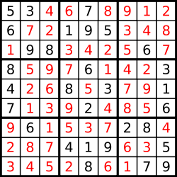

# 037. Sudoku Solver\(H\)

[037. Sudoku Solver](https://leetcode-cn.com/problems/sudoku-solver/)

## 题目描述\(困难\)

Write a program to solve a Sudoku puzzle by filling the empty cells.

A sudoku solution must satisfy all of the following rules:

1. Each of the digits 1-9 must occur exactly once in each row.
2. Each of the digits 1-9 must occur exactly once in each column.
3. Each of the the digits 1-9 must occur exactly once in each of the 9 3x3 sub-boxes of the grid.

Empty cells are indicated by the character '.'.


A sudoku puzzle...



...and its solution numbers marked in red.

**Note**:

> * The given board contain only digits 1-9 and the character '.'.
> * You may assume that the given Sudoku puzzle will have a single unique solution.
> * The given board size is always 9x9.

## 思路

## 解决方法

### 回溯

从上到下，从左到右遍历每个空位置。在第一个位置，随便填一个可以填的数字，再在第二个位置填一个可以填的数字，一直执行下去直到最后一个位置。期间如果出现没有数字可以填的话，就回退到上一个位置，换一下数字，再向后进行下去。

```java
    public void solveSudoku(char[][] board) {
        solver(board, 0);
    }

    public boolean solver(char[][] board, int index) {
        int totalNum = board.length * board.length;
        if (index >= totalNum) {
            return true;
        }
        for (; index < totalNum; index++) {
            int i = index / 9;
            int j = index % 9;
            if (board[i][j] == '.') {
                for (char ch = '1'; ch <= '9'; ch++) {
                    if (isValid(i, j, board, ch)) {
                        board[i][j] = ch;
                        if (solver(board, index + 1)) {
                            return true;
                        } else {
                            board[i][j] = '.';
                        }
                    }
                }
                return false;
            }
        }
        return true;
    }

    private boolean isValid(int row, int col, char[][] board, char c) {
        for (int i = 0; i < 9; i++) {
            if (board[row][i] == c || board[i][col] == c) {
                return false;
            }
        }
        int startRow = row / 3 * 3;
        int startCol = col / 3 * 3;
        for (int i = 0; i < 3; i++) {
            for (int j = 0; j < 3; j++) {
                if (board[startRow + i][startCol + j] == c) {
                    return false;
                }
            }
        }
        return true;
    }
```
时间复杂度：

空间复杂度：O(1)

### 回溯 二进制位验证符合要求

```java 
private int[] rows = new int[9];
    private int[] cols = new int[9];
    private int[] grid = new int[9];

    public void solveSudoku1(char[][] board) {
        List<Integer[]> empty = new ArrayList<>();

        for (int i = 0; i < 9; i++) {
            for (int j = 0; j < 9; j++) {
                if (board[i][j] == '.') {
                    empty.add(new Integer[]{i, j});
                } else {
                    int bytes = 1 << (board[i][j] - '1');
                    rows[i] |= bytes;
                    cols[j] |= bytes;
                    grid[i / 3 * 3 + j / 3] |= bytes;
                }
            }
        }
        solver1(board, 0);
    }

    public boolean solver1(char[][] board, int index) {
        int totalNum = board.length * board.length;
        if (index >= totalNum) {
            return true;
        }
        for (; index < totalNum; index++) {
            int i = index / 9;
            int j = index % 9;
            if (board[i][j] == '.') {
                for (char ch = '1'; ch <= '9'; ch++) {
                    if (isValid1(i, j, board, ch)) {
                        board[i][j] = ch;
                        int bytes = 1 << (ch - '1');
                        rows[i] |= bytes;
                        cols[j] |= bytes;
                        grid[i / 3 * 3 + j / 3] |= bytes;
                        if (solver1(board, index + 1)) {
                            return true;
                        } else {
                            board[i][j] = '.';
                            rows[i] ^= bytes;
                            cols[j] ^= bytes;
                            grid[i / 3 * 3 + j / 3] ^= bytes;
                        }
                    }
                }
                return false;
            }
        }
        return true;
    }

    public boolean isValid1(int row, int col, char[][] board, char ch) {
        int bytes = 1 << (ch - '1');
        if ((bytes & (rows[row] | cols[col] | grid[row / 3 * 3 + col / 3])) != 0) {
            return false;
        }

        return true;
    }
```
时间复杂度：

空间复杂度：O(1)

