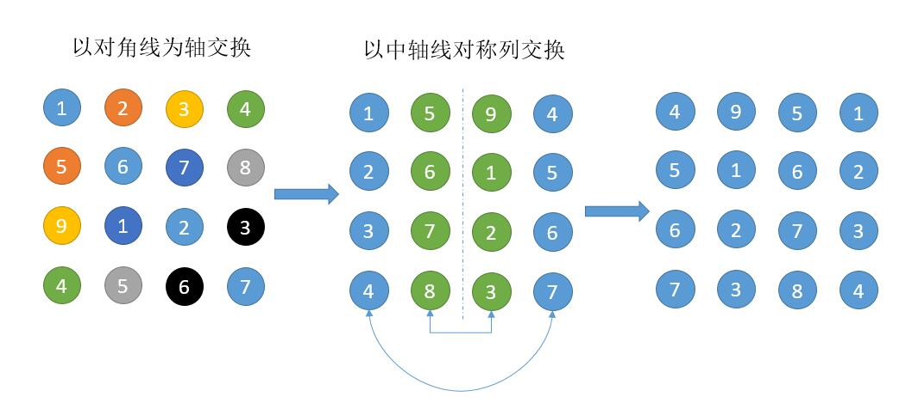

# 048. Rotate Image\(M\)

[048. Rotate Image](https://leetcode-cn.com/problems/rotate-image/)

## 题目描述\(中等\)

You are given an n x n 2D matrix representing an image.

Rotate the image by 90 degrees \(clockwise\).

**Note**:

You have to rotate the image in-place, which means you have to modify the input 2D matrix directly. DO NOT allocate another 2D matrix and do the rotation.

Example 1:

```
Given input matrix = 
[
  [1,2,3],
  [4,5,6],
  [7,8,9]
],

rotate the input matrix in-place such that it becomes:
[
  [7,4,1],
  [8,5,2],
  [9,6,3]
]
```

Example 2:

```
Given input matrix =
[
  [ 5, 1, 9,11],
  [ 2, 4, 8,10],
  [13, 3, 6, 7],
  [15,14,12,16]
], 

rotate the input matrix in-place such that it becomes:
[
  [15,13, 2, 5],
  [14, 3, 4, 1],
  [12, 6, 8, 9],
  [16, 7,10,11]
]
```

## 思路

循环移动规律
两次翻转的效果

## 解决方法

### 自外向内顺时针循环

```java
    //自外向内顺时针循环
    //自外向内一共有不超过 n/2 层（单个中心元素不算一层）矩形框。对于第 times 层矩形框，其框边长 len=nums-(times*2)，将其顺时针分为 4 份 len-1 的边，对四条边进行元素的循环交换即可。
    public void rotate(int[][] matrix) {
        int n = matrix.length;
        if (n == 0) {
            return;
        }
        int times = 0;
        while (times < n >> 1) {
            int len = n - times << 1 - 1;
            for (int i = 0; i < len; i++) {
                int temp = matrix[times][times + i];
                matrix[times][times + i] = matrix[n - 1 - (times + i)][times];
                matrix[n - 1 - (times + i)][times] = matrix[n - 1 - times][n - 1 - (times + i)];
                matrix[n - 1 - times][n - 1 - (times + i)] = matrix[times + i][n - 1 - times];
                matrix[times + i][n - 1 - times] = temp;
            }
            times++;
        }
    }
```
任意一个(i, j) , (j, n-i-1), (n-i-1, n-j-1), (n-j-1, i)就是这四个索引号上的数交换

```java
    public void rotate0(int[][] matrix) {
        int n = matrix.length;
        for (int i = 0; i < n / 2; i++) {
            for (int j = i; j < n - i - 1; j++) {
                int tmp = matrix[i][j];
                matrix[i][j] = matrix[n - j - 1][i];
                matrix[n - j - 1][i] = matrix[n - i - 1][n - j - 1];
                matrix[n - i - 1][n - j - 1] = matrix[j][n - i - 1];
                matrix[j][n - i - 1] = tmp;
            }
        }
    }
```

时间复杂度：O\(n²\)。

空间复杂度：O\(1\)。

### 两次翻转

```java
    //两次翻转
    //先沿右上 - 左下的对角线翻转（270° + 一次镜像），再沿水平中线上下翻转（−180°+ 一次镜像），可以实现顺时针 90 度的旋转效果
    public void rotate1(int[][] matrix){
        if(matrix.length == 0 || matrix.length != matrix[0].length) {
            return;
        }
        int n = matrix.length;
        for (int i = 0; i < n; ++i){
            for (int j = 0; j < n - i; ++j){
                int temp = matrix[i][j];
                matrix[i][j] = matrix[n - 1 - j][n - 1 - i];
                matrix[n - 1 - j][n - 1 - i] = temp;
            }
        }
        for (int i = 0; i < (n >> 1); ++i){
            for (int j = 0; j < n; ++j){
                int temp = matrix[i][j];
                matrix[i][j] = matrix[n - 1 - i][j];
                matrix[n - 1 - i][j] = temp;
            }
        }
    }
```

时间复杂度：O\(n²\)。

空间复杂度：O\(1\)。

### 转置加翻转

可以先转置，然后把每列对称交换交换一下



```java
//转置加翻转
    public void rotate2(int[][] matrix) {
        int n = matrix.length;

        // transpose matrix
        for (int i = 0; i < n; i++) {
            for (int j = i; j < n; j++) {
                int tmp = matrix[j][i];
                matrix[j][i] = matrix[i][j];
                matrix[i][j] = tmp;
            }
        }
        // reverse each row
        for (int i = 0; i < n; i++) {
            for (int j = 0; j < n / 2; j++) {
                int temp = matrix[i][j];
                matrix[i][j] = matrix[i][n - j - 1];
                matrix[i][n - j - 1] = temp;
            }
        }
    }
```

时间复杂度：O\(n²\)。

空间复杂度：O\(1\)。

