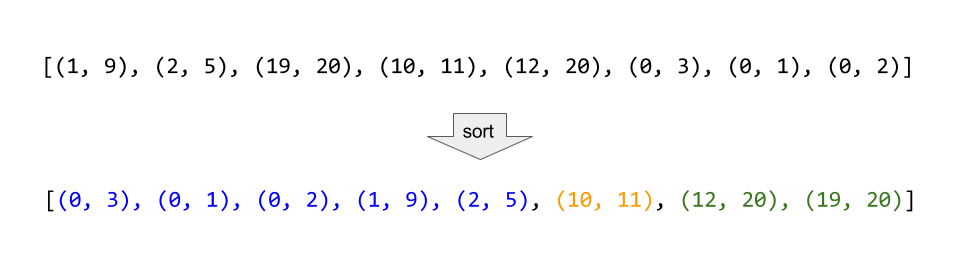

# 056. Merge Intervals\(M\)

[056. 合并区间](https://leetcode-cn.com/problems/merge-intervals/)

## 题目描述\(中等\)

Given a collection of intervals, merge all overlapping intervals.

Example 1:

```
Input: [[1,3],[2,6],[8,10],[15,18]]
Output: [[1,6],[8,10],[15,18]]
Explanation: Since intervals [1,3] and [2,6] overlaps, merge them into [1,6].
```

Example 2:

```
Input: [[1,4],[4,5]]
Output: [[1,5]]
Explanation: Intervals [1,4] and [4,5] are considered overlapping.
```

**NOTE**: input types have been changed on April 15, 2019. Please reset to default code definition to get new method signature.

## 思路

将数组排序，按区间合并

## 解决方法

## \# 排序



根据二维数组第一个数字大小按每一行整体排序  
判断当前区间的右节点是否大于等于下一区间的左节点，若是则更新右节点，否则当前区间断开

```java
    public int[][] merge(int[][] intervals) {
        List<int[]> arrayList = new ArrayList<>();
        if (intervals == null || intervals.length == 0) {
            return arrayList.toArray(new int[0][]);
        }

        // Arrays.sort(intervals, (a, b) -> a[0] - b[0]);// a[0] - b[0]大于0就交换顺序
        // 根据二维数组第一个数字大小按每一行整体排序
        Arrays.sort(intervals, new Comparator<int[]>() {
            @Override
            public int compare(int[] o1, int[] o2) {
                // TODO Auto-generated method stub
                return o1[0] - o2[0];
            }
        });
        int i = 0;
        while (i < intervals.length) {
            int left = intervals[i][0];
            int right = intervals[i][1];
            // i不能到最后一行,所以要小于(数组的长度 - 1)
            // 判断所在行的right和下一行的left大小,对right重新进行赋最大值,之后再不断进行while循环判断
            while (i < intervals.length - 1 && right >= intervals[i + 1][0]) {
                i++;
                right = Math.max(right, intervals[i][1]);
            }
            arrayList.add(new int[]{left, right});
            i++;
        }
        return arrayList.toArray(new int[arrayList.size()+1][]);
    }
```

时间复杂度：O\(n log\(n\)\)，排序算法。

空间复杂度：O\(n\)

