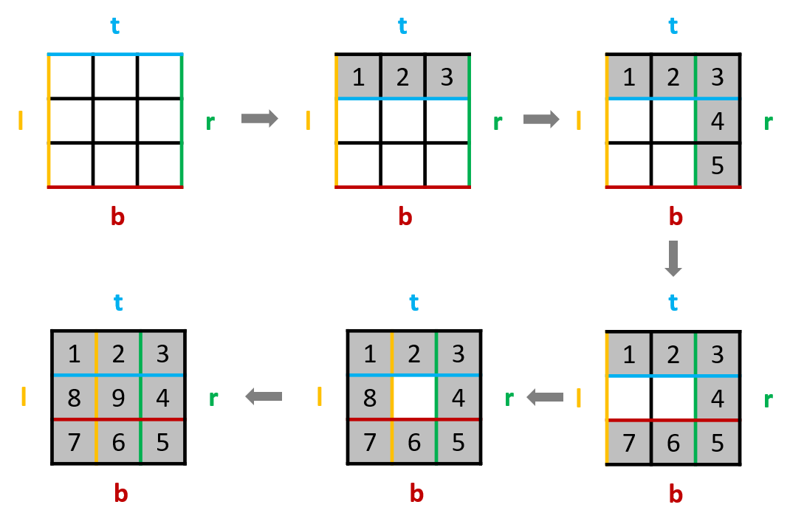
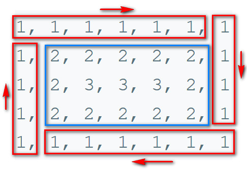

# 059. Spiral Matrix II\(M\)

[059. 螺旋矩阵 II](https://leetcode-cn.com/problems/spiral-matrix-ii/)

## 题目描述\(中等\)

Given a positive integer n, generate a square matrix filled with elements from 1 to $$n^2$$ in spiral order.

Example:

```
Input: 3
Output:
[
 [ 1, 2, 3 ],
 [ 8, 9, 4 ],
 [ 7, 6, 5 ]
]
```

## 思路

1. 模拟生成

## 解决方法

### 模拟

四个方向，触碰边界变换方向

```java
    public int[][] generateMatrix(int n) {
        int[][] matrix = new int[n][n];
        int i = 0, j = 0, d = 0;
        int[] di = {0, 1, 0, -1};
        int[] dj = {1, 0, -1, 0};
        boolean[][] used = new boolean[n][n];
        for (int k = 1; k <= n * n; k++) {
            matrix[i][j] = k;
            used[i][j] = true;
            int iTemp = i + di[d];
            int jTemp = j + dj[d];
            if (0 <= iTemp && iTemp < n && 0 <= jTemp && jTemp < n && !used[iTemp][jTemp]) {
                i = iTemp;
                j = jTemp;
            } else {
                d = (d + 1) % 4;
                i = i + di[d];
                j = j + dj[d];
            }
        }
        return matrix;
    }
```

### 设定边界

```java
    public int[][] generateMatrix1(int n) {
        int[][] matrix = new int[n][n];
        int r1 = 0, r2 = n - 1;
        int c1 = 0, c2 = n - 1;
        int num = 1;
        while (r1 <= r2 && c1 <= c2) {
            for (int c = c1; c < c2; c++) {
                matrix[r1][c] = num++;
            }
            for (int r = r1; r <= r2; r++) {
                matrix[r][c2] = num++;
            }
            if (r1 < r2 && c1 < c2) {
                for (int c = c2 - 1; c > c1; c--) {
                    matrix[r2][c] = num++;
                }
                for (int r = r2; r > r1; r--) {
                    matrix[r][c1] = num++;
                }
            }
            r1++;
            r2--;
            c1++;
            c2--;
        }
        return matrix;
    }
```



```java
    public int[][] generateMatrix2(int n) {
        int l = 0, r = n - 1, t = 0, b = n - 1;
        int[][] matrix = new int[n][n];
        int num = 1;
        while (num <= n * n) {
            // left to right.
            for (int i = l; i <= r; i++) {
                matrix[t][i] = num++;
            }
            t++;
            // top to bottom.
            for (int i = t; i <= b; i++) {
                matrix[i][r] = num++;
            }
            r--;
            // right to left.
            for (int i = r; i >= l; i--) {
                matrix[b][i] = num++;
            }
            b--;
            // bottom to top.
            for (int i = b; i >= t; i--) {
                matrix[i][l] = num++;
            }
            l++;
        }
        return matrix;
    }
```

### 洋葱遍历 


```java
    public int[][] generateMatrix3(int n) {
        int[][] matrix = new int[n][n];
        int num = 1;
        int start = 0, end = n - 1;
        while(start<=end){
            if(start==end){matrix[start][end]=num++;}
            for(int i=start;i<end;i++){
                matrix[start][i]=num++;
            }
            for(int i=start;i<end;i++){
                matrix[i][end]=num++;
            }
            for(int i=end;i>start;i--){
                matrix[end][i]=num++;
            }
            for(int i=end;i>start;i--){
                matrix[i][start]=num++;
            }
            start++;
            end--;
        }
        return matrix;
    }
```


