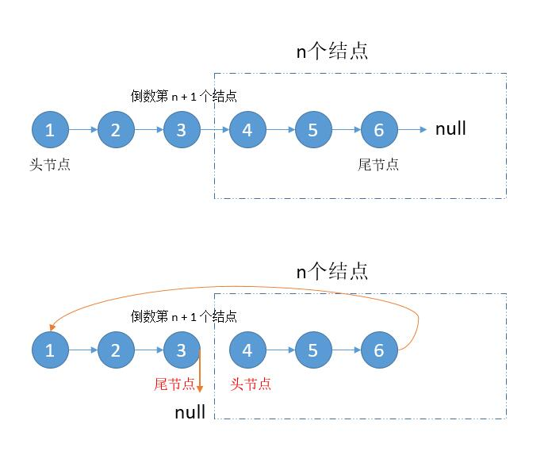

# 061. Rotate List\(M\)

[061. 旋转链表](https://leetcode-cn.com/problems/rotate-list/)

## 题目描述\(中等\)

Given a linked list, rotate the list to the right by k places, where k is non-negative.

Example 1:

```
Input: 1->2->3->4->5->NULL, k = 2
Output: 4->5->1->2->3->NULL
Explanation:
rotate 1 steps to the right: 5->1->2->3->4->NULL
rotate 2 steps to the right: 4->5->1->2->3->NULL
```

Example 2:

```
Input: 0->1->2->NULL, k = 4
Output: 2->0->1->NULL
Explanation:
rotate 1 steps to the right: 2->0->1->NULL
rotate 2 steps to the right: 1->2->0->NULL
rotate 3 steps to the right: 0->1->2->NULL
rotate 4 steps to the right: 2->0->1->NULL
```

## 思路

找到倒数第k个节点的前一个，该节点作为尾节点，后继作为头节点

## 解决方法

### 快慢指针



求出倒数第k个节点的前一个节点pre(倒数第k+1个节点)，
快指针求出正数第k+1个节点，
若k大于链表长度len,则k = k % len，继续从头遍历求正数第k+1个节点，
慢指针从头和快指针同时遍历，慢指针到达尾部时，即可得到倒数第k+1个节点,


```java
    public ListNode rotateRight(ListNode head, int k) {
        if (head == null) {
            return null;
        }
        int len = 1;
        int last = 0;
        ListNode start = new ListNode(0);
        start.next = head;
        ListNode cur = head;
        while (last < k && cur.next != null) {
            cur = cur.next;
            last++;
            len++;
        }
        if (last < k) {
            k = k % len;
            last = 0;
            cur = head;
            while (last < k && cur.next != null) {
                cur = cur.next;
                last++;
            }
        }
        ListNode pre = head;
        while (cur.next != null) {
            pre = pre.next;
            cur = cur.next;
        }
        cur.next = head;
        start.next = pre.next;
        pre.next = null;


        return start.next;
    }
```

时间复杂度：O (n)

空间复杂度：O (1)

### 求链表长度在找节点

```java
    public ListNode rotateRight1(ListNode head, int k) {
        if (head == null || k == 0) {
            return head;
        }
        int len = 0;
        ListNode h = head;
        ListNode tail = null;
        //求出链表长度，保存尾指针
        while (h != null) {
            h = h.next;
            len++;
            if (h != null) {
                tail = h;
            }
        }
        //求出需要整体移动多少个节点
        k = k % len;
        if (k == 0) {
            return head;
        }
        ListNode slow = head;
        for (int i = 1; i < len - k; i++) {
            slow = slow.next;
        }
        //尾指针指向头结点
        tail.next = head;
        //头指针更新为倒数第 n 个节点
        head = slow.next;
        //尾指针置为 null
        slow.next = null;
        return head;
    }
```

时间复杂度：O (n)

空间复杂度：O (1)

