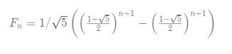

# 070. Climbing Stairs(E)
[070. 爬楼梯](https://leetcode-cn.com/problems/climbing-stairs/)

## 题目描述\(简单\)

You are climbing a stair case. It takes n steps to reach to the top.

Each time you can either climb 1 or 2 steps. In how many distinct ways can you climb to the top?

**Note**: Given n will be a positive integer.

Example 1:

```
Input: 2
Output: 2
Explanation: There are two ways to climb to the top.
1. 1 step + 1 step
2. 2 steps
```

Example 2:

```
Input: 3
Output: 3
Explanation: There are three ways to climb to the top.
1. 1 step + 1 step + 1 step
2. 1 step + 2 steps
3. 2 steps + 1 step
```

## 思路

1. 递归
2. 迭代
3. 公式法

## 解决方法

### 递归

```java
    public int climbStairs(int n) {
        if(n==1||n==0) {return 1;}
        return climbStairs(n-1)+climbStairs(n-2);
    }
```

### 递归+memoization 
```java
    public int climbStairs0(int n) {
        return climbStairsNth(n, new int[n + 1]);
    }

    private int climbStairsNth(int n, int[] memo) {
        if (n == 1) {
            return 1;
        }
        if (n == 2) {
            return 2;
        }
        int n1 = 0;
        if (memo[n - 1] == 0) {
            n1 = climbStairsNth(n - 1, memo);
            memo[n - 1] = n1;
        } else {
            n1 = memo[n - 1];
        }
        int n2 = 0;
        if (memo[n - 2] == 0) {
            n2 = climbStairsNth(n - 2, memo);
            memo[n - 2] = n2;

        } else {
            n2 = memo[n - 2];
        }
        return n1 + n2;
    }
```

时间复杂度：O(n)。

空间复杂度：O(n)。


### 迭代 动态规划

```java
    public int climbStairs(int n) {
        int pre2 = 1;
        int pre1 = 1;
        int cur = 1;
        while(n--!=1) {
            cur = pre2+pre1;
            pre2 = pre1;
            pre1 = cur;
        }
        return cur;
    }
```

时间复杂度：O(n)。

空间复杂度：O(1)。


### 公式法



```java
    public int climbStairs(int n) {
        double sqrt5=Math.sqrt(5);
        double fibn=Math.pow((1+sqrt5)/2,n+1)-Math.pow((1-sqrt5)/2,n+1);
        return (int)(fibn/sqrt5);
    }
```
时间复杂度：耗在了求幂的时候，O(log(n))。

空间复杂度：O(1)。


