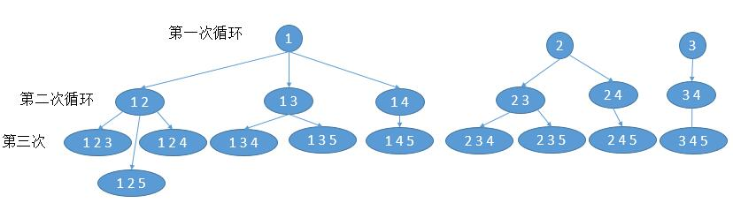

# 077. Combinations\(M\)

[077. 组合](https://leetcode-cn.com/problems/combinations/)

## 题目描述\(中等\)

Given two integers n and k, return all possible combinations of k numbers out of 1 ... n.

Example:

```
Input: n = 4, k = 2
Output:
[
  [2,4],
  [3,4],
  [2,3],
  [1,2],
  [1,3],
  [1,4],
]
```

## 思路

1. 回溯
2. 回溯 剪枝
3. 回溯 迭代
4. 迭代生成
5. 动态规划

## 解决方法

### 回溯

* 若组合完成- 添加到输出中。

* 遍历从 first t到 n的所有整数。

  * 将整数 i 添加到现有组合 curr中。

  * 继续向组合中添加更多整数 :backtrack\(i + 1, curr\).

  * 将 i 从 curr中移除，实现回溯。

```java
    public List<List<Integer>> combine0(int n, int k) {
        List<List<Integer>> listList = new ArrayList<>();
        if (n <= 0 || k <= 0 || k > n) {
            return listList;
        }
        backtrack(listList, new ArrayList<>(), n, k, 1);
        return listList;
    }

    private void backtrack(List<List<Integer>> listList, List<Integer> list, int n, int k, int index) {
        if (list.size() == k) {
            listList.add(new ArrayList<>(list));
            return;
        }
        for (int i = index + 1; i <= n; i++) {
            list.add(i);
            backtrack(listList, list, n, k, i);
            list.remove(list.size() - 1);
        }
    }
```

### 回溯+剪枝

修改for循环结束条件，剩余未选的数字全选若不满足总数要求，不需要再循环。i &lt;= n - \(k - list.size\(\)\) + 1。k - list.size \( \) 代表还需要的数字个数。因为我们最后取到了 n，所以还要加 1

比如，n = 5，k = 4，list.size\( \) == 1，此时代表我们还需要（4 - 1 = 3）个数字，如果 i = 4 的话，以后最多把 4 和 5 加入到 list中，而此时 list.size\(\) 才等于 1 + 2 = 3，不够 4 个，所以 i 没必要等于 4，i 循环到 3 就足够了。

```java
    public List<List<Integer>> combine0(int n, int k) {
        List<List<Integer>> listList = new ArrayList<>();
        if (n <= 0 || k <= 0 || k > n) {
            return listList;
        }
        backtrack1(listList, new ArrayList<>(), n, k, 1);
        return listList;
    }
    private void backtrack1(List<List<Integer>> listList, List<Integer> list, int n, int k, int index) {
        if (list.size() == k) {
            listList.add(new ArrayList<>(list));
            return;
        }
        for (int i = index; i <= n - (k - list.size()) + 1; i++) {
            list.add(i);
            backtrack1(listList, list, n, k, i + 1);
            list.remove(list.size() - 1);
        }
    }
```

### 回溯迭代

回溯其实有三个过程。

* for 循环结束，也就是 i == n + 1，然后回到上一层的 for 循环
* temp.size\(\) == k，也就是所需要的数字够了，然后把它加入到结果中。
* 每个 for 循环里边，进入递归，添加下一个数字

```java
    public List<List<Integer>> combine1(int n, int k) {
        List<List<Integer>> listList = new ArrayList<>();
        List<Integer> temp = new ArrayList<>();
        for (int i = 0; i < k; i++) {
            temp.add(0);
        }
        int i = 0;
        while (i >= 0) {
            //当前数字加 1
            temp.set(i, temp.get(i) + 1);
            //当前数字大于 n，对应回溯法的 i == n + 1，然后回到上一层
            //优化为剩余未选数量(k-i-1)不够，回溯
            if (temp.get(i) > n - (k - i - 1)) {
                i--;
            } else if (i == k - 1) {
                // 当前数字个数够了
                listList.add(new ArrayList<>(temp));
                //进入更新下一个数字
            } else {
                i++;
                //把下一个数字置为上一个数字，类似于回溯法中的 start
                temp.set(i, temp.get(i - 1));
            }
        }
        return listList;
    }
```

### 迭代生成



第 1 次循环，我们找出所有 1 个数的可能 [ 1 ]，[ 2 ]，[ 3 ]。4 和 5 不可能，解法一分析过了，因为总共需要 3 个数，4，5 全加上才 2 个数。

第 2 次循环，在每个 list 添加 1 个数， [ 1 ] 扩展为 [ 1 , 2 ]，[ 1 , 3 ]，[ 1 , 4 ]。[ 1 , 5 ] 不可能，因为 5 后边没有数字了。 [ 2 ] 扩展为 [ 2 , 3 ]，[ 2 , 4 ]。[ 3 ] 扩展为 [ 3 , 4 ]；

第 3 次循环，在每个 list 添加 1 个数， [ 1，2 ] 扩展为[ 1，2，3]， [ 1，2，4]， [ 1，2，5]；[ 1，3 ] 扩展为 [ 1，3，4]， [ 1，3，5]；[ 1，4 ] 扩展为 [ 1，4，5]；[ 2，3 ] 扩展为 [ 2，3，4]， [ 2，3，5]；[ 2，4 ] 扩展为 [ 2，4，5]；[ 3，4 ] 扩展为 [ 3，4，5]；

最后结果就是，[[ 1，2，3]， [ 1，2，4]， [ 1，2，5]，[ 1，3，4]， [ 1，3，5]， [ 1，4，5]， [ 2，3，4]， [ 2，3，5]，[ 2，4，5]， [ 3，4，5]]。

上边分析很明显了，三个循环，第一层循环是 1 到 k ，代表当前有多少个数。第二层循环就是遍历之前的所有结果。第三次循环就是将当前结果扩展为多个。

```java
    List<List<Integer>> listList = new ArrayList<List<Integer>>();
        if (n == 0 || k == 0 || k > n) {
            return listList;
        }
        //个数为 1 的所有可能
        for (int i = 1; i <= n + 1 - k; i++) {
            listList.add(Arrays.asList(i));
        }
        //第一层循环，从 2 到 k
        for (int i = 2; i <= k; i++) {
            List<List<Integer>> tmp = new ArrayList<>();
            //第二层循环，遍历之前所有的结果
            for (List<Integer> list : listList) {
                //第三次循环，对每个结果进行扩展
                //从最后一个元素加 1 开始，然后不是到 n ，而是和解法一的优化一样
                //(k - (i - 1)) 代表剩余未选的个数，最后再加 1 是因为取了 n
                for (int m = list.get(list.size() - 1) + 1; m <= n - (k - (i - 1)) + 1; m++) {
                    List<Integer> newList = new ArrayList<>(list);
                    newList.add(m);
                    tmp.add(newList);
                }
            }
            listList = tmp;
        }
        return listList;
```

时间复杂度：C(n,k)


### 递归分治

基于公式 C ( n, k ) = C ( n - 1, k - 1) + C ( n - 1, k ) 

从 n 个数字选 k 个，我们把所有结果分为两种，包含第 n 个数和不包含第 n 个数。这样的话，就可以把问题转换成

- 从 n - 1 里边选 k - 1 个，然后每个结果加上 n
- 从 n - 1 个里边直接选 k 个。


```java
    List<List<Integer>> listList = new ArrayList<>();
        if (k == n || k == 0) {
            List<Integer> list = new ArrayList<>();
            for (int i = 1; i <= k; ++i) {
                list.add(i);
            }
            listList.add(list);
            return listList;
        }
        // n - 1 里边选 k - 1 个
        listList = combine(n - 1, k - 1);
        //每个结果加上 n
        for(List list:listList){
            list.add(n);
        }
        //listList.forEach(e -> e.add(n));
        //把 n - 1 个选 k 个的结果也加入
        listList.addAll(combine(n - 1, k));
        return listList;
```

### 动态规划

```java
    List<List<Integer>>[][] dp = new List[n + 1][k + 1];
        //更新 k = 0 的所有情况
        for (int i = 0; i <= n; i++) {
            dp[i][0] = new ArrayList<>();
            dp[i][0].add(new ArrayList<>());
        }
        // i 从 1 到 n
        for (int i = 1; i <= n; i++) {
            // j 从 1 到 i 或者 k
            for (int j = 1; j <= i && j <= k; j++) {
                dp[i][j] = new ArrayList<>();
                //判断是否可以从 i - 1 里边选 j 个
                if (i > j){
                    dp[i][j].addAll(dp[i - 1][j]);
                }
                //把 i - 1 里边选 j - 1 个的每个结果加上 i
                for (List<Integer> list: dp[i - 1][j - 1]) {
                    List<Integer> tmpList = new ArrayList<>(list);
                    tmpList.add(i);
                    dp[i][j].add(tmpList);
                }
            }
        }
        return dp[n][k];
```

### 动态规划空间优化

```java
    List<List<Integer>>[] dp = new List[k + 1];
        dp[0] = new ArrayList<>();
        dp[0].add(new ArrayList<>());
        for (int i = 1; i <= n; i++) {
            List<List<Integer>> temp = new ArrayList<>(dp[0]);
            for (int j = 1; j <= i && j <= k; j++) {
                List<List<Integer>> last = temp;
                if(dp[j]!=null){
                    temp = new ArrayList<>(dp[j]);
                }
                // 判断是否可以从 i - 1 里边选 j 个
                if (i <= j) {
                    dp[j] = new ArrayList<>();
                }
                //把 i - 1 里边选 j - 1 个的每个结果加上 i
                for (List<Integer> list : last) {
                    List<Integer> tmpList = new ArrayList<>(list);
                    tmpList.add(i);
                    dp[j].add(tmpList);
                }
            }
        }
        return dp[k];
    }

```
