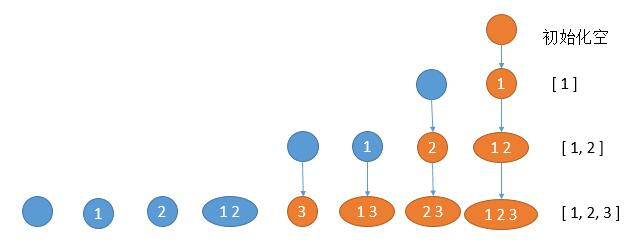

# 078. Subsets\(M\)

[078. 子集](https://leetcode-cn.com/problems/subsets/)

## 题目描述\(中等\)

Given a set of distinct integers, nums, return all possible subsets \(the power set\).

**Note**: The solution set must not contain duplicate subsets.

Example:

```
Input: nums = [1,2,3]
Output:
[
  [3],
  [1],
  [2],
  [1,2,3],
  [1,3],
  [2,3],
  [1,2],
  []
]
```

## 思路

1. 回溯
2. 二进制位
3. 迭代遍历

## 解决方法

### 回溯

```java
    public List<List<Integer>> subsets(int[] nums) {
        List<List<Integer>> listList = new ArrayList<>();
        combine(listList, new ArrayList<>(), nums, 0);
        return listList;
    }

    private void combine(List<List<Integer>> listList, List<Integer> list, int[] nums, int index) {
        listList.add(new ArrayList<>(list));
        for (int i = index; i < nums.length; i++) {
            list.add(nums[i]);
            combine(listList, list, nums, i + 1);
            list.remove(list.size() - 1);
        }
    }
```

### 二进制位

所有的子集根据下标对应的位置存在与否可用二进制数表示


例如，nums = [ 1, 2 , 3 ]。1 代表在，0 代表不在。
```
1 2 3
0 0 0 -> [     ]
0 0 1 -> [    3]
0 1 0 -> [  2  ]   
0 1 1 -> [  2 3]  
1 0 0 -> [1    ]
1 0 1 -> [1   3] 
1 1 0 -> [1 2  ]
1 1 1 -> [1 2 3]
```

```java
    public List<List<Integer>> subsets1(int[] nums) {
        List<List<Integer>> listList = new ArrayList<>();
        int len = nums.length;
        int num = 1 << len;
        for (int i = 0; i < num; i++) {
            int bit = i;
            List<Integer> list = new ArrayList<>();
            for (int j = 0; j < len; j++) {
                if ((bit & 1) == 1) {
                    list.add(nums[j]);
                }
                bit >>= 1;
            }
            listList.add(list);
        }
        return listList;
    }
```

### 迭代遍历

先只考虑给定数组的 1 个元素的所有子数组，然后再考虑数组的 2 个元素的所有子数组 ... 最后再考虑数组的 n 个元素的所有子数组。求 k 个元素的所有子数组，只需要在 k - 1 个元素的所有子数组里边加上 nums [ k ] 即可。



```java
    public List<List<Integer>> subsets2(int[] nums) {
        List<List<Integer>> listList = new ArrayList<>();
        listList.add(new ArrayList<>());
        for (int i = 0; i < nums.length; i++) {
            List<List<Integer>> tmpList = new ArrayList<>();
            //遍历之前的所有结果
            for (List<Integer> list : listList) {
                List<Integer> tmp = new ArrayList<>(list);
                tmp.add(nums[i]);
                tmpList.add(tmp);
            }
            listList.addAll(tmpList);
        }
        return listList;
    }
```


