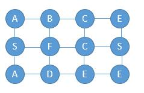

# 079. Word Search\(M\)

[079. 单词搜索](https://leetcode-cn.com/problems/word-search/)

## 题目描述\(中等\)

Given a 2D board and a word, find if the word exists in the grid.

The word can be constructed from letters of sequentially adjacent cell, where "adjacent" cells are those horizontally or vertically neighboring. The same letter cell may not be used more than once.

Example:

```
board =
[
  ['A','B','C','E'],
  ['S','F','C','S'],
  ['A','D','E','E']
]

Given word = "ABCCED", return true.
Given word = "SEE", return true.
Given word = "ABCB", return false.
```

## 思路

DFS

## 解决方法

### DFS

在深度优先遍历过程中，判断当前遍历元素是否对应 word 元素，如果不匹配就结束当前的遍历，返回上一次的元素，尝试其他路径。当然，和普通的 dfs 一样，我们需要一个 visited 数组标记元素是否访问过。



```java
    public boolean exist0(char[][] board, String word) {
        if (board.length == 0) {
            return false;
        }
        if (word.length() == 0) {
            return true;
        }
        int m = board.length, n = board[0].length;

        byte[][] visited = new byte[m][n];

        for (int i = 0; i < m; i++) {
            for (int j = 0; j < n; j++) {
                if (existStart0(board, visited, word, i, j, 0)) {
                    return true;
                }
            }
        }
        return false;
    }

    private boolean existStart0(char[][] board, byte[][] visited, String word, int i, int j, int index) {
        int m = board.length, n = board[0].length;
        if (i < 0 || i >= m || j < 0 || j >= n || visited[i][j] == 1 || board[i][j] != word.charAt(index)) {
            return false;
        }
        if (index == word.length() - 1) {
            return true;
        }
        visited[i][j] = 1;
        boolean found = existStart0(board, visited, word, i + 1, j, index + 1)
            || existStart0(board, visited, word, i - 1, j, index + 1)
            || existStart0(board, visited, word, i, j + 1, index + 1)
            || existStart0(board, visited, word, i, j - 1, index + 1);
        visited[i][j] = 0;
        return found;
    }
```

### DFS 标记

优化空间复杂度，上述采用等大的二维数组来标记是否访问过，
对于字符可以采用标记和还原的方法。异或。
因为 ASCII 码值的范围是 0 - 127，二进制的话就是 0000 0000 - 0111 1111，把它和 128 做异或，也就是和 1000 0000 。这样，如果想还原原来的数字只需要再异或 128 就可以了。
```
//标记
board[i][j] ^= 128;
//还原
board[i][j] ^= 128;
```


```java
    public boolean exist1(char[][] board, String word) {
        if (board.length == 0) {
            return false;
        }
        if (word.length() == 0) {
            return true;
        }
        int m = board.length, n = board[0].length;

        for (int i = 0; i < m; i++) {
            for (int j = 0; j < n; j++) {
                if (existStart(board, word, i, j, 0)) {
                    return true;
                }
            }
        }
        return false;
    }

    private boolean existStart(char[][] board, String word, int i, int j, int index) {
        if (index == word.length() - 1) {
            return board[i][j] == word.charAt(index);
        }
        if (board[i][j] != word.charAt(index)) {
            return false;
        }
        board[i][j] ^= 128;
        int[] di = {0, 1, 0, -1};
        int[] dj = {1, 0, -1, 0};
        int m = board.length, n = board[0].length;
        for (int d = 0; d < 4; d++) {
            int iTmp = i + di[d], jTmp = j + dj[d];
            if (iTmp >= 0 && iTmp < m && jTmp >= 0 && jTmp < n && (board[iTmp][jTmp] >= 0 && board[iTmp][jTmp] < 128)) {
                if (existStart(board, word, iTmp, jTmp, index + 1)) {
                    return true;
                }
            }
        }
        board[i][j] ^= 128;
        return false;
    }
```


