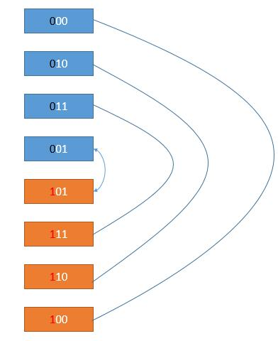

# 089. Gray Code\(M\)

[089. 格雷编码](https://leetcode-cn.com/problems/gray-code/)

## 题目描述\(中等\)

The gray code is a binary numeral system where two successive values differ in only one bit.

Given a non-negative integer n representing the total number of bits in the code, print the sequence of gray code. A gray code sequence must begin with 0.

Example 1:

```
Input: 2
Output: [0,1,3,2]
Explanation:
00 - 0
01 - 1
11 - 3
10 - 2

For a given n, a gray code sequence may not be uniquely defined.
For example, [0,2,3,1] is also a valid gray code sequence.

00 - 0
10 - 2
11 - 3
01 - 1
```

Example 2:

```
Input: 0
Output: [0]
Explanation: We define the gray code sequence to begin with 0.
             A gray code sequence of n has size = 2n, which for n = 0 the size is 20 = 1.
             Therefore, for n = 0 the gray code sequence is [0].
```

## 思路

1. 遍历生成判断是否存在
2. 动态规划
3. 生成规律直接推导
4. 公式

## 解决方法

### 遍历生成

```java
    public List<Integer> grayCode(int n) {
        List<Integer> list = new ArrayList<>();
        int[] code = new int[n];
        for (int i = 0; i < n; i++) {
            code[i] = 1 << i;
        }
        int num = 1 << n;
        Set<Integer> set = new HashSet<>();
        list.add(0);
        set.add(0);
        while (list.size() != num) {
            int last = list.get(list.size() - 1);
            for (int i = 0; i < n; i++) {
                int cur = last ^ code[i];
                if (!set.contains(cur)) {
                    list.add(cur);
                    set.add(cur);
                    break;
                }
            }
        }
        return list;
    }
```

### 动态规划

假设我们有了 n = 2 的解，考虑怎么得到 n = 3 的解。



```java
    public List<Integer> grayCode2(int n) {
        List<Integer> gray = new ArrayList<Integer>();
        //初始化 n = 0 的解
        gray.add(0);
        for (int i = 0; i < n; i++) {
            //要加的数
            int add = 1 << i;
            //倒序遍历，并且加上一个值添加到结果中
            for (int j = gray.size() - 1; j >= 0; j--) {
                gray.add(gray.get(j) + add);
            }
        }
        return gray;
    }
```

时间复杂度：$$ O(2^n) $$，因为有这么多的结果。

空间复杂度：O\(1\)。

### 直接推导

维基百科提供的一个生成格雷码的思路。

> 以二进制为 0 值的格雷码为第零项，第一项改变最右边的位元，第二项改变右起第一个为1的位元的左边位元，第三、四项方法同第一、二项，如此反复，即可排列出n个位元的格雷码。

```
以 n = 3 为例。

0 0 0 第零项初始化为 0。

0 0 1 第一项改变上一项最右边的位元

0 1 1 第二项改变上一项右起第一个为 1 的位元的左边位

0 1 0 第三项同第一项，改变上一项最右边的位元

1 1 0 第四项同第二项，改变最上一项右起第一个为 1 的位元的左边位

1 1 1 第五项同第一项，改变上一项最右边的位元

1 0 1 第六项同第二项，改变最上一项右起第一个为 1 的位元的左边位

1 0 0 第七项同第一项，改变上一项最右边的位元
```

```java
    public List<Integer> grayCode3(int n) {
        List<Integer> gray = new ArrayList<Integer>();
        gray.add(0);
        for (int i = 1; i < 1 << n; i++) {
            int last = gray.get(i - 1);
            if ((i & 1) == 1) {
                //第一项改变上一项最右边的位元
                gray.add(last ^ 1);
            } else {
                //第二项改变上一项右起第一个为 1 的位元的左边位
                int tmp = last;
                for (int bit = 0; bit < n; bit++) {
                    if ((tmp & 1) == 1) {
                        gray.add(last ^ (1 << (bit + 1)));
                        break;
                    }
                    tmp >>= 1;
                }
            }
        }
        return gray;
    }
```

时间复杂度：由于每添加两个数需要找第一个为 1 的位元，需要 O\(n\)，所以 $$ O(n2^n) $$

空间复杂度：O\(1\)。

### 公式

二进制转成格雷码公式


遍历 0 到 $$ 2^n-1 $$，然后利用公式转换即可。即最高位保留，其它位是当前位和它的高一位进行异或操作。

```java
    public List<Integer> grayCode1(int n) {
        List<Integer> gray = new ArrayList<Integer>();
        for (int binary = 0; binary < 1 << n; binary++) {
            gray.add(binary ^ binary >> 1);
        }
        return gray;
    }

```
时间复杂度：$$ O(2^n) $$，因为有这么多的结果。

空间复杂度：O\(1\)。