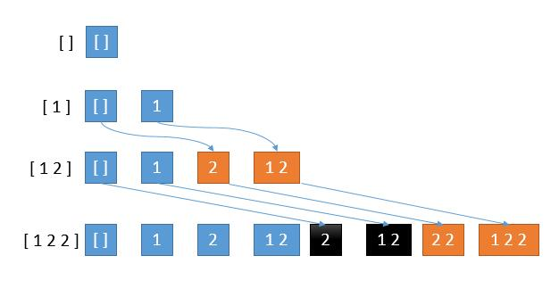

# 090. Subsets II\(M\)

[090. 子集 II](https://leetcode-cn.com/problems/subsets-ii/)

## 题目描述\(中等\)

Given a collection of integers that might contain duplicates, nums, return all possible subsets \(the power set\).

Note: The solution set must not contain duplicate subsets.

Example:

```
Input: [1,2,2]
Output:
[
  [2],
  [1],
  [1,2,2],
  [2,2],
  [1,2],
  []
]
```

## 思路

首先排序数组可用于判断重复数字

* 回溯
* 位运算
* 迭代

## 解决方法

### 回溯

```java
    public List<List<Integer>> subsetsWithDup(int[] nums) {
        List<List<Integer>> listList = new ArrayList<>();
        Arrays.sort(nums);
        combine(listList, new ArrayList<>(), nums, 0);
        return listList;
    }

    //回溯
    private void combine(List<List<Integer>> listList, List<Integer> list, int[] nums, int index) {
        listList.add(new ArrayList<>(list));
        for (int i = index; i < nums.length; i++) {
            if (i > index && nums[i] == nums[i - 1]) {
                continue;
            }
            list.add(nums[i]);
            combine(listList, list, nums, i + 1);
            list.remove(list.size() - 1);
        }
    }
```

### 位运算

对于 nums = [ 1 2 2 2 3 ]。
```
1 2 2 2 3
0 1 1 0 0  -> [  2 2  ]
0 1 0 1 0  -> [  2 2  ]
0 0 1 1 0  -> [  2 2  ]
```

上边三个数产生的数组重复的了。三个中我们只取其中 1 个，取哪个呢？取从重复数字的开头连续的数字。什么意思呢？就是下边的情况是我们所保留的。
```
2 2 2 2 2 
1 0 0 0 0 -> [  2         ]
1 1 0 0 0 -> [  2 2       ]
1 1 1 0 0 -> [  2 2 2     ]
1 1 1 1 0 -> [  2 2 2 2   ]
1 1 1 1 1 -> [  2 2 2 2 2 ]
```
而对于 [ 2 2 ] 来说，除了 1 1 0 0 0 可以产生，下边的几种情况，都是产生的 [ 2 2 ]
```
2 2 2 2 2 
1 1 0 0 0 -> [  2 2       ]
1 0 1 0 0 -> [  2 2       ]
0 1 1 0 0 -> [  2 2       ]
0 1 0 1 0 -> [  2 2       ]
0 0 0 1 1 -> [  2 2       ]
......
```
怎么把 1 1 0 0 0 和上边的那么多种情况区分开来呢？我们来看一下出现了重复数字，并且当前是 1 的前一个的二进位。
```
对于 1 1 0 0 0 ，是 1。
对于 1 0 1 0 0 , 是 0。
对于 0 1 1 0 0 ，是 0。
对于 0 1 0 1 0 ，是 0。
对于 0 0 0 1 1 ，是 0。
......
```
可以看到只有第一种情况对应的是 1 ，其他情况都是 0。其实除去从开头是连续的 1 的话，就是两种情况。

第一种就是，占据了开头，类似于这种 10...1....

第二种就是，没有占据开头，类似于这种 0...1...

这两种情况，除了第一位，其他位一定存在有 1 的前边是 0。所以的话，我们的条件是看出现了重复数字，并且当前位是 1 的前一个的二进位，只要存在一个符合的该子集就是重复的。


```java
    public List<List<Integer>> subsetsWithDup2(int[] nums) {
        List<List<Integer>> listList = new ArrayList<>();
        Arrays.sort(nums);
        int len = nums.length;
        int num = 1 << len;
        for (int i = 0; i < num; i++) {
            int bit = i;
            boolean illegal = false;
            List<Integer> list = new ArrayList<>();
            for (int j = 0; j < len; j++) {
                if ((bit & 1) == 1) {
                    if (j > 0 && nums[j] == nums[j - 1] && (i >> (j - 1) & 1) == 0) {
                        illegal = true;
                        break;
                    }
                    list.add(nums[j]);
                }
                bit >>= 1;
            }
            if (!illegal) {
                listList.add(list);
            }
        }
        return listList;
```

### 迭代1




第 4 行新添加的 2 要加到第 3 行的所有解中，而第 3 行的一部分解是旧解，一部分是新解。可以看到，我们黑色部分是由第 3 行的旧解产生的，橙色部分是由新解产生的。
而第 2 行到第 3 行，已经在旧解中加入了 2 产生了第 3 行的橙色部分，所以这里如果再在旧解中加 2 产生黑色部分就造成了重复。

所以当有重复数字的时候，我们只考虑上一步的新解，算法中用一个指针保存每一步的新解开始的位置即可。

```java
    public List<List<Integer>> subsetsWithDup3(int[] nums) {
        List<List<Integer>> listList = new ArrayList<>();
        listList.add(new ArrayList<>());
        Arrays.sort(nums);
        int newStart = 1;
        for (int i = 0; i < nums.length; i++) {
            List<List<Integer>> tmpList = new ArrayList<>();
            //遍历之前的所有结果
            for (int j = 0; j < listList.size(); j++) {
                if (i > 0 && nums[i] == nums[i - 1] && j < newStart) {
                    continue;
                }
                List<Integer> tmp = new ArrayList<>(listList.get(j));
                tmp.add(nums[i]);
                tmpList.add(tmp);
            }
            newStart = listList.size();
            listList.addAll(tmpList);
        }
        return listList;
    }
```

### 迭代2

当有 n 个重复数字出现，其实就是在出现重复数字之前的所有解中，分别加 1 个重复数字， 2 个重复数字，3 个重复数字 ... 看一个例子。

```
数组 [ 1 2 2 2 ] 
[ ]的所有子串 [ ]
[ 1 ] 个的所有子串 [ ] [ 1 ] 
然后出现了重复数字 2，那么我们记录重复的次数。然后遍历之前每个解即可
对于 [ ] 这个解，
加 1 个 2，变成 [ 2 ] 
加 2 个 2，变成 [ 2 2 ]
加 3 个 2，变成 [ 2 2 2 ]
对于 [ 1 ] 这个解
加 1 个 2，变成 [ 1 2 ] 
加 2 个 2，变成 [ 1 2 2 ]
加 3 个 2，变成 [ 1 2 2 2 ]
```

```java
    public List<List<Integer>> subsetsWithDup4(int[] nums) {
        List<List<Integer>> listList = new ArrayList<List<Integer>>();
        List<Integer> empty = new ArrayList<>();
        listList.add(empty);
        Arrays.sort(nums);

        for (int i = 0; i < nums.length; i++) {
            int dupCount = 0;
            //判断当前是否是重复数字，并且记录重复的次数
            while (((i + 1) < nums.length) && nums[i + 1] == nums[i]) {
                dupCount++;
                i++;
            }
            int prevNum = listList.size();
            //遍历之前几个结果的每个解
            for (int j = 0; j < prevNum; j++) {
                List<Integer> element = new ArrayList<>(listList.get(j));
                //每次在上次的结果中多加 1 个重复数字
                for (int t = 0; t <= dupCount; t++) {
                    element.add(nums[i]);
                    listList.add(new ArrayList<>(element));
                }
            }
        }
        return listList;
    }
```


