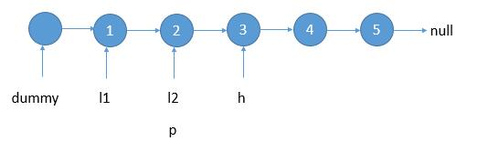
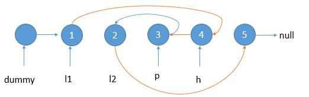

# 092. Reverse Linked List II\(M\)

[092. 反转链表 II](https://leetcode-cn.com/problems/reverse-linked-list-ii/)

## 题目描述\(中等\)

Reverse a linked list from position m to n. Do it in one-pass.

**Note**: 1 ≤ m ≤ n ≤ length of list.

Example:

```
Input: 1->2->3->4->5->NULL, m = 2, n = 4
Output: 1->4->3->2->5->NULL
```

## 思路

## 解决方法

### 迭代倒序

首先找到 m 的位置，记录两端的节点 left \(l1\) 和 right\(l2\)  
倒序 m 到 n 之间的节点



倒转链表，将 h 的 next 指向 p，并且后移 p 和 h。



```java
    public ListNode reverseBetween(ListNode head, int m, int n) {
        if (head == null || head.next == null) {
            return head;
        }
        ListNode start = new ListNode(0);
        start.next = head;
        ListNode left = start;
        for (int i = 1; i < m; i++) {
            left = left.next;
        }
        ListNode cur = left.next;
        ListNode right = cur;
        ListNode pre = null;
        ListNode next = null;
        for (int i = m; i <= n; i++) {
            next = cur.next;
            cur.next = pre;
            pre = cur;
            cur = next;
        }
        right.next = next;
        left.next = pre;
        return start.next;
    }
```

时间复杂度：O(n)
空间复杂度：O(1)


