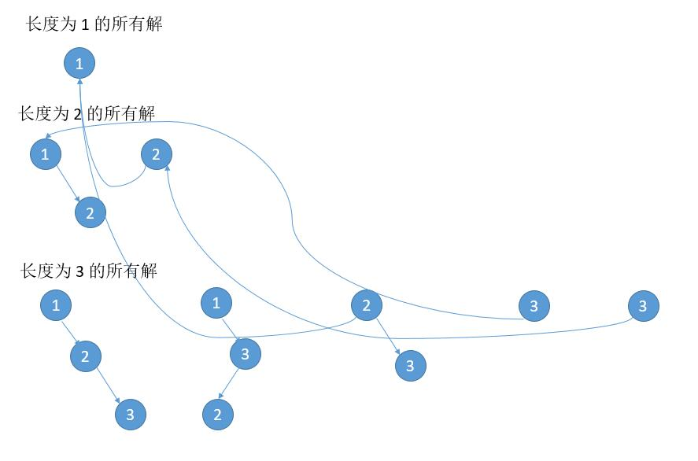

# 095. Unique Binary Search Trees II\(M\)

[095. 不同的二叉搜索树 II](https://leetcode-cn.com/problems/unique-binary-search-trees-ii/)

## 题目描述\(中等\)

Given an integer n, generate all structurally unique BST's \(binary search trees\) that store values 1 ... n.

Example:

```
Input: 3
Output:
[
  [1,null,3,2],
  [3,2,null,1],
  [3,1,null,null,2],
  [2,1,3],
  [1,null,2,null,3]
]
Explanation:
The above output corresponds to the 5 unique BST's shown below:

   1         3     3      2      1
    \       /     /      / \      \
     3     2     1      1   3      2
    /     /       \                 \
   2     1         2                 3
```

## 思路

* 递归分治

* 动态规划

## 解决方法

### 递归分治

```java
    public List<TreeNode> generateTrees(int n) {
        List<TreeNode> list = new ArrayList<>();
        if (n == 0) {
            return list;
        }
        return generateTrees(1, n);
    }

    private List<TreeNode> generateTrees(int start, int end) {
        List<TreeNode> list = new ArrayList<>();
        if (start > end) {
            list.add(null);
            return list;
        }
        if (start == end) {
            TreeNode t = new TreeNode(start);
            list.add(t);
            return list;
        }
        for (int i = start; i <= end; i++) {
            List<TreeNode> leftList = generateTrees(start, i - 1);
            List<TreeNode> rightList = generateTrees(i + 1, end);
            for (TreeNode leftTree : leftList) {
                for (TreeNode rightTree : rightList) {
                    TreeNode r = new TreeNode(i);
                    r.left = leftTree;
                    r.right = rightTree;
                    list.add(r);
                }
            }

        }
        return list;
    }
```

### 动态规划

是求出长度为 1 的所有可能，长度为 2 的所有可能 ... 直到 n。

仔细观察，我们可以发现长度是为 2 的所有可能其实只有两种结构。

```
  x  
 /    
y

y
 \
  x
```

看之前推导的 \[ 1 2 \] 和 \[ 2 3 \]，只是数字不一样，结构是完全一样的。

```
[ 1 2 ]
  1  
   \    
    2
   2
  /
 1

[ 2 3 ]
  2  
   \    
    3
   3
  /
 2
```

n = 100 的时候，求长度是 2 的所有情况的时候，我们没必要把 \[ 1 2 \] ， \[ 2 3 \] ， \[ 3 4 \] ... \[ 99 100 \] 所有的情况都求出来，只需要求出 \[ 1 2 \] 的所有情况即可。  
但 \[ 99 100 \] 怎么办呢？只求了 \[ 1 2 \] 的所有情况。答案很明显了，在 \[ 1 2 \] 的所有情况每个数字加一个偏差 98，即加上根节点的值就可以了。

```
[ 1 2 ]
  1  
   \    
    2
   2
  /
 1

[ 99 100 ]
  1 + 98
   \    
    2 + 98
   2 + 98
  /
 1 + 98

即
  99  
   \    
    100
   100
  /
 99
```

需要一个函数，实现树的复制并且加上偏差。

```java
    public List<TreeNode> generateTrees1(int n) {
        List<TreeNode>[] dp = new ArrayList[n + 1];
        dp[0] = new ArrayList<>();
        if (n == 0) {
            return dp[0];
        }
        dp[0].add(null);
        for (int len = 1; len <= n; len++) {
            dp[len] = new ArrayList<>();
            for (int root = 1; root <= len; root++) {
                int leftLen = root - 1;
                int rightLen = len - root;
                for (TreeNode l : dp[leftLen]) {
                    for (TreeNode r : dp[rightLen]) {
                        TreeNode treeNode = new TreeNode(root);
                        treeNode.left = l;
                        treeNode.right = clone(r, root);
                        dp[len].add(treeNode);
                    }
                }

            }
        }
        return dp[n];
    }

    private TreeNode clone(TreeNode t, int offset) {
        if (t == null) {
            return null;
        }
        TreeNode root = new TreeNode(t.val + offset);
        root.left = clone(t.left, offset);
        root.right = clone(t.right, offset);
        return root;
    }
```
值得注意的是，所有的左子树没有 clone ，也就是很多子树被共享了，在内存中就会是下边的样子。


### 动态规划空间优化

```
考虑 [] 的所有解
null

考虑 [ 1 ] 的所有解
1

考虑 [ 1 2 ] 的所有解
  2
 /
1

 1
  \
   2

考虑 [ 1 2 3 ] 的所有解
    3
   /
  2
 /
1

   2
  / \
 1   3

   3
  /
 1
  \
   2

   1
     \
      3
     /
    2

  1
    \
     2
      \
       3

```

仔细分析，可以发现一个规律。首先每次新增加的数字大于之前的所有数字，所以新增加的数字出现的位置只可能是根节点或者是根节点的右孩子，右孩子的右孩子，右孩子的右孩子的右孩子等等，总之一定是右边。其次，新数字所在位置原来的子树，改为当前插入数字的左孩子即可，因为插入数字是最大的。

```
对于下边的解 
  2
 /
1

然后增加 3
1.把 3 放到根节点
    3
   /
  2
 /
1

2. 把 3 放到根节点的右孩子
   2
  / \
 1   3

对于下边的解
 1
  \
   2

然后增加 3
1.把 3 放到根节点
    3
   /
  1
   \
    2

2. 把 3 放到根节点的右孩子，原来的子树作为 3 的左孩子       
      1
        \
         3
        /
      2

3. 把 3 放到根节点的右孩子的右孩子
  1
    \
     2
      \
       3

```
以上就是根据 [ 1 2 ] 推出 [ 1 2 3 ] 的所有过程。由于求当前的所有解只需要上一次的解，所有只需要两个 list，pre 保存上一次的所有解， cur 计算当前的所有解。

```java
    public List<TreeNode> generateTrees2(int n) {
        List<TreeNode> pre = new ArrayList<>();
        if (n == 0) {
            return pre;
        }
        pre.add(null);
        for (int i = 1; i <= n; i++) {
            List<TreeNode> cur = new ArrayList<>();
            //遍历之前的所有解
            for (TreeNode preNode : pre) {
                TreeNode maxNode = new TreeNode(i);
                //插入到根节点
                maxNode.left = preNode;
                cur.add(maxNode);
                for (int j = 0; j < pre.size(); j++) {
                    TreeNode preRoot = clone(preNode, 0);
                    TreeNode right = preRoot;
                    int k = 0;
                    //遍历 j 次找右孩子
                    while (right != null && k++ < j) {
                        right = right.right;
                    }
                    if (right == null) {
                        break;
                    }
                    //保存当前右孩子的位置的子树作为插入节点的左孩子
                    TreeNode rightNode = right.right;
                    maxNode = new TreeNode(i);
                    //右孩子是插入的节点
                    right.right = maxNode;
                    //插入节点的左孩子更新为插入位置之前的子树
                    maxNode.left = rightNode;
                    cur.add(preRoot);
                }
            }
            pre = cur;
        }
        return pre;
    }
```


