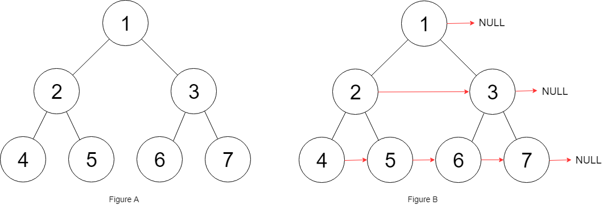
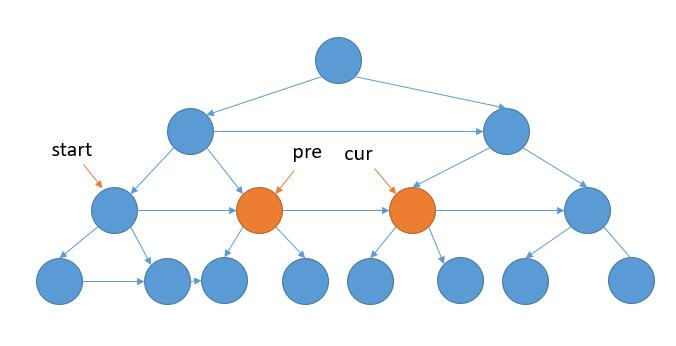
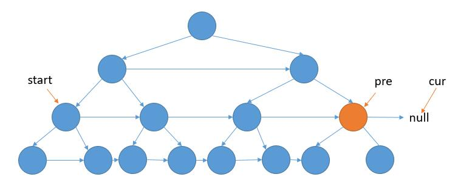

# 116. Populating Next Right Pointers in Each Node\(M\)

[116. 填充每个节点的下一个右侧节点指针](https://leetcode-cn.com/problems/populating-next-right-pointers-in-each-node/)

## 题目描述\(中等\)

You are given a perfect binary tree where all leaves are on the same level, and every parent has two children. The binary tree has the following definition:

```
struct Node {  
  int val;  
  Node *left;  
  Node *right;  
  Node *next;  
}
```

Populate each next pointer to point to its next right node. If there is no next right node, the next pointer should be set to NULL.

Initially, all next pointers are set to NULL.

Example:  


**Note**:

* You may only use constant extra space.
* Recursive approach is fine, implicit stack space does not count as extra space for this problem.

## 思路

## 解决方法

### 递归

对根节点的左右子树连接，并将右子树next连接根节点的next的左子树(由于完美二叉树父节点的兄弟节点是完备的
)

```java
    public Node connect(Node root) {
        if (root == null) {
            return root;
        }
        if (root.left != null) {
            root.left.next = root.right;
            if (root.next != null) {
                root.right.next = root.next.left;
            }
        }
        //左右子树构建顺序都可以，由于完美二叉树父节点的兄弟节点是完备的
        connect(root.left);
        connect(root.right);
        return root;
    }
```

### BFS
队列将每层节点存储并连接

```java
    public Node connect1(Node root) {
        if (root == null) {
            return root;
        }
        Queue<Node> queue = new LinkedList<>();
        queue.add(root);
        while (!queue.isEmpty()) {
            Node pre = null;
            int size = queue.size();
            for (int i = 0; i < size; i++) {
                Node p = queue.poll();
                if (pre != null) {
                    pre.next = p;
                }
                if (p.left != null) {
                    queue.add(p.left);
                }
                if (p.right != null) {
                    queue.add(p.right);
                }
                pre = p;
            }
        }
        return root;
    }
```

### 迭代

- 每一层怎么遍历？

    之前是用队列将下一层的节点保存了起来。
    
    这里的话，其实只需要提前把下一层的next构造完成，到了下一层的时候就可以遍历了。

- 什么时候进入下一层？

    之前是得到当前队列的元素个数，然后遍历那么多次。
    
    这里的话，注意到最右边的节点的next为null，所以可以判断当前遍历的节点是不是null。

- 怎么得到每层开头节点？

    之前队列把当前层的所以节点存了起来，得到开头节点当然很容易。
    
    这里的话，额外需要一个变量把它存起来。



如上图，我们需要把 pre 的左孩子的 next 指向右孩子，pre 的右孩子的next指向cur的左孩子。




如上图，当 cur 指向 null 以后，我们只需要把 pre 的左孩子的 next 指向右孩子。
```java
    public Node connect2(Node root) {
        if (root == null) {
            return root;
        }
        Node start = root;
        Node cur = null;
        while (start.left != null) {
            cur = start;
            while (cur != null) {
                cur.left.next = cur.right;
                if (cur.next != null) {
                    cur.right.next = cur.next.left;
                }
                cur = cur.next;
            }
            start = start.left;
        }
        return root;
    }
```

### dummy节点

```java
    public Node connect3(Node root) {
        Node cur = root;
        while (cur != null) {
            Node dummy = new Node();
            Node tail = dummy;
            //遍历 cur 的当前层
            while (cur != null) {
                if (cur.left != null) {
                    tail.next = cur.left;
                    tail = tail.next;
                }
                if (cur.right != null) {
                    tail.next = cur.right;
                    tail = tail.next;
                }
                cur = cur.next;
            }
            //更新 cur 到下一层
            cur = dummy.next;
        }
        return root;
    }
```


