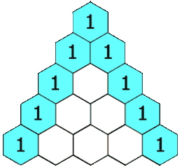

# 118. Pascal's Triangle(E)
[118. Pascal's Triangle](https://leetcode-cn.com/problems/pascals-triangle/)

## 题目描述\(简单\)

Given a non-negative integer numRows, generate the first numRows of Pascal's triangle.



In Pascal's triangle, each number is the sum of the two numbers directly above it.

Example:

```
Input: 5
Output:
[
     [1],
    [1,1],
   [1,2,1],
  [1,3,3,1],
 [1,4,6,4,1]
]
```

## 思路
动态规划
根据上一行计算当前行

## 解决方法

### 动态规划


```java 
    public List<List<Integer>> generate(int numRows) {
        List<List<Integer>> lists = new ArrayList<>();
        if(numRows == 0) {return lists;}
        lists.add(Arrays.asList(1));
        for(int i=1;i<numRows;i++) {
        	List<Integer> preLine = lists.get(i-1);
        	Integer[] line = new Integer[i+1];
        	line[0] = 1;
        	line[line.length-1] = 1;
        	for(int j=1;j<i;j++) {
        		line[j] = preLine.get(j-1)+preLine.get(j);
        	}
        	lists.add(Arrays.asList(line));
        }
        return lists;
    }
```
时间复杂度：$$O(numRows^2)$$
空间复杂度：$$O(numRows^2)$$


