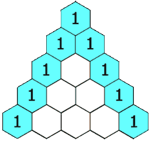

## [119. Pascal's Triangle II](https://leetcode-cn.com/problems/pascals-triangle-ii/)

## 题目描述\(简单\)

Given a non-negative index k where k ≤ 33, return the kth index row of the Pascal's triangle.

**Note **that the row index starts from 0.



In Pascal's triangle, each number is the sum of the two numbers directly above it.

Example:

```
Input: 3
Output: [1,3,3,1]
```

Follow up:

> Could you optimize your algorithm to use only O\(k\) extra space?

## 思路

1. 每行正向遍历，根据上一行计算该行数据
2. 每行逆向遍历，当前行即可作为上一行
3. 公式法

## 解决方法

### 行内正向遍历

```java
    public List<Integer> getRow(int rowIndex) {
        if (rowIndex == 0) {
            return new ArrayList<>(Arrays.asList(1));
        }
        //if(rowIndex==1) {return new ArrayList<>(Arrays.asList(1,1));}
        List<Integer> row = null;
        List<Integer> preLine = new ArrayList<>(Arrays.asList(1));
        for (int i = 1; i <= rowIndex; i++) {
            row = new ArrayList<>();
            row.add(1);
            for (int j = 1; j < i; j++) {
                row.add(preLine.get(j - 1) + preLine.get(j));
            }
            row.add(1);
            preLine = row;
        }
        return row;
    }
```

时间复杂度 $O(n^2)$  
空间复杂度 O\(n\)

```java
    public List<Integer> getRow0(int rowIndex) {
        if (rowIndex == 0) {
            return new ArrayList<>(Arrays.asList(1));
        }
        Integer[] line = new Integer[rowIndex + 1];
        line[0] = 1;
        for (int i = 1; i <= rowIndex; i++) {
            int pre = line[0];
            for (int j = 1; j < i; j++) {
                int tmp = line[j];
                line[j] = line[j] + pre;
                pre = tmp;
            }
            line[i] = 1;
        }
        return new ArrayList<>(Arrays.asList(line));
    }
```

时间复杂度 $O(n^2)$  
空间复杂度 O\(n\)

### 行内逆向遍历

每行首尾为1，自后向前计算该位置数值，覆盖已不再使用的位置的数据

倒着进行，这样就不会存在覆盖的情况了。

因为更新完j的信息后，虽然把j之前的信息覆盖掉了。但是下一次我们更新的是j - 1，需要的是j - 1和j - 2 的信息，j信息覆盖就不会造成影响了

```java
    public List<Integer> getRow1(int rowIndex) {
        if (rowIndex == 0) {
            return new ArrayList<>(Arrays.asList(1));
        }
        Integer[] line = new Integer[rowIndex + 1];
        line[0] = 1;
        for (int i = 1; i <= rowIndex; i++) {
            for (int j = i - 1; j >= 1; j--) {
                line[j] = line[j] + line[j - 1];
            }
            line[i] = 1;
        }
        List<Integer> row = new ArrayList<>(Arrays.asList(line));
        return row;
    }
```

时间复杂度 $O(n^2)$  
空间复杂度 O\(n\)

### 公式法
杨辉三角其实可以看做由组合数构成


$$ C_n^k = n!/(k!(n-k)!) = (n*(n-1)*(n-2)*...(n-k+1))/k! $$

$$ C_n^k = C_n^{k-1} * (n-k+1)/k $$

```java
    public List<Integer> getRow2(int rowIndex) {
        List<Integer> row = new ArrayList<>();
        int N = rowIndex;
        long pre = 1;
        row.add(1);
        for (int k = 1; k <= N; k++) {
            long cur = pre * (N - k + 1) / k;
            row.add((int) cur);
            pre = cur;
        }
        return row;
    }
```


