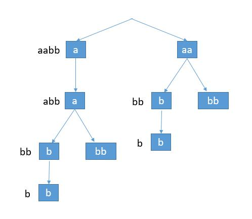

# 131. Palindrome Partitioning\(M\)

[131. 分割回文串](https://leetcode-cn.com/problems/palindrome-partitioning/)

## 题目描述\(中等\)

Given a string s, partition s such that every substring of the partition is a palindrome.

Return all possible palindrome partitioning of s.

Example:

```
Input: "aab"
Output:
[
  ["aa","b"],
  ["a","a","b"]
]
```

## 思路

* 分治
* 回溯

## 解决方法

### 分治

```
aabb
先考虑在第 1 个位置切割，a | abb
这样我们只需要知道 abb 的所有结果，然后在所有结果的头部把 a 加入
abb 的所有结果就是 [a b b] [a bb]
每个结果头部加入 a，就是 [a a b b] [a a bb]

aabb
再考虑在第 2 个位置切割，aa | bb
这样我们只需要知道 bb 的所有结果，然后在所有结果的头部把 aa 加入
bb 的所有结果就是 [b b] [bb]
每个结果头部加入 aa,就是 [aa b b] [aa bb]

aabb
再考虑在第 3 个位置切割，aab|b
因为 aab 不是回文串，所有直接跳过

aabb
再考虑在第 4 个位置切割，aabb |
因为 aabb 不是回文串，所有直接跳过

最后所有的结果就是所有的加起来
[a a b b] [a a bb] [aa b b] [aa bb]
```

```java
    public List<List<String>> partition(String s) {
        return conquer(s);
    }

    public List<List<String>> conquer(String s) {
        List<List<String>> listList = new ArrayList<>();
        if (s.length() == 0) {
            listList.add(new ArrayList<>());
            return listList;
        }
        if (s.length() == 1) {
            listList.add(new ArrayList<>(Arrays.asList(s)));
            return listList;
        }
        for (int i = 0; i < s.length(); i++) {
            String leftStr = s.substring(0, i + 1);
            if (!isPalindrome(leftStr)) {
                continue;
            }
            String rightStr = s.substring(i + 1);
            for (List<String> list : conquer(rightStr)) {
                list.add(0, leftStr);
                listList.add(list);
            }
        }
        return listList;
    }

    private boolean isPalindrome(String s) {
        int i = 0;
        int j = s.length() - 1;
        while (i < j) {
            if (s.charAt(i) != s.charAt(j)) {
                return false;
            }
            i++;
            j--;
        }
        return true;
    }
```

### 动态规划 + 分治

用 dp\[ i \]\[ j \] 表示 s\[ i, j \] 是否是回文串。

然后有 dp\[ i \]\[ j \] = s\[ i \] == s\[ j \] && dp\[ i + 1 \]\[ j - 1 \] 。

```java
    public List<List<String>> partition1(String s) {
        int len = s.length();
        boolean[][] dp = new boolean[len][len];
        for (int l = 1; l <= len; l++) {
            for (int i = 0; i <= len - l; i++) {
                int j = i + l - 1;
                dp[i][j] = s.charAt(i) == s.charAt(j) && (l < 3 || dp[i + 1][j - 1]);
            }
        }
        return conquer1(s, 0, dp);
    }

    public List<List<String>> conquer1(String s, int start, boolean[][] dp) {
        List<List<String>> listList = new ArrayList<>();
        if (start == s.length()) {
            listList.add(new ArrayList<>());
            return listList;
        }
        for (int i = start; i < s.length(); i++) {
            if (!dp[start][i]) {
                continue;
            }
            String leftStr = s.substring(start, i + 1);
            for (List<String> list : conquer1(s, i + 1, dp)) {
                list.add(0, leftStr);
                listList.add(list);
            }
        }
        return listList;
    }
```

### 回溯 DFS

```
aabb
先考虑在第 1 个位置切割，a | abb
把 a 加入到结果中 [a]

然后考虑 abb
先考虑在第 1 个位置切割，a | bb
把 a  加入到结果中 [a a]

然后考虑 bb
先考虑在第 1 个位置切割，b | b
把 b 加入到结果中 [a a b] 

然后考虑 b
先考虑在第 1 个位置切割，b | 
把 b 加入到结果中 [a a b b] 

然后考虑空串
把结果加到最终结果中 [[a a b b]]

回溯到上一层 
考虑 bb
考虑在第 2 个位置切割，bb |
把 bb 加入到结果中 [a a bb] 

然后考虑 空串
把结果加到最终结果中 [[a a b b] [a a bb]]

然后继续回溯
```





```java
    public List<List<String>> partition2(String s) {
        int len = s.length();
        boolean[][] dp = new boolean[len][len];
        for (int l = 1; l <= len; l++) {
            for (int i = 0; i <= len - l; i++) {
                int j = i + l - 1;
                dp[i][j] = s.charAt(i) == s.charAt(j) && (l < 3 || dp[i + 1][j - 1]);
            }
        }
        List<List<String>> listList = new ArrayList<>();
        backtrack(s, 0, listList, new ArrayList<>(), dp);
        return listList;
    }

    public void backtrack(String s, int start, List<List<String>> listList, List<String> list, boolean[][] dp) {
        if (start == s.length()) {
            listList.add(new ArrayList<>(list));
            return;
        }
        for (int i = start; i < s.length(); i++) {
            if (dp[start][i]) {
                list.add(s.substring(start, i + 1));
                backtrack(s, i + 1, listList, list, dp);
                list.remove(list.size() - 1);
            }
        }
    }
```


