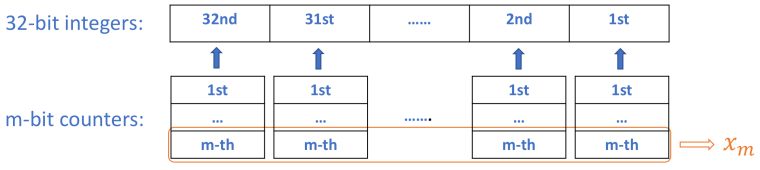

# 137. Single Number II\(M\)

[137. 只出现一次的数字 II](https://leetcode-cn.com/problems/single-number-ii/)

## 题目描述\(中等\)

Given a **non-empty** array of integers, every element appears three times except for one, which appears exactly once. Find that single one.

**Note**:

Your algorithm should have a linear runtime complexity. Could you implement it without using extra memory?

Example 1:

```
Input: [2,2,3,2]
Output: 3
```

Example 2:

```
Input: [0,1,0,1,0,1,99]
Output: 99
```

## 思路

* 排序
* 计数
* 位运算

## 解决方法

### 排序

```java
    public int singleNumber(int[] nums) {
        Arrays.sort(nums);
        for (int i = 0; i < nums.length; i++) {
            if (i + 1 < nums.length && nums[i] == nums[i + 1]) {
                while (i + 1 < nums.length && nums[i] == nums[i + 1]) {
                    i++;
                }
            } else {
                return nums[i];
            }
        }
        return 0;
    }
```

时间复杂度：O\(n\*log\(n\)\)。

空间复杂度：O\(1\)。

### 计数

```java
    public int singleNumber1(int[] nums) {
        Map<Integer, Integer> map = new HashMap<>();
        for (int n : nums) {
            Integer count = map.get(n);
            count = count == null ? 1 : count + 1;
            map.put(n, count);
        }
        for (Integer n : map.keySet()) {
            if (map.get(n) == 1) {
                return n;
            }
        }
        return 0;
    }
```

时间复杂度：O\(n\)。

空间复杂度：O\(n\)。

### 位运算

```
假如例子是 1 2 6 1 1 2 2 3 3 3, 3 个 1, 3 个 2, 3 个 3,1 个 6
1     0 0 1
2     0 1 0 
6     1 1 0 
1     0 0 1
1     0 0 1
2     0 1 0
2     0 1 0
3     0 1 1  
3     0 1 1
3     0 1 1      
最右边的一列 1001100111 有 6 个 1
再往前看一列 0110011111 有 7 个 1
再往前看一列 0010000 有 1 个 1
我们只需要把是 3 的倍数的对应列写 0，不是 3 的倍数的对应列写 1    
也就是 1 1 0,也就是 6。
```

如果所有数字都出现了 3 次，那么每一列的 1 的个数就一定是 3 的倍数。之所以有的列不是 3 的倍数，就是因为只出现了 1 次的数贡献出了 1。所以所有不是 3 的倍数的列写 1，其他列写 0 ，就找到了这个出现 1 次的数。

```java
    public int singleNumber2(int[] nums) {
        int single = 0;
        //考虑每一位
        for (int i = 0; i < 32; i++) {
            int count = 0;
            //考虑每一个数
            for (int j = 0; j < nums.length; j++) {
                //当前位是否是 1
                if ((nums[j] >>> i & 1) == 1) {
                    count++;
                }
            }
            //1 的个数是否是 3 的倍数
            if (count % 3 != 0) {
                single = single | 1 << i;
            }
        }
        return single;
    }
```

时间复杂度：O\(n\)。

空间复杂度：O\(1\)。

### 位运算 通解

#### 通用方法

[参考](https://leetcode.com/problems/single-number-ii/discuss/43295/Detailed-explanation-and-generalization-of-the-bitwise-operation-method-for-single-numbers)

**问题**  
给一个数组，每个元素都出现 k \( k &gt; 1\) 次，除了一个数字只出现 p 次\(p &gt;= 1, p % k !=0\)，找到出现 p 次的那个数。  
**特化到1bit数字**

为了计数 k 次，我们必须要 m 个比特，其中 $$ 2^m >=k $$，也就是 $$ m >= logk $$。

假设我们 m 个比特依次是 $$ x_mx_{m-1}...x_2x_1 $$

开始全部初始化为 0。    即 00...00

然后扫描所有数字的当前 bit 位，用 i 表示当前的 bit。

初始状态 00...00。

第一次遇到 1 , m 个比特依次是 00...01。

第二次遇到 1 , m 个比特依次是 00...10。

第三次遇到 1 , m 个比特依次是 00...11。

第四次遇到 1 , m 个比特依次是 00..100。

x1 的变化规律就是遇到 1 变成 1 ，再遇到 1 变回 0。遇到 0 的话就不变。

所以 x1 = x1 ^ i，可以用异或来求出 x1 。

x2 的话，当遇到 1 的时候，如果之前 x1 是 0，x2 就不变。如果之前 x1 是 1，对应于上边的第二次遇到 1 和第四次遇到 1。 x2 从 0 变成 1 和 从 1 变成 0。  
所以 x2 的变化规律就是遇到 1 同时 x1 是 1 就变成 1，再遇到 1 同时 x1 是 1 就变回 0。遇到 0 的话就不变。和 x1 的变化规律很像，所以同样可以使用异或。

x2 = x2 ^ \(i & x1\)，多判断了 x1 是不是 1。

假设我们的 k = 3，那么我们应该在 10 之后就变成 00，而不是到 11。

所以我们需要一个 mask ，当没有到达 k 的时候和 mask进行与操作是它本身，当到达 k 的时候和 mask 相与就回到 00...000。

根据上边的要求构造 mask，假设 k 写成二进制以后是 $$ k_m...k_2k_1 $$。

mask = $$ ~(y_1 \& y_2 \& ... \& y_m) $$,

如果 $$k_j = 1$$，那么$$y_j = x_j$$

如果 $$k_j = 0$$，那么$$y_j = ~x_j$$

算法框架如下

```
for (int i : nums) {
    xm ^= (xm-1 & ... & x1 & i);
    xm-1 ^= (xm-2 & ... & x1 & i);
    .....
    x1 ^= i;

    mask = ~(y1 & y2 & ... & ym) where yj = xj if kj = 1, and yj = ~xj if kj = 0 (j = 1 to m).

    xm &= mask;
    ......
    x1 &= mask;
}
```

**泛化到32bit数字**

现在该将我们的结果从1位数字大小写转换为32位整数了，一种简单的方法是32为整数中的每个位创建计数器，利用按位运算的优势，能够集中管理所有计数器，集中是指使用m个32位整数而不是32个m位计数器，其中$$ m >= logk $$。原因是按位运算仅适用于每个位，因此对不同位的运算彼此独立



最上面的行是32位整数，其中每个位都有一个对应的m位计数器(由向上箭头下方的列显示)。由于对每个位的按位操作是彼此32独立的，因此我们可以将所有计数器的位组合为一个32位数字(由橙色框显示)。此32位数字中的所有位(表示为xm)将遵循相同的按位运算。由于每个计数器都有m位，所以我们最终得到m个32位数字，该数字对应于part II中定义的数字x1, ..., xm，但是现在它们是32位整数而不是1位数字。因此，在上面开发的算法，我们只是需要把x1到xm为32位整数，而不是1位数字。其他一切都将相同。

**返回什么**

x1...xm 应该返回哪个？理解m个32-bit整数代表的意义，x1为例，x1有32bits，标记为r(1..32)，在扫描完输入数组后，x1的r-th代表所有元素的r-th中1的个数(所有元素r-th中1的个数为q，则r-th为q%k)

如果 p = 1，那么如果出现一次的数字的某一位是 1 ，一定会使得 x1 ，也就是计数的最低位置的对应位为 1，所以我们把 x1 返回即可。对于上边的例子，就是 110 ，所以返回 6。

如果 p = 2，二进制就是 10，那么如果出现 2次的数字的某一位是 1 ，一定会使得 x2 的对应位变为 1，所以我们把 x2 返回即可。

如果 p = 3，二进制就是 11，那么如果出现 3次的数字的某一位是 1 ，一定会使得 x1 和x2的对应位都变为1，所以我们把 x1 或者 x2 返回即可。

**快速示例**

```java
1. k = 2, p = 1
    //k是2，则m = 1我们只需要一个32位整数（x1）作为计数器。而且2^m = k，所以我们甚至不需要一个mask
    public int singleNumber(int[] nums) {
        int x1 = 0;
         
        for (int i : nums) {
            x1 ^= i;
        }
         
        return x1;
    }
 2. k = 3, p = 1   
    //k是3,那么m = 2,需要两个32位integers（x2，x1）作为计数器。而且2^m > k，这样我们就需要一个mask。k = '11'，k1 = 1，k2 = 1，mask = ~(x1 & x2)
    public int singleNumber(int[] nums) {
        int x1 = 0, x2 = 0, mask = 0;
         
        for (int i : nums) {
            x2 ^= x1 & i;
            x1 ^= i;
            mask = ~(x1 & x2);
            x2 &= mask;
            x1 &= mask;
        }

        return x1;  
        // Since p = 1, in binary form p = '01', then p1 = 1, so we should return x1. 
        // If p = 2, in binary form p = '10', then p2 = 1, and we should return x2.
        // Or alternatively we can simply return (x1 | x2).
    }
3. k = 5, p = 3
    //k是5的话m = 3,需要3个32位整数（x3，x2，x1）作为计数器。k = '101'，k1 = 1，k2 = 0，k3 = 1，mask = ~(x1 & ~x2 & x3)
    public int singleNumber(int[] nums) {
        int x1 = 0, x2 = 0, x3  = 0, mask = 0;
   
        for (int i : nums) {
            x3 ^= x2 & x1 & i;
            x2 ^= x1 & i;
            x1 ^= i;
            mask = ~(x1 & ~x2 & x3);
            x3 &= mask;
            x2 &= mask;
            x1 &= mask;
        }
        
        return x1;  
        // Since p = 3, in binary form p = '011', then p1 = p2 = 1, so we can return either x1 or x2. 
        // If p = 4, in binary form p = '100', only p3 = 1, which implies we can only return x3.
        // Or alternatively we can simply return (x1 | x2 | x3).
    }

```

