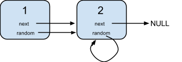
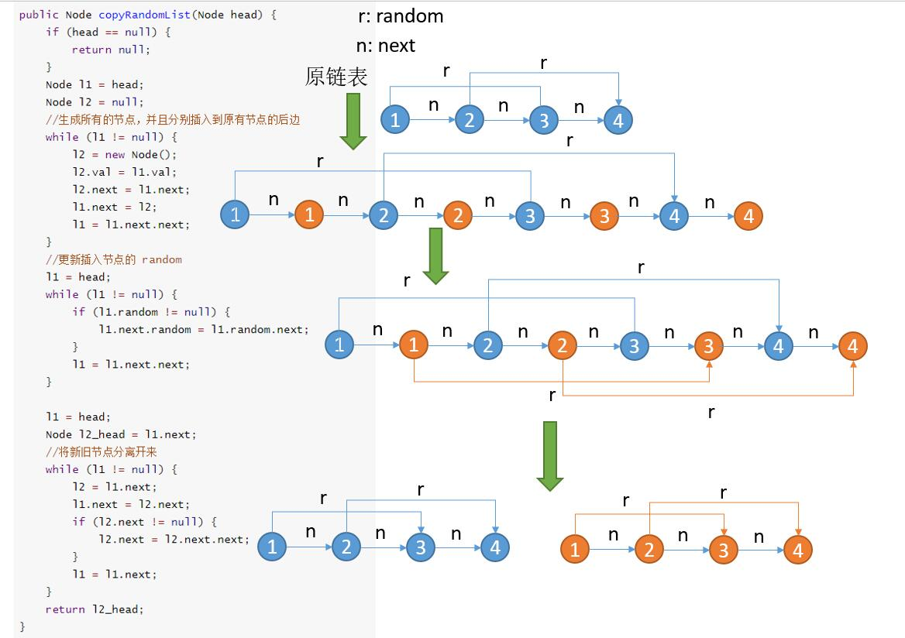
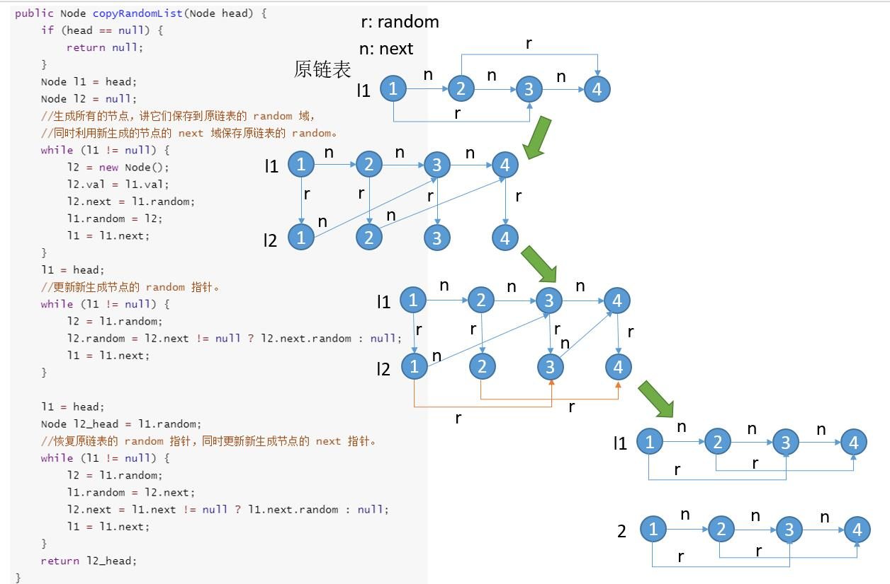

# 138. Copy List with Random Pointer\(M\)

## 题目描述\(中等\)

A linked list is given such that each node contains an additional random pointer which could point to any node in the list or null.

Return a deep copy of the list.



**Note**:

You must return the copy of the given head as a reference to the cloned list.

```java
class Node {
    public int val;
    public Node next;
    public Node random;

    public Node() {}

    public Node(int _val,Node _next,Node _random) {
        val = _val;
        next = _next;
        random = _random;
    }
}
```

## 思路

* 遍历生成同时进行
* 两次遍历 生成 设置
* 
## 解决方法

### 遍历生成 递归

原始图中的Node作为key,克隆生成的Node作为value

```java
public Node copyRandomList(Node head) {
        if (head == null) {
            return null;
        }
        Map<Node, Node> map = new HashMap<>();
        return copyRandomList(head, map);
    }

    public Node copyRandomList(Node head, Map<Node, Node> map) {
        if (head == null) {
            return null;
        }
        if (map.containsKey(head)) {
            return map.get(head);
        }

        Node newHead = new Node(head.val, null, null);
        map.put(head, newHead);
        newHead.next = copyRandomList(head.next, map);
        newHead.random = copyRandomList(head.random, map);
        return newHead;
    }
```

```java
public Node copyRandomList0(Node head) {
        if (head == null) {
            return null;
        }
        Node newHead = new Node(head.val, null, null);
        Map<Node, Node> map = new HashMap<>();
        map.put(head, newHead);
        Node curNode = newHead;
        Node node;
        while (head != null) {
            curNode = map.get(head);
            Node next = head.next;
            Node random = head.random;
            if (next != null) {
                if (!map.containsKey(next)) {
                    node = new Node(next.val, null, null);
                    map.put(next, node);
                }
                curNode.next = map.get(next);
            }
            if (random != null) {
                if (!map.containsKey(random)) {
                    node = new Node(random.val, null, null);
                    map.put(random, node);
                }
                curNode.random = map.get(random);
            }
            head = next;
        }
        return newHead;
    }
```

### 两次遍历

遍历第一遍链表，我们不考虑链表之间的相互关系，仅仅生成所有节点，然后把它存到 HashMap 中，val 作为 key，Node 作为 value。

遍历第二遍链表，将之前生成的节点取出来，更新它们的 next 和 random 指针。

```java
    public Node copyRandomList4(Node head) {
        if (head == null) {
            return null;
        }
        HashMap<Integer, Node> map = new HashMap<>();
        Node h = head;
        //生成所有节点
        while (h != null) {
            Node node = new Node();
            node.val = h.val;
            map.put(node.val, node);
            h = h.next;
        }
        h = head;
        //更新 next 和 random
        while (h != null) {
            if (h.next != null) {
                map.get(h.val).next = map.get(h.next.val);
            }
            if (h.random != null) {
                map.get(h.val).random = map.get(h.random.val);
            }
            h = h.next;
        }
        return map.get(head.val);
    }
```

### 利用next域保存生成的结点

1. 生成所有的节点，并且分别插入到原有节点的后边
2. 更新插入节点的 random
3. 将新旧节点分离开来




```java
    public Node copyRandomList1(Node head) {
        if (head == null) {
            return null;
        }
        Node l1 = head;
        Node l2 = null;
        //生成所有的节点，并且分别插入到原有节点的后边
        while (l1 != null) {
            l2 = new Node();
            l2.val = l1.val;
            l2.next = l1.next;
            l1.next = l2;
            l1 = l1.next.next;
        }
        //更新插入节点的 random
        l1 = head;
        while (l1 != null) {
            if (l1.random != null) {
                l1.next.random = l1.random.next;
            }
            l1 = l1.next.next;
        }

        l1 = head;
        Node l2Head = l1.next;
        //将新旧节点分离开来
        while (l1 != null) {
            l2 = l1.next;
            l1.next = l2.next;
            if (l2.next != null) {
                l2.next = l2.next.next;
            }
            l1 = l1.next;
        }
        return l2Head;
    }
```

### 利用random域保存生成的结点

1. 生成所有的节点，将它们保存到原链表的 random 域，同时利用新生成的节点的 next 域保存原链表的 random。
2. 更新新生成节点的 random 指针。
3. 恢复原链表的 random 指针，同时更新新生成节点的 next 指针。




```java
    public Node copyRandomList3(Node head) {
        if (head == null) {
            return null;
        }
        Node l1 = head;
        Node l2 = null;
        //生成所有的节点，讲它们保存到原链表的 random 域，
        //同时利用新生成的节点的 next 域保存原链表的 random。
        while (l1 != null) {
            l2 = new Node();
            l2.val = l1.val;
            l2.next = l1.random;
            l1.random = l2;
            l1 = l1.next;
        }
        l1 = head;
        //更新新生成节点的 random 指针。
        while (l1 != null) {
            l2 = l1.random;
            l2.random = l2.next != null ? l2.next.random : null;
            l1 = l1.next;
        }

        l1 = head;
        Node l2Head = l1.random;
        //恢复原链表的 random 指针，同时更新新生成节点的 next 指针。
        while (l1 != null) {
            l2 = l1.random;
            l1.random = l2.next;
            l2.next = l1.next != null ? l1.next.random : null;
            l1 = l1.next;
        }
        return l2Head;
    }
```


