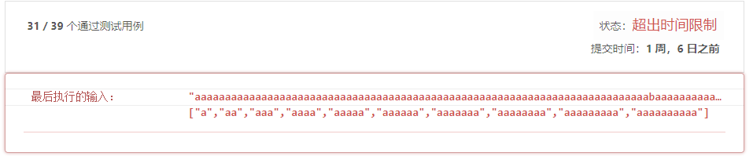

# 140. Word Break II\(H\)

[140. 单词拆分 II](https://leetcode-cn.com/problems/word-break-ii/)

## 题目描述\(困难\)

Given a **non-empty** string s and a dictionary wordDict containing a list of **non-empty** words, add spaces in s to construct a sentence where each word is a valid dictionary word. Return all such possible sentences.

**Note**:

* The same word in the dictionary may be reused multiple times in the segmentation.
* You may assume the dictionary does not contain duplicate words.

Example 1:

```
Input:
s = "catsanddog"
wordDict = ["cat", "cats", "and", "sand", "dog"]
Output:
[
  "cats and dog",
  "cat sand dog"
]
```

Example 2:

```
Input:
s = "pineapplepenapple"
wordDict = ["apple", "pen", "applepen", "pine", "pineapple"]
Output:
[
  "pine apple pen apple",
  "pineapple pen apple",
  "pine applepen apple"
]
Explanation: Note that you are allowed to reuse a dictionary word.
```

Example 3:

```
Input:
s = "catsandog"
wordDict = ["cats", "dog", "sand", "and", "cat"]
Output:
[]
```

## 思路

* 回溯
* 记忆化回溯
* 动态递归
* 动态递归+DFS

## 解决方法

### 回溯

```java
    public List<String> wordBreak(String s, List<String> wordDict) {
        return wordBreak(s, 0, new HashSet<>(wordDict));
    }

    public List<String> wordBreak(String s, int start, Set<String> wordSet) {
        List<String> list = new ArrayList<>();
        if (start == s.length()) {
            list.add("");
        }
        for (int end = start + 1; end <= s.length(); end++) {
            String prefix = s.substring(start, end);
            if (wordSet.contains(prefix)) {
                List<String> strs = wordBreak(s, end, wordSet);
                for (String str : strs) {
                    list.add(prefix + (str.equals("") ? "" : " ") + str);
                }
            }
        }
        return list;
    }
```

必然超时

时间复杂度：$O(n^n)$，考虑最坏情况 ss = "aaaaaaa"，s 的每一个前缀都在字典中，回溯树的大小会达到 $n^n$  
空间复杂度：O\(n^3\)，最坏情况下，回溯的深度可以达到 n 层，每层可能包含 n 个字符串，且每个字符串的长度都为 n 。

### 记忆化回溯

key 是当前考虑字符串的开始下标， value 包含了所有从key开始的所有可行句子。

```java
    public List<String> wordBreak1(String s, List<String> wordDict) {
        return wordBreak1(s, 0, new HashSet<>(wordDict), new HashMap<Integer, List<String>>());
    }

    public List<String> wordBreak1(String s, int start, Set<String> wordSet, Map<Integer, List<String>> map) {
        if (map.containsKey(start)) {
            return map.get(start);
        }
        List<String> list = new ArrayList<>();
        if (start == s.length()) {
            list.add("");
        }
        for (int end = start + 1; end <= s.length(); end++) {
            String prefix = s.substring(start, end);
            if (wordSet.contains(prefix)) {
                List<String> strs = wordBreak1(s, end, wordSet, map);
                for (String str : strs) {
                    list.add(prefix + (str.equals("") ? "" : " ") + str);
                }
            }
        }
        map.put(start, list);
        return list;
    }
```

另一种回溯记忆化思路

key 是当前考虑字符串的结束下标+1， value 包含了所有从头开始到key这个下标的的所有可行句子。

```java
    public List<String> wordBreak2(String s, List<String> wordDict) {
        return wordBreak2(s, s.length(), new HashSet<>(wordDict), new HashMap<Integer, List<String>>());
    }

    public List<String> wordBreak2(String s, int end, Set<String> wordSet, Map<Integer, List<String>> map) {
        if (map.containsKey(end)) {
            return map.get(end);
        }
        List<String> list = new ArrayList<>();
        if (end == 0) {
            return list;
        }
        for (int start = 0; start <= end; start++) {
            String posterfix = s.substring(start, end);
            if (wordSet.contains(posterfix)) {
                if (start == 0) {
                    list.add(posterfix);
                } else {
                    List<String> strs = wordBreak2(s, start, wordSet, map);
                    for (String str : strs) {
                        list.add(str + " " + posterfix);
                    }
                }
            }
        }
        map.put(end, list);
        return list;
    }
```

### 动态规划

dp\[k\] 被用来存储用 s\[0:k\) 可被拆分成合法单词的句子

我们以 i 为结尾表示的子字符串的所有前缀，通过指针 j 将 s 拆分成 s1'和 s2'

```java
    public List<String> wordBreak3(String s, List<String> wordDict) {
        int len = s.length();
        Set<String> wordSet = new HashSet<>(wordDict);
        List<String>[] dp = new ArrayList[len + 1];
        dp[0] = new ArrayList<>();
        dp[0].add("");
        for (int i = 1; i <= len; i++) {
            List<String> list = new ArrayList<>();
            for (int j = 0; j < i; j++) {
                String posterfix = s.substring(j, i);
                if (dp[j].size() > 0 && wordSet.contains(posterfix)) {
                    for (String str : dp[j]) {
                        list.add(str + (str.equals("") ? "" : " ") + posterfix);
                    }
                }
            }
            dp[i] = list;
        }
        return dp[len];
    }
```



超时，如图极端情况下

时间复杂度：O\(n^3\)，求 dp 需要两重循环，添加一个新的列表需要额外一重循环。

空间复杂度：O\(n^3\)，dp 数组的长度是n ，dp 数组里保存了数组，数组里是一些字符串，也就是每个 dp 元素需要 n^2的空间。

### 动态规划 + DFS

动态规划判断dp\[k\]是否为真，然后DFS找路径

```java
    public List<String> wordBreak4(String s, List<String> wordDict) {
        int len = s.length();
        Set<String> wordSet = new HashSet<>(wordDict);
        boolean[] dp = new boolean[len + 1];
        dp[0] = true;
        for (int i = 1; i <= len; i++) {
            for (int j = 0; j < i; j++) {
                if (dp[j] && wordSet.contains(s.substring(j, i))) {
                    dp[i] = true;
                    break;
                }
            }
        }
        List<String> list = new ArrayList<>();
        if (dp[len]) {
            Deque<String> queue = new LinkedList<>();
            dfs(list, s, len, wordSet, queue, dp);
        }
        return list;
    }

    private void dfs(List<String> list, String s, int end, Set<String> wordSet, Deque<String> queue, boolean[] dp) {
        if (end == 0) {
            StringBuilder sb = new StringBuilder();
            for (String word : queue) {
                sb.append(word);
                sb.append(" ");
            }
            sb.deleteCharAt(sb.length() - 1);
            list.add(sb.toString());
            return;
        }
        for (int i = 0; i < end; i++) {
            if (dp[i]) {
                String suffix = s.substring(i, end);
                if (wordSet.contains(suffix)) {
                    queue.addFirst(suffix);
                    dfs(list, s, i, wordSet, queue, dp);
                    queue.removeFirst();
                }
            }
        }
    }
```


