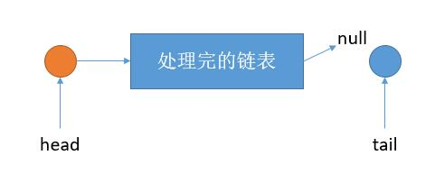
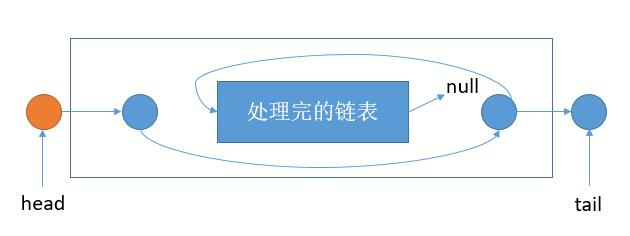

# 143. Reorder List\(M\)

## 题目描述\(中等\)

Given a singly linked list L: $$L_0 ->L_1->...->L_{n-1}->L_n$$,  
reorder it to: $$ L_0->L_n->L_1->L_{n-1}->L_2->L_{n-2}-... $$

You may not modify the values in the list's nodes, only nodes itself may be changed.

Example 1:

```
Given 1->2->3->4, reorder it to 1->4->2->3.
```

Example 2:

```
Given 1->2->3->4->5, reorder it to 1->5->2->4->3.
```

## 思路

* 存储
* 递归
* 拆半归并

## 解决方法

### 数组存储

```java
    public void reorderList(ListNode head) {
        if (head == null) {
            return;
        }
        List<ListNode> nodes = new ArrayList<>();
        while (head != null) {
            nodes.add(head);
            head = head.next;
        }
        int i = 0, j = nodes.size() - 1;
        for (; i < j; i++, j--) {
            ListNode n1 = nodes.get(i);
            ListNode n2 = nodes.get(j);
            n2.next = n1.next;
            n1.next = n2;
        }
        nodes.get(i).next = null;
    }
```

### 递归

归函数能够返回当前头元素对应的尾元素，并且将头元素和尾元素之间的链表按要求完成



如上图，只需要将 head 指向 tail，tail 指向处理完的链表头即可



然后把之前的 tail.next 返回就是外层 head 对应的 tail 了

```java
    public void reorderList1(ListNode head) {
        if (head == null) {
            return;
        }
        int len = 0;
        ListNode node = head;
        while (node != null) {
            len++;
            node = node.next;
        }
        reorderList(head, len);
    }

    public ListNode reorderList(ListNode head, int len) {
        if (len == 1) {
            ListNode next = head.next;
            head.next = null;
            return next;
        }
        if (len == 2) {
            ListNode next = head.next.next;
            head.next.next = null;
            return next;
        }
        ListNode tail = reorderList(head.next, len - 2);
        ListNode next = tail.next;
        tail.next = head.next;
        head.next = tail;
        return next;
    }
```


### 拆半依次归并
```
1 -> 2 -> 3 -> 4 -> 5 -> 6
第一步，将链表平均分成两半
1 -> 2 -> 3
4 -> 5 -> 6

第二步，将第二个链表逆序
1 -> 2 -> 3
6 -> 5 -> 4

第三步，依次连接两个链表
1 -> 6 -> 2 -> 5 -> 3 -> 4
```

1. 快慢指针找中点
2. 链表逆序
3. 链表连接

```java
    public void reorderList2(ListNode head) {
        if (head == null) {
            return;
        }
        ListNode slow = head, fast = head;
        while (fast.next != null && fast.next.next != null) {
            slow = slow.next;
            fast = fast.next.next;
        }
        ListNode newHead = slow.next;
        slow.next = null;
        newHead = reverseNode(newHead);
        ListNode first = head, second = newHead;
        ListNode temp1, temp2;
        while (second != null) {
            temp2 = second.next;
            second.next = first.next;
            first.next = second;
            first = second.next;
            second = temp2;
        }
    }

    public ListNode reverseNode(ListNode node) {
        ListNode cur = node;
        ListNode pre = null, next;
        while (cur != null) {
            next = cur.next;
            cur.next = pre;
            pre = cur;
            cur = next;
        }
        return pre;
    }
```


