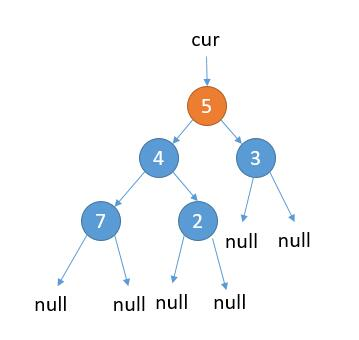
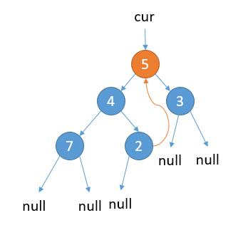
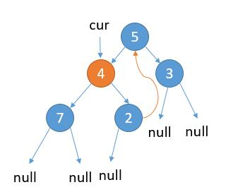
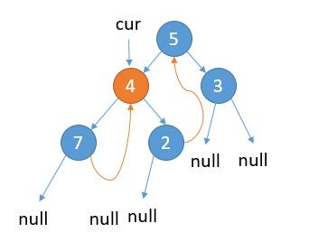
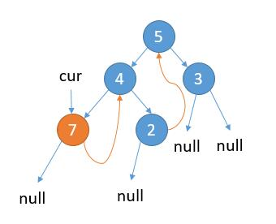
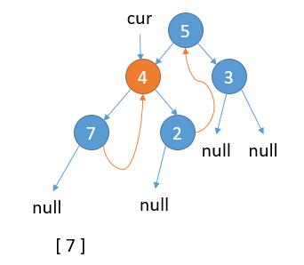
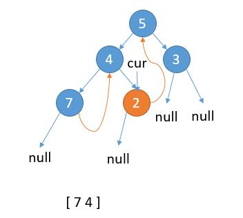
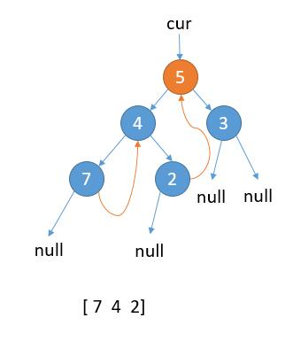
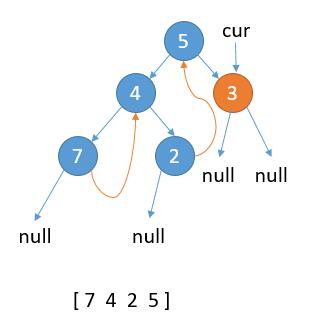
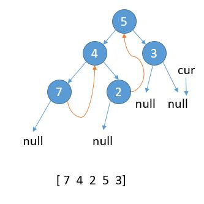

# 145. Binary Tree Postorder Traversal(H)


[145. 二叉树的后序遍历](https://leetcode-cn.com/problems/binary-tree-postorder-traversal/)


## 题目描述(困难)

Given a binary tree, return the postorder traversal of its nodes' values.

Example:
```
Input: [1,null,2,3]
   1
    \
     2
    /
   3

Output: [3,2,1]
Follow up: Recursive solution is trivial, could you do it iteratively?

```

## 思路

- 递归
- 迭代
- 转换为根右左的逆序
- Morris Traversal


## 解决方法


### 递归

```java
    public List<Integer> postorderTraversal(TreeNode root) {
        List<Integer> list = new ArrayList<>();
        postorder(list, root);
        return list;
    }

    public void postorder(List<Integer> list, TreeNode p) {
        if (p == null) {
            return;
        }
        postorder(list, p.left);
        postorder(list, p.right);
        list.add(p.val);
    }

```

### 迭代

通过记录上一次遍历的节点。

如果当前节点的右节点和上一次遍历的节点相同，那就表明当前是从右节点过来的了

```java
    public List<Integer> postorderTraversal1(TreeNode root) {
        List<Integer> list = new ArrayList<>();
        if (root == null) {
            return list;
        }
        Stack<TreeNode> stack = new Stack<>();
        TreeNode p = root;
        TreeNode preVisited = null;
        while (p != null || !stack.isEmpty()) {
            while (p != null) {
                stack.push(p);
                p = p.left;
            }
            p = stack.peek();
            if (p.right == null || preVisited == p.right) {
                preVisited = p;
                list.add(p.val);
                stack.pop();
                p = null;
            } else {
                p = p.right;
            }
        }
        return list;
    }
```


### 转换为根右左的逆序


模拟递归压栈出栈
```java
    //根右左的逆序
    public List<Integer> postorderTraversal2(TreeNode root) {
        List<Integer> list = new ArrayList<>();
        if (root == null) {
            return list;
        }
        Stack<TreeNode> stack = new Stack<>();
        stack.push(root);
        while (!stack.isEmpty()) {
            TreeNode p = stack.pop();
            list.add(p.val);
            if (p.left != null) {
                stack.push(p.left);
            }
            if (p.right != null) {
                stack.push(p.right);
            }
        }
        Collections.reverse(list);
        return list;
    }

```

访问根节点，右子树持续压栈，直到没有右子树出栈，访问左子树，最后访问List逆序

```java
    //根右左的逆序
    public List<Integer> postorderTraversal3(TreeNode root) {
        List<Integer> list = new ArrayList<>();
        if (root == null) {
            return list;
        }
        Stack<TreeNode> stack = new Stack<>();
        TreeNode p = root;
        while (p != null || !stack.isEmpty()) {
            while (p != null) {
                list.add(p.val);
                stack.push(p);
                p = p.right;
            }
            p = stack.pop();
            p = p.left;
        }
        Collections.reverse(list);
        return list;
    }
```

Morris Traversal 的逆序

```java
    public List<Integer> postorderTraversal4(TreeNode root) {
        List<Integer> list = new ArrayList<>();
        TreeNode cur = root;
        while (cur != null) {
            if (cur.right == null) {
                list.add(cur.val);
                cur = cur.left;
            } else {
                TreeNode pre = cur.right;
                while (pre.left != null && pre.left != cur) {
                    pre = pre.left;
                }
                if (pre.left == null) {
                    list.add(cur.val);
                    pre.left = cur;
                    cur = cur.right;
                }
                if (pre.left == cur) {
                    pre.left = null;
                    cur = cur.left;
                }
            }
        }
        Collections.reverse(list);
        return list;
    }
```


### Morris Traversal

左子树最后遍历的节点一定是一个叶子节点，它的左右孩子都是 null，我们把它右孩子指向当前根节点，这样的话我们就不需要额外空间了。这样做，遍历完当前左子树，就可以回到根节点了。

当然如果当前根节点左子树为空，那么我们只需要保存根节点的值，然后考虑右子树即可。

所以总体思想就是：记当前遍历的节点为 cur。

1. cur.left 为 null，保存 cur 的值，更新 cur = cur.right

2. cur.left 不为 null，找到 cur.left 这颗子树最右边的节点记做 last

- 2.1 last.right 为 null，那么将 last.right = cur，更新 cur = cur.left

- 2.2 last.right 不为 null，说明之前已经访问过，第二次来到这里，表明当前子树遍历完成，保存 cur 的值，更新 cur = cur.right


如上图，cur 指向根节点。 当前属于 2.1 的情况，cur.left 不为 null，cur 的左子树最右边的节点的右孩子为 null，那么我们把最右边的节点的右孩子指向 cur。

接着，更新 cur = cur.left。

如上图，当前属于 2.1 的情况，cur.left 不为 null，cur 的左子树最右边的节点的右孩子为 null，那么我们把最右边的节点的右孩子指向 cur。

更新 cur = cur.left。

如上图，当前属于情况 1，cur.left 为 null，保存 cur 的值，更新 cur = cur.right。

如上图，当前属于 2.2 的情况，cur.left 不为 null，cur 的左子树最右边的节点的右孩子已经指向 cur，保存 cur 的值，更新 cur = cur.right。

如上图，当前属于情况 1，cur.left 为 null，保存 cur 的值，更新 cur = cur.right。

如上图，当前属于 2.2 的情况，cur.left 不为 null，cur 的左子树最右边的节点的右孩子已经指向 cur，保存 cur 的值，更新 cur = cur.right。

当前属于情况 1，cur.left 为 null，保存 cur 的值，更新 cur = cur.right。

cur 指向 null，结束遍历。


```java
```


