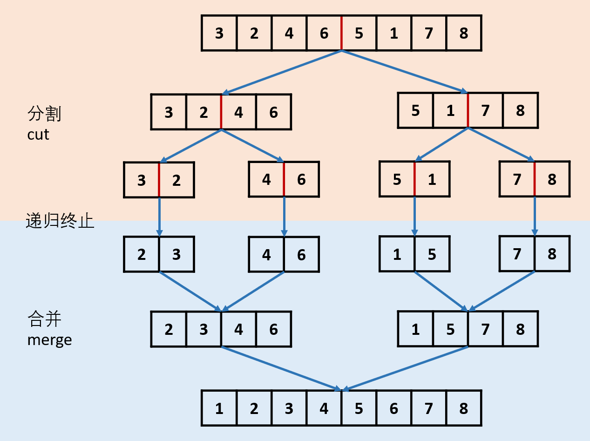
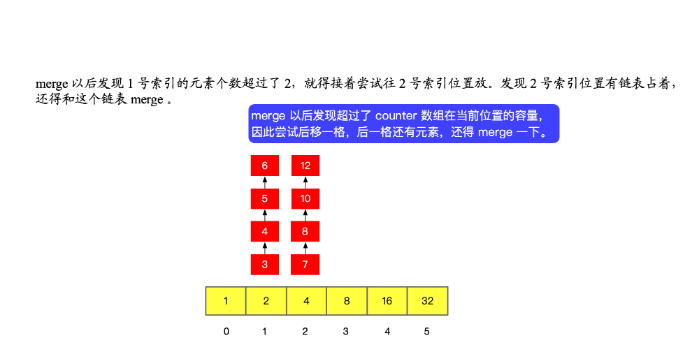

# 148. Sort List\(M\)

[148. 排序链表](https://leetcode-cn.com/problems/sort-list/)

## 题目描述\(中等\)

Sort a linked list in O\(n log n\) time using constant space complexity.

Example 1:

```
Input: 4->2->1->3
Output: 1->2->3->4
```

Example 2:

```
Input: -1->5->3->4->0
Output: -1->0->3->4->5
```

## 思路

* 插入排序
* 归并排序
* 自底向上归并排序

### 解决方法

### 插入排序

```java
    public ListNode sortList1(ListNode head) {
        ListNode dummy = new ListNode(0);
        dummy.next = head;
        ListNode cur = head, pre = dummy;
        ListNode next;
        while (cur != null) {
            next = cur.next;
            if (next != null && next.val < cur.val) {
                while (pre.next.val < next.val) {
                    pre = pre.next;
                }
                cur.next = next.next;
                next.next = pre.next;
                pre.next = next;
                pre = dummy;
            } else {
                cur = next;
            }
        }
        return dummy.next;
    }
```

时间复杂度：O\(n^2\)

### 归并排序 递归



链表快慢指针找中点trick，判断fast.next和fast.next.next

* fast.next!=null时，链表长度为偶数，slow指向偏左中点
* fast.next==null时，链表长度为奇数，slow指向中点结点

链表快慢指针找中点trick，判断fast和fast.next
(想要获取中点左侧或偏左结点需要记录前一个指针)
* fast==null时，链表长度为偶数时，slow指向偏右中点
* fast!=null时，链表长度为奇数时，slow指向中点结点

链表快慢指针找中点trick，fast先走一步，判断fast和fast.next

* fast!=null时，链表长度为偶数时，slow指向偏左中点
* fast==null时，链表长度为奇数时，slow指向中点结点

```java
    public ListNode sortList2(ListNode head) {
        if (head == null || head.next == null) {
            return head;
        }
        ListNode slow = head, fast = head;
        while (fast.next != null && fast.next.next != null) {
            slow = slow.next;
            fast = fast.next.next;
        }
        ListNode right = sortList2(slow.next);
        slow.next = null;
        ListNode left = sortList2(head);

        ListNode dummy = new ListNode(0);
        ListNode cur = dummy;
        while (left != null && right != null) {
            if (left.val < right.val) {
                cur.next = left;
                left = left.next;
            } else {
                cur.next = right;
                right = right.next;
            }
            cur = cur.next;
        }
        cur.next = left != null ? left : right;
        return dummy.next;
    }
```

### 自底向上归并排序




counter数组存放归并后的链表头结点，根据下标i确定存放链表长度$$2^i$$，若数组当前下标处有链表存储，则归并后后移，该位置空以待后续继续存放

```java
    public ListNode sortList3(ListNode head) {
        if (head == null || head.next == null) {
            return head;
        }
        ListNode[] counter = new ListNode[32];
        int maxIndex = 0;
        ListNode cur = head;
        ListNode next;
        while (cur != null) {
            next = cur.next;
            // 拿出的节点就和原来的链表没有关系了，我们在 counter 数组中完成排序，所以要切断它和原链表的关系
            cur.next = null;
            int i = 0;
            ListNode newMergeNode;
            // 只要非空当前位置非空，就进行一次 merge，merge 以后尝试放到下一格，如果下一格非空就继续合并
            // 合并以后再尝试放到下一格，直到下一格为空，直接放在那个为空的下一格就好
            while (counter[i] != null) {
                newMergeNode = mergeTwoLists(cur, counter[i]);
                cur = newMergeNode;
                counter[i] = null;
                i++;
            }
            maxIndex = Math.max(maxIndex, i);
            counter[i] = cur;
            cur = next;
        }
        ListNode newHead = null;
        // 遍历整个 count 数组，将它们全部归并，这个操作就和归并 n 个有序单链表是一样的了，这里采用两两归并
        for (ListNode l : counter) {
            newHead = mergeTwoLists(newHead, l);
        }
        return newHead;
    }

    public ListNode mergeTwoLists(ListNode l1, ListNode l2) {
        if (l1 == null) {
            return l2;
        }
        if (l2 == null) {
            return l1;
        }
        if (l1.val < l2.val) {
            l1.next = mergeTwoLists(l1.next, l2);
            return l1;
        } else {
            l2.next = mergeTwoLists(l1, l2.next);
            return l2;
        }
    }
```


