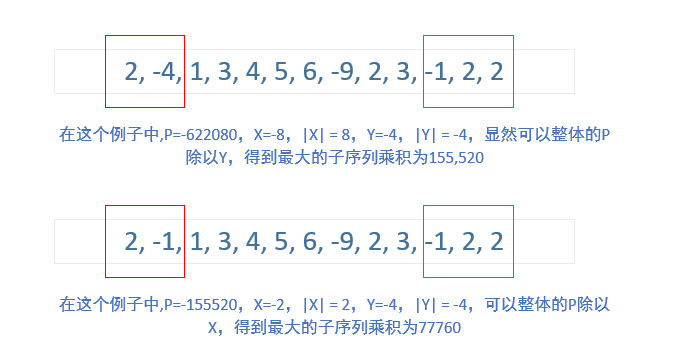

# 152. Maximum Product Subarray\(M\)

[152. 乘积最大子序列](https://leetcode-cn.com/problems/maximum-product-subarray/)

## 题目描述\(中等\)

Given an integer array nums, find the contiguous subarray within an array \(containing at least one number\) which has the largest product.

Example 1:

```
Input: [2,3,-2,4]
Output: 6
Explanation: [2,3] has the largest product 6.
```

Example 2:

```
Input: [-2,0,-1]
Output: 0
Explanation: The result cannot be 2, because [-2,-1] is not a subarray.
```

## 思路

## 解决方法

### 暴力遍历

```java
    public int maxProduct(int[] nums) {
        int n = nums.length;
        if (n == 0) {
            return 0;
        }
        int maxProduct = Integer.MIN_VALUE;
        for (int i = 0; i < n; i++) {
            int prodcut = 1;
            for (int j = i; j < n; j++) {
                prodcut *= nums[j];
                if (prodcut > maxProduct) {
                    maxProduct = prodcut;
                }
            }
        }
        return maxProduct;
    }
```

### 动态规划

max, min 存储以当前数字为结尾的子串的最大值最小值

对当前数字num判断

* num &lt; 0 ：max, min = min \* num, max \* num \(同时和num比较\)
* num &gt; 0 ：max, min = max \* num, min \* num \(同时和num比较\)

```java
    public int maxProduct1(int[] nums) {
        int n = nums.length;
        if (n == 0) {
            return 0;
        }
        int maxProduct = nums[0];
        int max = nums[0], min = nums[0];
        for (int i = 1; i < n; i++) {
            if (nums[i] < 0) {
                int tmp = max;
                max = min;
                min = tmp;
            }
            max = Math.max(max * nums[i], nums[i]);
            min = Math.min(min * nums[i], nums[i]);
            maxProduct = Math.max(maxProduct, max);
        }
        return maxProduct;
    }
```

### 

注意到
a. 0乘任何数都等于0。
b. 而负整数或正整数乘任何一个非0整数I，结果的绝对值都会大于1。

根据a.假如我们选定的子序列中只要有元素是0，所得的结果都会是0。
根据b.不包含0的子序列，元素越多乘积的绝对值越大。

可以看作，0把数组截断了，这样的话，子序列就有这两种：
1）[0]
2）被0截断后，正整数和负整数组成的最长子序列

毫无疑问，情况1）的乘积是0。
但情况2）的乘积却是有正有负的：
当2）的乘积是正数或者只有一个元素时，毫无疑问，此子序列的最大乘积就是它。
当2）的乘积是负数并且元素有2个以上时，设子序列的乘积是P，算出X = E1 \* E2 \* E3 \* ... \* En(En是子序列中第一个负整数)，
Y = Em \* Em+1 \* ... \* Ek (Em为子序列中最后一个负整数，k为子序列最后一个元素)
假如|X| < |Y|， 最大的乘积是P/X，反之是P/Y。





实现的时候，并不需要计算Y的值，因为我们从左往右遍历的时候会顺便把P/Y的值计算出来（假如P是负数的话）

```java
    public int maxProduct3(int[] nums) {
        int n = nums.length;
        if (n == 0) {
            return 0;
        }
        int maxProduct = Integer.MIN_VALUE;
        int product = 0, negative = 0;
        boolean hasNegative = false;
        for (int i = 0; i < n; i++) {
            if (product == 0) {
                hasNegative = false;
                product = 1;
            }
            product *= nums[i];
            if (product > maxProduct) {
                maxProduct = product;
            }
            if (hasNegative && product / negative > maxProduct) {
                maxProduct = product / negative;
            }
            if (product < 0 && !hasNegative) {
                hasNegative = true;
                negative = product;
            }
        }
        return maxProduct;
    }
```


