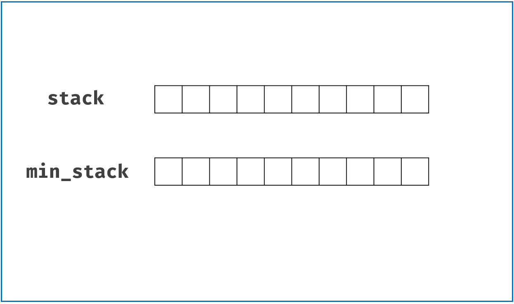

# 155. Min Stack(E)
[155. Min Stack](https://leetcode-cn.com/problems/min-stack/)

## 题目描述(简单)

Design a stack that supports push, pop, top, and retrieving the minimum element in constant time.

> - push(x) -- Push element x onto stack.
> - pop() -- Removes the element on top of the stack.
> - top() -- Get the top element.
> - getMin() -- Retrieve the minimum element in the stack.
 

Example:
```
MinStack minStack = new MinStack();
minStack.push(-2);
minStack.push(0);
minStack.push(-3);
minStack.getMin();   --> Returns -3.
minStack.pop();
minStack.top();      --> Returns 0.
minStack.getMin();   --> Returns -2.
```

## 思路

- 辅助栈
- 单个栈栈顶存放最小值

## 解决方法

### 辅助栈

借用一个辅助栈min_stack，用于存获取stack中最小值。

算法流程：

- push()方法： 每当push()新值进来时，如果 小于等于 min_stack栈顶值，则一起push()到min_stack，即更新了栈顶最小值；
- pop()方法： 判断将pop()出去的元素值是否是min_stack栈顶元素值（即最小值），如果是则将min_stack栈顶元素一起pop()，这样可以保证min_stack栈顶元素始终是stack中的最小值。
- getMin()方法： 返回min_stack栈顶即可。

- min_stack作用分析：
    - min_stack等价于遍历stack所有元素，把升序的数字都删除掉，留下一个从栈底到栈顶降序的栈。
    - 相当于给stack中的降序元素做了标记，每当pop()这些降序元素，min_stack会将相应的栈顶元素pop()出去，保证其栈顶元素始终是stack中的最小元素。




```java
class MinStack {
    private Stack<Integer> stack;
    private Stack<Integer> minStack;

    public MinStack() {
        stack = new Stack<>();
        minStack = new Stack<>();
    }

    public void push(int x) {
        stack.push(x);
        if (minStack.isEmpty() || x <= minStack.peek())
            minStack.push(x);
    }

    public void pop() {
        if (stack.pop().equals(minStack.peek()))
            minStack.pop();
    }

    public int top() {
        return stack.peek();
    }

    public int getMin() {
        return minStack.peek();
    }
}
```

### 单个栈

入栈出栈判断最小值是否改变并进行栈操作


```java
class MinStack {
	
	private Deque<Integer> stack = null;
	public MinStack() {
        stack = new LinkedList<>();
    }
    
    public void push(int x) {
    	if(stack.isEmpty()) {
    		stack.push(x);
    		stack.push(x);
    	}
    	else {
    		int min = stack.peek();
    		stack.push(x);
    		min = x<min?x:min;
    		stack.push(min);
		}
    }
    
    public void pop() {
        stack.pop();
        stack.pop();
    }
    
    public int top() {
    	int min = stack.pop();
    	int top = stack.peek();
    	stack.push(min);
        return top;
    }
    
    public int getMin() {
        return stack.peek();
    }

}
```


