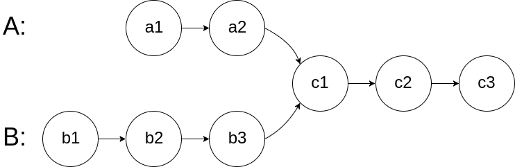
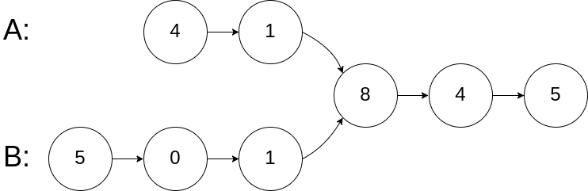
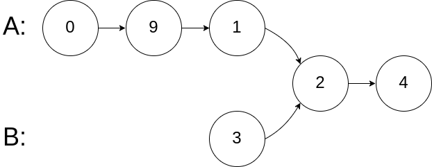
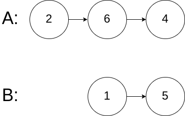
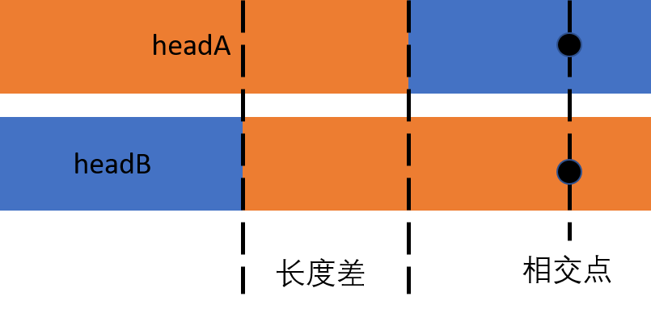

# 160. Intersection of Two Linked Lists(E)
[160. Intersection of Two Linked Lists](https://leetcode-cn.com/problems/intersection-of-two-linked-lists/)

## 题目描述\(简单\)

Write a program to find the node at which the intersection of two singly linked lists begins.

For example, the following two linked lists:



begin to intersect at node c1.

Example 1:



```
Input: intersectVal = 8, listA = [4,1,8,4,5], listB = [5,0,1,8,4,5], skipA = 2, skipB = 3  
Output: Reference of the node with value = 8  
Input Explanation: The intersected node's value is 8 (note that this must not be 0 if the two lists intersect). 
                   From the head of A, it reads as [4,1,8,4,5]. From the head of B, it reads as [5,0,1,8,4,5]. 
                   There are 2 nodes before the intersected node in A; There are 3 nodes before the intersected node in B.
```

Example 2:



```
Input: intersectVal = 2, listA = [0,9,1,2,4], listB = [3,2,4], skipA = 3, skipB = 1
Output: Reference of the node with value = 2
Input Explanation: The intersected node's value is 2 (note that this must not be 0 if the two lists intersect). 
                   From the head of A, it reads as [0,9,1,2,4]. From the head of B, it reads as [3,2,4]. 
                   There are 3 nodes before the intersected node in A; There are 1 node before the intersected node in B.
```

Example 3:



```
Input: intersectVal = 0, listA = [2,6,4], listB = [1,5], skipA = 3, skipB = 2
Output: null
Input Explanation: From the head of A, it reads as [2,6,4]. From the head of B, it reads as [1,5]. 
                   Since the two lists do not intersect, intersectVal must be 0, 
                   while skipA and skipB can be arbitrary values.
Explanation: The two lists do not intersect, so return null.
```

**Notes**:

* If the two linked lists have no intersection at all, return null.
* The linked lists must retain their original structure after the function returns.
* You may assume there are no cycles anywhere in the entire linked structure.
* Your code should preferably run in O\(n\) time and use only O\(1\) memory.

## 思路

- 二次遍历
- 双指针
- 哈希
- 构造环求入口点


## 解决方法

### 二次遍历

设定两个指针分别指向两个链表头部，一起向前走直到其中一个到达末端，另一个与末端距离则是两链表的 长度差 。再通过长链表指针先走的方式消除长度差，最终两链表即可同时走到相交点。

```java
    public ListNode getIntersectionNode(ListNode headA, ListNode headB) {
        ListNode pA = headA;
        ListNode pB = headB;
        int lenA = 0;
        int lenB = 0;
        while(pA!=null) {
            lenA++;
            pA = pA.next;
        }
        while(pB!=null) {
            lenB++;
            pB = pB.next;
        }
        int diff = lenA - lenB;
        if(diff>0) {
            while(diff--!=0) {
                headA = headA.next;
            }
        }
        else if (diff<0) {
            while(diff++!=0) {
                headB = headB.next;
            }
        }
        while(headA!=null) {
            if(headA==headB) {return headA;}
            headA = headA.next;
            headB = headB.next;
        }
        return null;
    }
```

时间复杂度 : O(m+n)。
空间复杂度 : O(1)

### 双指针

拼接两链表。 设长-短链表为 C ，短-长链表为 D （分别代表长链表在前和短链表在前的拼接链表），则当 C 走到长短链表交接处时， D 走在长链表中，且与长链表头距离为长度差; 当双指针相同时跳出循环，交点或null



```java
    public ListNode getIntersectionNode(ListNode headA, ListNode headB) {
        if(headA==null||headB==null) {return null;}
        ListNode pA = headA;
        ListNode pB = headB;
        while(pA!=pB) {
            pA = pA==null?headB:pA.next;
            pB = pB==null?headA:pB.next;
        }
        return pA;
    }
```

时间复杂度 : O(m+n)。
空间复杂度 : O(1)

### 哈希

开辟一个set用以存储一条链表中的指针，遍历另一条链表查找指针是否相等

```java
    public ListNode getIntersectionNode3(ListNode headA, ListNode headB) {
        if (headA == null || headB == null) {
            return null;
        }
        ListNode curA = headA, curB = headB;
        Set<ListNode> set = new HashSet();
        while (curA != null) {
            set.add(curA);
            curA = curA.next;
        }
        while (curB != null) {
            if (set.contains(curB)) {
                return curB;
            }
            curB = curB.next;
        }
        return null;
    }
```

时间复杂度 : O(m+n)。
空间复杂度 : O(m)或O(n)

### 构造环求入口点

将任意一链表收尾相连构成环，问题转化为环形链表查找入环节点

```java
    public ListNode getIntersectionNode(ListNode headA, ListNode headB) {
        if (headA == null || headB == null) {    return null;}
        ListNode last = headB;
        while (last.next != null) {    last = last.next;}
        last.next = headB;

        ListNode fast = headA;
        ListNode slow = headA;

        while (fast != null && fast.next != null) {
            slow = slow.next;
            fast = fast.next.next;
            if (slow == fast) {
                fast = headA;
                while (slow != fast) {
                    slow = slow.next;
                    fast = fast.next;
                }
                last.next = null;
                return fast;
            }
        }
        last.next = null;
        return null;
    }
```

时间复杂度 : O(m+n)。
空间复杂度 : O(1)

