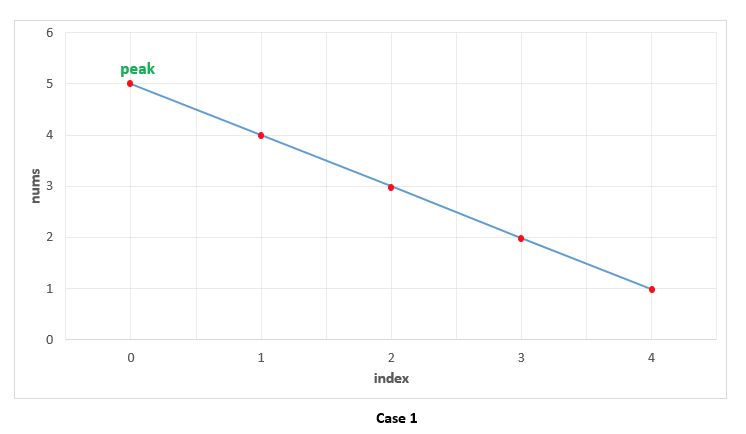
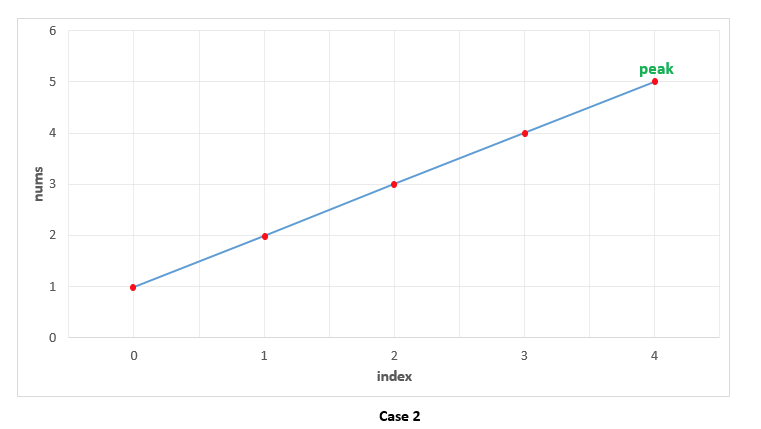
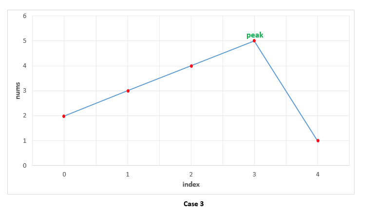

# 162. Find Peak Element\(M\)

[162. 寻找峰值](https://leetcode-cn.com/problems/find-peak-element/)

## 题目描述\(中等\)

A peak element is an element that is greater than its neighbors.

Given an input array `nums`, where `nums[i] ≠ nums[i+1]`, find a peak element and return its index.

The array may contain multiple peaks, in that case return the index to any one of the peaks is fine.

You may imagine that `nums[-1] = nums[n] = -∞`.

Example 1:

```
Input: nums = [1,2,3,1]
Output: 2
Explanation: 3 is a peak element and your function should return the index number 2.
```

Example 2:

```
Input: nums = [1,2,1,3,5,6,4]
Output: 1 or 5 
Explanation: Your function can return either index number 1 where the peak element is 2, 
             or index number 5 where the peak element is 6.
```

**Note**:

Your solution should be in logarithmic complexity.

## 思路

## 解决方法

### 遍历

边界值特殊考虑

```java
    public int findPeakElement(int[] nums) {
        int n = nums.length;
        int i = 0;
        for (; i < n; i++) {
            if (i == 0) {
                if (n > 1 && nums[i] > nums[i + 1]) {
                    break;
                } else if (n == 1) {
                    break;
                }
            } else if (i == n - 1) {
                if (nums[i] > nums[i - 1]) {
                    break;
                }
            } else {
                if (nums[i] > nums[i - 1] && nums[i] > nums[i + 1]) {
                    break;
                }
            }
        }
        return i;
    }
```

```java
    public int findPeakElement1(int[] nums) {
        int n = nums.length;
        if (n == 1 || nums[0] > nums[1]) {
            return 0;
        }
        int i = 1;
        for (; i < n - 1; i++) {
            if (nums[i] > nums[i - 1] && nums[i] > nums[i + 1]) {
                return i;
            }
        }
        if (nums[n - 1] > nums[n - 2]) {
            return n - 1;
        }
        return 0;
    }
```

### 线性扫描

本方法利用了连续的两个元素 nums\[j\]nums\[j\] 和 nums\[j + 1\]nums\[j+1\] 不会相等这一事实。于是，我们可以从头开始遍历 numsnums 数组。每当我们遇到数字 nums\[i\]nums\[i\]，只需要检查它是否大于下一个元素 nums\[i+1\]nums\[i+1\] 即可判断 nums\[i\]nums\[i\] 是否是峰值。










首项是-inf，找到第一个大于后面值的数即为峰值，若无，返回最后一个值，最后一个值必然大于尾项-inf

```java
    public int findPeakElement2(int[] nums) {
        for (int i = 0; i < nums.length - 1; i++) {
            if (nums[i] > nums[i + 1]) {
                return i;
            }
        }
        return nums.length - 1;
    }
```

### 递归二分搜索

```java
    public int findPeakElement4(int[] nums) {
        return searchPeak(nums, 0, nums.length - 1);
    }

    public int searchPeak(int[] nums, int left, int right) {
        if (left == right) {
            return left;
        }
        int mid = left + (right - left) / 2;
        if (nums[mid] > nums[mid + 1]) {
            return searchPeak(nums, left, mid);
        } else {
            return searchPeak(nums, mid + 1, right);
        }
    }
```

时间复杂度: O(log(n))。每一步都将搜索空间减半。因此，总的搜索空间只需要 log(n) 步。其中 n 为 nums数组的长度。
空间复杂度: O(log(n))。每一步都将搜索空间减半。因此，总的搜索空间只需要 log(n) 步。于是，递归树的深度为log(n)。


### 迭代二分搜索

```java
    public int findPeakElement3(int[] nums) {
        int left = 0, right = nums.length - 1;
        while (left < right) {
            int mid = left + (right - left) / 2;
            if (nums[mid] > nums[mid + 1]) {
                right = mid;
            } else {
                left = mid + 1;
            }
        }
        return left;
    }

```

时间复杂度: O(log(n))。每一步都将搜索空间减半。因此，总的搜索空间只需要 log(n) 步。其中 n 为 nums数组的长度。
空间复杂度: O(1)。


