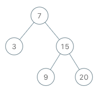

# 173. Binary Search Tree Iterator\(M\)

[173. 二叉搜索树迭代器](https://leetcode-cn.com/problems/binary-search-tree-iterator/)

## 题目描述\(中等\)

Implement an iterator over a binary search tree \(BST\). Your iterator will be initialized with the root node of a BST.

Calling `next()` will return the next smallest number in the BST.

Example:



```
BSTIterator iterator = new BSTIterator(root);
iterator.next();    // return 3
iterator.next();    // return 7
iterator.hasNext(); // return true
iterator.next();    // return 9
iterator.hasNext(); // return true
iterator.next();    // return 15
iterator.hasNext(); // return true
iterator.next();    // return 20
iterator.hasNext(); // return false
```

**Note**:

```
next() and hasNext() should run in average O(1) time and uses O(h) memory, where h is the height of the tree.
You may assume that next() call will always be valid, that is, there will be at least a next smallest number in the BST when next() is called.
```

## 思路

## 解决方法

###

```java
public class BSTIterator {
    Stack<TreeNode> stack = new Stack<>();

    public BSTIterator(TreeNode root) {
        while (root != null) {
            stack.push(root);
            root = root.left;
        }
    }

    /**
     * @return the next smallest number
     */
    public int next() {
        TreeNode p = stack.pop();
        int value = p.val;
        p = p.right;
        while (p != null) {
            stack.push(p);
            p = p.left;
        }
        return value;
    }

    /**
     * @return whether we have a next smallest number
     */
    public boolean hasNext() {
        return !stack.isEmpty();
    }
}

```


