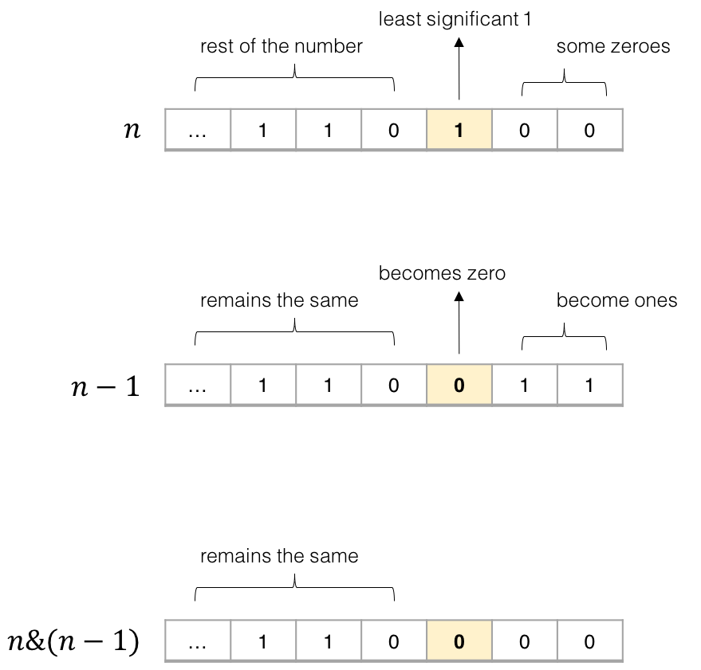

# 191. Number of 1 Bits(E)
[191. Number of 1 Bits](https://leetcode-cn.com/problems/number-of-1-bits/)

## 题目描述\(简单\)

Write a function that takes an unsigned integer and return the number of '1' bits it has \(also known as the Hamming weight\).

Example 1:

```
Input: 00000000000000000000000000001011
Output: 3
Explanation: The input binary string 00000000000000000000000000001011 has a total of three '1' bits.
```

Example 2:

```
Input: 00000000000000000000000010000000
Output: 1
Explanation: The input binary string 00000000000000000000000010000000 has a total of one '1' bit.
```

Example 3:

```
Input: 11111111111111111111111111111101
Output: 31
Explanation: The input binary string 11111111111111111111111111111101 has a total of thirty one '1' bits.
```

**Note**:

* Note that in some languages such as Java, there is no unsigned integer type. In this case, the input will be given as signed integer type and should not affect your implementation, as the internal binary representation of the integer is the same whether it is signed or unsigned.
* In Java, the compiler represents the signed integers using 2's complement notation. Therefore, in Example 3 above the input represents the signed integer -3.

Follow up:

> If this function is called many times, how would you optimize it?

## 思路

## 解决方法

### 右移遍历与操作

```java
    public int hammingWeight(int n) {
        int count = 0;
        for(int i=0;i<32;i++) {
            if((1&n)==1) {
                count++;
            }
            n>>=1;
        }
        return count;
    }
```

```java
    public int hammingWeight(int n) {
        int count = 0;
        while(n!=0) {
            count+=(n&1);
            n>>>=1;
        }
        return count;
    }
```

### 右移遍历取余

```java
    public int hammingWeight(int n) {
        int count = 0;
        for (int i = 0; i < 32; i++) {
            count += n % 2 != 0 ? 1 : 0;
            n >>= 1;
        }
        return count;
    }
```

### 位运算小技巧
将 n 和 n-1 做与运算会将最低位的 1 变成 0



在二进制表示中，数字 n 中最低位的 1 总是对应 n - 1 中的 0 。因此，将 n 和 n - 1 与运算总是能把 n 中最低位的 1 变成 0 ，并保持其他位不变。


```java
    public int hammingWeight(int n) {
        int count = 0;
        while(n!=0) {
            count++;
            n=n&(n-1);
        }
        return count;
    }
```


