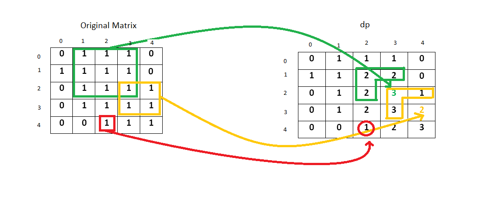

# 221. Maximal Square\(M\)
[221. 最大正方形](https://leetcode-cn.com/problems/maximal-square/)


## 题目描述\(中等\)

Given a 2D binary matrix filled with 0's and 1's, find the largest square containing only 1's and return its area.

Example:

```
Input: 

1 0 1 0 0
1 0 1 1 1
1 1 1 1 1
1 0 0 1 0

Output: 4
```

## 思路

* 暴力
* 动态规划

## 解决方法

### 暴力

1. 用一个变量去来记录迄今为止发现的最大正方形的边长，以及用一个变量记录当前正方形的大小，两个变量都初始化为 0；
2. 从矩阵的左上角开始搜索 1，找到 0 不需要做任何操作，只要找到 1 我们就试图找到由 1 组成的最大正方形；
3. 为此我们向右和向下移动，临时增加列索引和行索引，然后用标志标记该行列是否全都为 1；
4. 如果全都为 1，则继续检索行列，如果找到 0，便停止移动，更新最大正方形的边长。然后从最初发现 1 的元素旁边遍历矩阵，直到矩阵的所有元素都被遍历。

```java
    public int maximalSquare0(char[][] matrix) {
        if (matrix.length == 0 || matrix[0].length == 0) {
            return 0;
        }
        int m = matrix.length, n = matrix[0].length;
        int max = 0;
        for (int i = 0; i < m; i++) {
            for (int j = 0; j < n; j++) {
                if (matrix[i][j] == '1') {
                    int side = 1;
                    boolean flag = true;
                    while (i + side < m && j + side < n) {
                        for (int k = j; k <= j + side && flag; k++) {
                            if (matrix[i + side][k] == '0') {
                                flag = false;
                            }
                        }
                        for (int k = i; k < i + side && flag; k++) {
                            if (matrix[k][j + side] == '0') {
                                flag = false;
                            }
                        }
                        if (flag) {
                            side++;
                        } else {
                            break;
                        }
                    }
                    max = Math.max(side, max);
                }
            }
        }
        return max * max;
    }
```

时间复杂度：O\(\(mn\)^2\)，最坏情况下，我们需要遍历整个矩阵寻找每个 1。  
空间复杂度：O\(1\)，没有使用额外的空间。

### 动态规划

1. 用 0 初始化另一个矩阵 dp，维数和原始矩阵维数相同；
2. dp(i,j) 表示的是由 1 组成的最大正方形的边长；
3. 从 (0,0) 开始，对原始矩阵中的每一个 1，我们将当前元素的值更新为

    $$ dp(i, j)=min(dp(i-1, j), dp(i-1, j-1), dp(i, j-1))+1 $$
4. 用一个变量记录当前出现的最大边长，这样遍历一次，找到最大的正方形边长 max，那么结果就是max^2





```java
    public int maximalSquare(char[][] matrix) {
        if (matrix.length == 0 || matrix[0].length == 0) {
            return 0;
        }
        int m = matrix.length, n = matrix[0].length;
        int[][] dp = new int[m + 1][n + 1];
        int max = 0;
        for (int i = 1; i <= m; i++) {
            for (int j = 1; j <= n; j++) {
                if (matrix[i - 1][j - 1] == '1') {
                    dp[i][j] = 1 + Math.min(dp[i][j - 1], Math.min(dp[i - 1][j], dp[i - 1][j - 1]));
                    max = Math.max(dp[i][j], max);
                }
            }
        }
        return max * max;
    }
```

### 动态规划空间优化

在前面的动态规划解法中，计算 $$ i^{th} $$行（row）的 dp 方法中，我们只使用了上一个元素和第 $$(i-1)^{th}$$行，因此我们不需要二维 dp 矩阵，因为一维 dp 足以满足此要求。

我们扫描一行原始矩阵元素时，我们根据公式：$$ dp[j]=min(dp[j-1],dp[j],prev)$$ 更新数组 dp，其中 prev 指的是 dp[j-1]，对于每一行，我们重复相同过程并在 dp 矩阵中更新元素。


```java
    public int maximalSquare1(char[][] matrix) {
        if (matrix.length == 0 || matrix[0].length == 0) {
            return 0;
        }
        int m = matrix.length, n = matrix[0].length;
        int[] dp = new int[n + 1];
        int max = 0;
        int prev;
        for (int i = 1; i <= m; i++) {
            prev = 0;
            for (int j = 1; j <= n; j++) {
                int temp = dp[j];
                if (matrix[i - 1][j - 1] == '1') {
                    dp[j] = 1 + Math.min(dp[j], Math.min(dp[j - 1], prev));
                    max = Math.max(dp[j], max);
                } else {
                    dp[j] = 0;
                }
                prev = temp;
            }
        }
        return max * max;
    }
```


