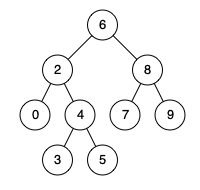

# 235. Lowest Common Ancestor of a Binary Search Tree(E)
[235. Lowest Common Ancestor of a Binary Search Tree](https://leetcode-cn.com/problems/lowest-common-ancestor-of-a-binary-search-tree/)

## 题目描述\(简单\)

Given a binary search tree \(BST\), find the lowest common ancestor \(LCA\) of two given nodes in the BST.

According to the definition of LCA on Wikipedia: “The lowest common ancestor is defined between two nodes p and q as the lowest node in T that has both p and q as descendants \(where we **allow a node to be a descendant of itself**\).”

Given binary search tree:  root = \[6,2,8,0,4,7,9,null,null,3,5\]



Example 1:

```
Input: root = [6,2,8,0,4,7,9,null,null,3,5], p = 2, q = 8
Output: 6
Explanation: The LCA of nodes 2 and 8 is 6.
```

Example 2:

```
Input: root = [6,2,8,0,4,7,9,null,null,3,5], p = 2, q = 4
Output: 2
Explanation: The LCA of nodes 2 and 4 is 2, since a node can be a descendant of itself according to the LCA definition.
```

**Note**:

* All of the nodes' values will be unique.
* p and q are different and both values will exist in the BST.

## 思路

二叉搜索树（BST）的性质：

- 节点 N 左子树上的所有节点的值都小于等于节点 N 的值
- 节点 N 右子树上的所有节点的值都大于等于节点 N 的值
- 左子树和右子树也都是 BST


1. 递归
2. 迭代

## 解决方法

### 递归

1. 从根节点开始遍历树
2. 如果节点 p 和节点 q 都在右子树上，那么以右孩子为根节点继续 1 的操作
3. 如果节点 p 和节点 q 都在左子树上，那么以左孩子为根节点继续 1 的操作
4. 如果条件 2 和条件 3 都不成立，这就意味着我们已经找到节 p 和节点 q 的 LCA 了


```java
	public TreeNode lowestCommonAncestor(TreeNode root, TreeNode p, TreeNode q) {
		if(root==null||p==null||q==null) {return null;}
		if(p.val<root.val&&q.val<root.val) {
			return lowestCommonAncestor(root.left, p, q);
		}
		else if (p.val>root.val&&q.val>root.val) {
			return lowestCommonAncestor(root.right, p, q);
		}
		else  {
			return root;
		}
	}
```
时间复杂度：O(N) 其中 N 为 BST 中节点的个数，在最坏的情况下我们可能需要访问 BST 中所有的节点。

空间复杂度：O(N) 所需开辟的额外空间主要是递归栈产生的，之所以是 N 是因为 BST 的高度为 N。


### 迭代
由于我们不需要回溯来找到 LCA 节点，所以我们是完全可以不利用栈或者是递归的;只需要找到分割点就可以,这个分割点就是能让节点 p 和节点 q 不能在同一颗子树上的那个节点，或者是节点 p 和节点 q 中的一个，这种情况下其中一个节点是另一个节点的父亲节点。


```java
	public TreeNode lowestCommonAncestor(TreeNode root, TreeNode p, TreeNode q) {
		if(root==null||p==null||q==null) {return null;}
		int pVal = p.val;
		int qVal = q.val;
		TreeNode node = root;
		while(node!=null) {
			int val = node.val;
			if(pVal<val&&qVal<val) {
				node = node.left;
			}
			else if (pVal>val&&qVal>val) {
				node = node.right;
			}
			else {
				return node;
			}
		}
		return null;
	}
```


