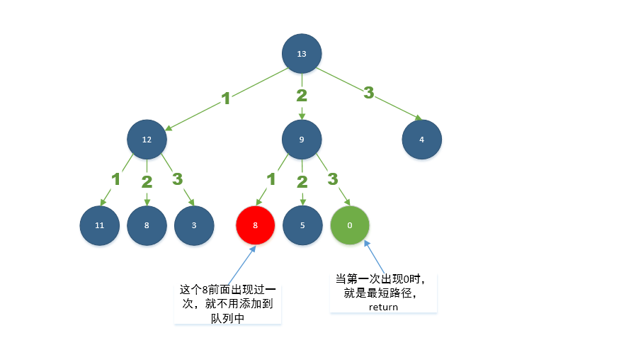

# 279. Perfect Squares\(M\)

## 题目描述\(中等\)

## 思路

## 解决方法

### 回溯 剪枝

### 递归分治

```java

```

### 动态规划

### BFS



### 数学公式


[Lagrange's four-square theorem](https://en.wikipedia.org/wiki/Lagrange%27s_four-square_theorem)
