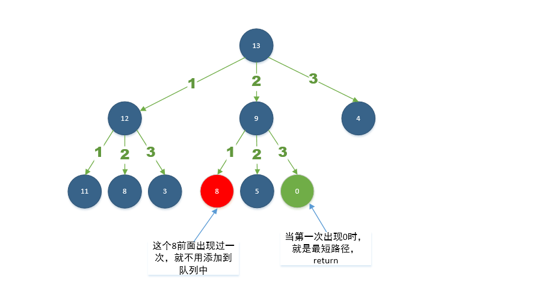

# 279. Perfect Squares\(M\)

[279. 完全平方数](https://leetcode-cn.com/problems/perfect-squares/)

## 题目描述\(中等\)

Given a positive integer n, find the least number of perfect square numbers (for example, `1, 4, 9, 16, ...`) which sum to n.

Example 1:
```
Input: n = 12
Output: 3 
Explanation: 12 = 4 + 4 + 4.
```
Example 2:
```
Input: n = 13
Output: 2
Explanation: 13 = 4 + 9.
```

## 思路
- 回溯
- 分治
- 动态规划
- BFS
- 数学公式

## 解决方法

### 回溯 剪枝

```java
    public int numSquares(int n) {
        numSquares(n, 0);
        return count != null ? count : 0;
    }

    Integer count = null;

    public void numSquares(int n, int num) {
        if (count != null && count <= num) {
            return;
        }
        if (n == 0) {
            count = num;
            return;
        }
        for (int i = (int) Math.sqrt(n); i >= 1; i--) {
            numSquares(n - i * i, num + 1);
        }
    }
```

### 栈迭代

模拟回溯过程，超时

```java
    public int numSquares1(int n) {
        int count = n;
        Stack<int[]> stack = new Stack<>();
        stack.push(new int[]{n, 0});
        while (!stack.isEmpty()) {
            int[] cur = stack.pop();
            if (count <= cur[1]) {
                continue;
            }
            if (cur[0] == 0) {
                count = cur[1];
                continue;
            }
            for (int i = (int) Math.sqrt(cur[0]); i >= 1; i--) {
                stack.push(new int[]{cur[0] - i * i, cur[1] + 1});
            }
        }
        return count;
    }
```

### 递归分治

自顶向下，记忆化搜索

```java
    public int numSquares0(int n) {
        return numSquares(n, new Integer[n + 1]);
    }

    public int numSquares(int n, Integer[] memo) {
        if (memo[n] != null) {
            return memo[n];
        }
        int sqrt = (int) Math.sqrt(n);
        if (sqrt * sqrt == n) {
            return memo[n] = 1;

        }
        int min = Integer.MAX_VALUE;
        for (int i = 1; i <= sqrt; i++) {
            min = Math.min(min, numSquares(n - i * i, memo) + 1);
        }
        return memo[n] = min;
    }

```

### 动态规划

- dp[i]代表数字i由完全平方数组成的个数的最小值，初始化为最大值i
- 转移方程：dp[i] = min(dp[i], dp[i - j * j] + 1)

```java
    public int numSquares2(int n) {
        int[] dp = new int[n + 1];
        for (int i = 1; i <= n; i++) {
            dp[i] = i;
            for (int j = 1; j * j <= i; j++) {
                dp[i] = Math.min(dp[i], dp[i - j * j] + 1);
            }
        }
        return dp[n];
    }
```
时间复杂度：O(n*sqrt(n))
空间复杂度：O(n)

### BFS

队列：用来存储每一轮遍历得到的节点；

标记：对于遍历过的节点，应该将它标记，防止重复遍历。

为了节省遍历的时间，曾经（ n - 以前出现的平方数） 这个值出现过，则在此出现这样的数时直接忽略



```java
    public int numSquares3(int n) {
        Queue<Integer> queue = new LinkedList<>();
        queue.add(n);
        boolean[] visited = new boolean[n + 1];
        int depth = 0;
        while (!queue.isEmpty()) {
            int size = queue.size();
            depth++;
            for (int k = 0; k < size; k++) {
                int num = queue.poll();
                for (int i = 1; i * i <= num; i++) {
                    int next = num - i * i;
                    if (next == 0) {
                        return depth;
                    }
                    if (!visited[next]) {
                        queue.add(next);
                        visited[next] = true;
                    }
                }
            }
        }
        return 0;
    }
```

### 数学公式

『拉格朗日四个方形定理』：任何一个正整数都可以表示成不超过四个整数的平方之和。 推论：满足四数平方和定理的数n（四个整数的情况），必定满足 n=4^a(8b+7)

[Lagrange's four-square theorem](https://en.wikipedia.org/wiki/Lagrange%27s_four-square_theorem)

```java
    public boolean isSquare(int n) {
        int sqrt = (int) Math.sqrt(n);
        return sqrt * sqrt == n;
    }

    public int numSquares4(int n) {
        if (isSquare(n)) {
            return 1;
        }
        while ((n & 3) == 0) {
            n >>= 2;
        }
        if ((n & 7) == 7) {
            return 4;
        }
        for (int i = 1; i * i <= n; i++) {
            if (isSquare(n - i * i)) {
                return 2;
            }
        }
        return 3;
    }

    public int numSquares5(int n) {
        while (n % 4 == 0) {
            n >>= 2;
        }
        if (n % 8 == 7) {
            return 4;
        }
        for (int i = 0; i * i <= n; i++) {
            int j = (int) Math.sqrt(n - i * i);
            if (i * i + j * j == n) {
                return (i != 0 ? 1 : 0) + (j != 0 ? 1 : 0);
            }
        }
        return 3;
    }
```