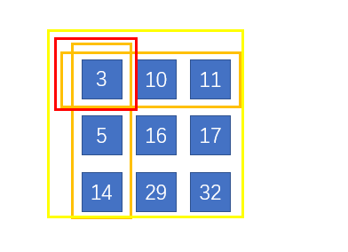

# 304. Range Sum Query 2D - Immutable(M)

[304. 二维区域和检索 - 矩阵不可变](https://leetcode-cn.com/problems/range-sum-query-2d-immutable/)


## 题目描述(中等)

给定一个二维矩阵，计算其子矩形范围内元素的总和，该子矩阵的左上角为 (row1, col1) ，右下角为 (row2, col2)。


上图子矩阵左上角 (row1, col1) = (2, 1) ，右下角(row2, col2) = (4, 3)，该子矩形内元素的总和为 8。

示例:
```
给定 matrix = [
  [3, 0, 1, 4, 2],
  [5, 6, 3, 2, 1],
  [1, 2, 0, 1, 5],
  [4, 1, 0, 1, 7],
  [1, 0, 3, 0, 5]
]

sumRegion(2, 1, 4, 3) -> 8
sumRegion(1, 1, 2, 2) -> 11
sumRegion(1, 2, 2, 4) -> 12
```
**说明**:
- 你可以假设矩阵不可变。
- 会多次调用 sumRegion 方法。
- 你可以假设 row1 ≤ row2 且 col1 ≤ col2。

## 思路

- 缓存行
- 缓存矩阵

## 解决方法

### 缓存行

将二维矩阵视为一维数组的 mm 行。为了找到区域和，我们只需要在区域中逐行累积和

```java
public class NumMatrix {
    int m, n;
    int[][] sumArray;

    public NumMatrix(int[][] matrix) {
        if (matrix.length == 0 || matrix[0].length == 0) {
            return;
        }
        m = matrix.length;
        n = matrix[0].length;
        sumArray = new int[m + 1][n + 1];
        for (int i = 1; i <= m; i++) {
            for (int j = 1; j <= n; j++) {
                sumArray[i][j] = sumArray[i][j - 1] + matrix[i - 1][j - 1];
            }
        }
    }

    public int sumRegion(int row1, int col1, int row2, int col2) {
        int sum = 0;
        for (int i = row1; i <= row2; i++) {
            sum += sumArray[i + 1][col2 + 1] - sumArray[i + 1][col1];
        }
        return sum;
    }
}

```

### 缓存矩阵

sumMatrix[i+1][j+1]表示从（0,0）到（i,j）区域累计的和  

sumRegion(1,1,2,2)如下



等于黄色的部分总和 - 两个橙色总和 + 红色部分 （ 因为我们发现当我们减去橙色部分， 红色部分多删除一次）

(row1,col1)到(row2,col2)区域累计和为sumMatrix[row2 + 1][col2 + 1] - sumMatrix[row2 + 1][col1] - sumMatrix[row1][col2 + 1] + sumMatrix[row1][col1]

```java
public class NumMatrix_1 {
    int m, n;
    int[][] sumMatrix;

    public NumMatrix_1(int[][] matrix) {
        if (matrix.length == 0 || matrix[0].length == 0) {
            return;
        }
        m = matrix.length;
        n = matrix[0].length;
        sumMatrix = new int[m + 1][n + 1];
        for (int i = 1; i <= m; i++) {
            for (int j = 1; j <= n; j++) {
                sumMatrix[i][j] = sumMatrix[i][j - 1] + sumMatrix[i - 1][j] - sumMatrix[i - 1][j - 1] + matrix[i - 1][j - 1];
            }
        }
    }

    public int sumRegion(int row1, int col1, int row2, int col2) {
        int sum = sumMatrix[row2 + 1][col2 + 1] - sumMatrix[row2 + 1][col1] - sumMatrix[row1][col2 + 1] + sumMatrix[row1][col1];
        return sum;
    }
}
```