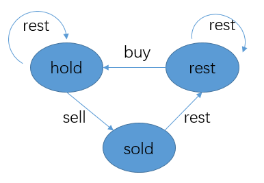
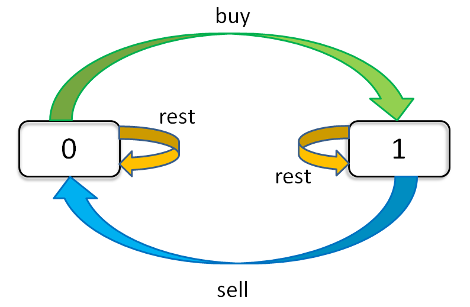

# 309. Best Time to Buy and Sell Stock with Cooldown(M)


[309. 最佳买卖股票时机含冷冻期](https://leetcode-cn.com/problems/best-time-to-buy-and-sell-stock-with-cooldown/)

## 题目描述(中等)

给定一个整数数组，其中第 i 个元素代表了第 i 天的股票价格 。​

设计一个算法计算出最大利润。在满足以下约束条件下，你可以尽可能地完成更多的交易（多次买卖一支股票）:

- 你不能同时参与多笔交易（你必须在再次购买前出售掉之前的股票）。
- 卖出股票后，你无法在第二天买入股票 (即冷冻期为 1 天)。

示例:
```
输入: [1,2,3,0,2]
输出: 3 
解释: 对应的交易状态为: [买入, 卖出, 冷冻期, 买入, 卖出]
```

## 思路

- 动态规划

## 解决方法

### 三种状态动态规划

状态：
- hold：继续持有股票
- sold：卖出股票
- rest：什么都不做

状态转化如下：



- sold[i] = hold[i-1] + price[i];
- hold[i] = max(hold[i-1], rest[i-1] - price[i])
- rest[i] = max(rest[i-1], sold[i-1])

最后一天最大值情况为要么什么都不做，要么卖出股票，即 max(sold，rest)

```java
    public int maxProfit(int[] prices) {
        int hold = Integer.MIN_VALUE;
        int sold = 0;
        int rest = 0;
        for (int price : prices) {
            int preSold = sold;
            sold = hold + price;
            hold = Math.max(hold, rest - price);
            rest = Math.max(rest, preSold);
        }
        return Math.max(sold, rest);
    }
```

### 通解 两种状态动态规划 

状态：
- dp[i][0]:第i天不持有股票的收益
- dp[i][1]:第i天持有股票的收益

状态转移
- dp[i][0] = max(dp[i-1][0], dp[i-1][1] + prices[i])
- dp[i][1] = max(dp[i-1][1], dp[i-2][0] - prices[i])

```java
    public int maxProfit0(int[] prices) {
        int n = prices.length;
        if (n == 0) {
            return 0;
        }
        int[][] dp = new int[n][2];
        for (int i = 0; i < n; i++) {
            if (i == 0) {
                dp[i][1] = -prices[i];
            } else if (i == 1) {
                dp[i][0] = Math.max(dp[i - 1][0], dp[i - 1][1] + prices[i]);
                dp[i][1] = Math.max(dp[i - 1][1], -prices[i]);
            } else {
                dp[i][0] = Math.max(dp[i - 1][0], dp[i - 1][1] + prices[i]);
                dp[i][1] = Math.max(dp[i - 1][1], dp[i - 2][0] - prices[i]);
            }
        }
        return dp[n - 1][0];
    }

```

### 动态规划 空间优化

只关注前一天的两种状态和两天前不持有的状态，三个变量即可

```java
    public int maxProfit1(int[] prices) {
        int dp0 = 0;
        int dp1 = Integer.MIN_VALUE;
        // dp[i-2][0];
        int dpPre = 0;
        for (int price : prices) {
            int temp = dp0;
            dp0 = Math.max(dp1 + price, dp0);
            dp1 = Math.max(dpPre - price, dp1);
            dpPre = temp;
        }
        return dp0;
    }
```

## 股票系列通用方法

### 穷举框架

利用「状态」进行穷举。我们具体到每一天，看看总共有几种可能的「状态」，再找出每个「状态」对应的「选择」。我们要穷举所有「状态」，穷举的目的是根据对应的「选择」更新状态。

```python
    for 状态1 in 状态1的所有取值：
        for 状态2 in 状态2的所有取值：
            for ...
                dp[状态1][状态2][...] = 择优(选择1，选择2...)
```

比如说这个问题，每天都有三种「选择」：买入、卖出、无操作，我们用 buy, sell, rest 表示这三种选择。但问题是，并不是每天都可以任意选择这三种选择的，因为 sell 必须在 buy 之后，buy 必须在 sell 之后。那么 rest 操作还应该分两种状态，一种是 buy 之后的 rest（持有了股票），一种是 sell 之后的 rest（没有持有股票）。而且别忘了，我们还有交易次数 k 的限制，就是说你 buy 还只能在 k > 0 的前提下操作。

这个问题的「状态」有三个，第一个是天数，第二个是允许交易的最大次数，第三个是当前的持有状态（即之前说的 rest 的状态，我们不妨用 1 表示持有，0 表示没有持有）。然后我们用一个三维数组就可以装下这几种状态的全部组合：

```java
dp[i][k][0 or 1]
0 <= i <= n-1, 1 <= k <= K
n 为天数，大 K 为最多交易数
此问题共 n × K × 2 种状态，全部穷举就能搞定。

for 0 <= i < n:
    for 1 <= k <= K:
        for s in {0, 1}:
            dp[i][k][s] = max(buy, sell, rest)

```

### 状态转移



通过这个图可以很清楚地看到，每种状态（0 和 1）是如何转移而来的。

```
dp[i][k][0] = max(dp[i-1][k][0], dp[i-1][k][1] + prices[i])
              max(   选择 rest  ,           选择 sell      )

解释：今天我没有持有股票，有两种可能：
要么是我昨天就没有持有，然后今天选择 rest，所以我今天还是没有持有；
要么是我昨天持有股票，但是今天我 sell 了，所以我今天没有持有股票了。

dp[i][k][1] = max(dp[i-1][k][1], dp[i-1][k-1][0] - prices[i])
              max(   选择 rest  ,           选择 buy         )

解释：今天我持有着股票，有两种可能：
要么我昨天就持有着股票，然后今天选择 rest，所以我今天还持有着股票；
要么我昨天本没有持有，但今天我选择 buy，所以今天我就持有股票了。
```

定义 base case，即最简单的情况。
```
dp[-1][k][0] = 0
解释：因为 i 是从 0 开始的，所以 i = -1 意味着还没有开始，这时候的利润当然是 0 。
dp[-1][k][1] = -infinity
解释：还没开始的时候，是不可能持有股票的，用负无穷表示这种不可能。
dp[i][0][0] = 0
解释：因为 k 是从 1 开始的，所以 k = 0 意味着根本不允许交易，这时候利润当然是 0 。
dp[i][0][1] = -infinity
解释：不允许交易的情况下，是不可能持有股票的，用负无穷表示这种不可能。
```

状态转移方程总结一下：
```
base case：
dp[-1][k][0] = dp[i][0][0] = 0
dp[-1][k][1] = dp[i][0][1] = -infinity

状态转移方程：
dp[i][k][0] = max(dp[i-1][k][0], dp[i-1][k][1] + prices[i])
dp[i][k][1] = max(dp[i-1][k][1], dp[i-1][k-1][0] - prices[i])
```
