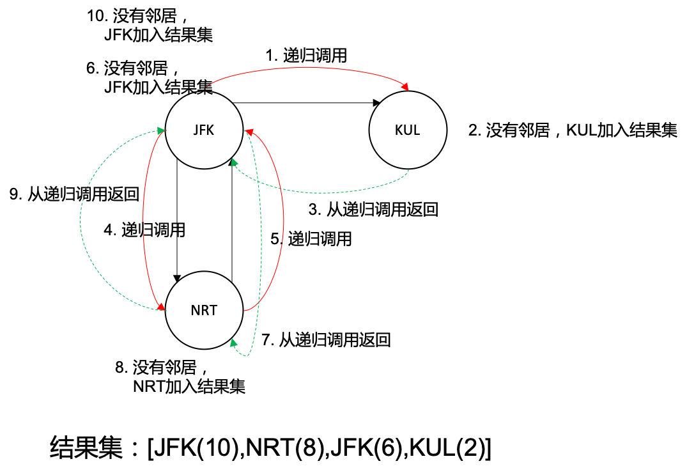

# 332. Reconstruct Itinerary(M)

[332. 重新安排行程](https://leetcode-cn.com/problems/reconstruct-itinerary/)

## 题目描述(中等)

给定一个机票的字符串二维数组 `[from, to]`，子数组中的两个成员分别表示飞机出发和降落的机场地点，对该行程进行重新规划排序。所有这些机票都属于一个从JFK（肯尼迪国际机场）出发的先生，所以该行程必须从 JFK 出发。

**说明**:
1. 如果存在多种有效的行程，你可以按字符自然排序返回最小的行程组合。例如，行程 ["JFK", "LGA"] 与 ["JFK", "LGB"] 相比就更小，排序更靠前
2. 所有的机场都用三个大写字母表示（机场代码）。
3. 假定所有机票至少存在一种合理的行程。

示例 1:
```
输入: [["MUC", "LHR"], ["JFK", "MUC"], ["SFO", "SJC"], ["LHR", "SFO"]]
输出: ["JFK", "MUC", "LHR", "SFO", "SJC"]
```
示例 2:
```
输入: [["JFK","SFO"],["JFK","ATL"],["SFO","ATL"],["ATL","JFK"],["ATL","SFO"]]
输出: ["JFK","ATL","JFK","SFO","ATL","SFO"]
解释: 另一种有效的行程是 ["JFK","SFO","ATL","JFK","ATL","SFO"]。但是它自然排序更大更靠后。
```

## 思路

图的深度优先遍历，找到一个欧拉通路，沿一条路能够遍历所有节点；本质上求得的是有向图的欧拉路径

## 解决方法

### DFS 逆序插入

- 一张顶点度数都为偶数的图


首先我们忽略掉按字典顺序输出的条件。我们可以看出，如果顶点度数为偶数，那么我们先从 JFK 到 MUC 再回 JFK 到 ATL 最后返回 JFK，又或是 JFK 先到 ATL 再回 JFK 再去 MUC 再回 JFK，都是合法的路径。如果按照字典顺序输出，优先访问字典顺序小的节点ATL即可

- 有且仅有一个顶点度数为奇数的图，


必须先从 JFK 到 NRT 再回 JFK，最后到达 KUL 作为终点。按照字典顺序先到 KUL，就进入了 “死路”。采用 DFS 方式遍历图时，需要将访问到的节点逆序插入到结果集。因此第一个访问到的节点将出现在结果集最后面，以顺序的方式来查看结果。如果第一个访问的节点是 “孤岛节点”，他会出现在结果集的最后。顺序读取结果集时，这种 “孤岛节点” 是最后遇到的，是图遍历的终点。




黑色实线表示图的边；红色实实线表示递归调用；绿色虚线表示递归调用返回；数字代表执行顺序；文字表示执行的操作，结果集的数字表示在第几步操作加入的。

```java
    public List<String> findItinerary(List<List<String>> tickets) {
        // 因为逆序插入，所以用链表
        List<String> list = new LinkedList<>();
        Map<String, PriorityQueue<String>> adjMap = new HashMap<>();
        for (List<String> ticket : tickets) {
            String from = ticket.get(0);
            String to = ticket.get(1);
            if (adjMap.containsKey(from)) {
                adjMap.get(from).add(to);
            } else {
                PriorityQueue<String> queue = new PriorityQueue<>();
                queue.add(to);
                adjMap.put(from, queue);
            }
        }
        dfs(list, "JFK", adjMap);
        return list;
    }

    public void dfs(List<String> list, String from, Map<String, PriorityQueue<String>> adjMap) {
        Queue<String> adjQueue = adjMap.get(from);
        while (adjQueue != null && adjQueue.size() > 0) {
            String to = adjQueue.poll();
            dfs(list, to, adjMap);
        }
        list.add(0, from);
    }
```

### DFS 迭代 逆序插入

修改为迭代算法

```java
    public List<String> findItinerary1(List<List<String>> tickets) {
        List<String> list = new LinkedList<>();
        Map<String, PriorityQueue<String>> adjMap = new HashMap<>();
        for (List<String> ticket : tickets) {
            String from = ticket.get(0);
            String to = ticket.get(1);
            PriorityQueue<String> queue = adjMap.computeIfAbsent(from, key -> new PriorityQueue<>());
            queue.add(to);
        }
        dfs1(list, "JFK", adjMap);
        return list;
    }

    public void dfs1(List<String> list, String from, Map<String, PriorityQueue<String>> adjMap) {
        Stack<String> stack = new Stack<>();
        stack.push(from);
        while (!stack.isEmpty()) {
            Queue<String> adjQueue = null;
            while ((adjQueue = adjMap.get(stack.peek())) != null && adjQueue.size() > 0) {
                String to = adjQueue.poll();
                stack.push(to);
            }
            list.add(0, stack.pop());
        }
    }
```