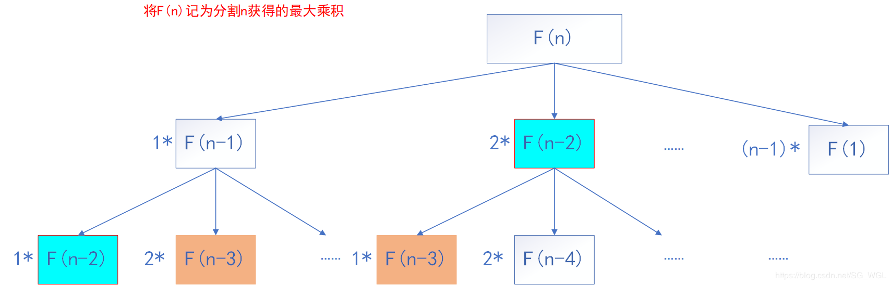

# 343. Integer Break(M)

[343. 整数拆分](https://leetcode-cn.com/problems/integer-break/)

## 题目描述(中等)

给定一个正整数 n，将其拆分为至少两个正整数的和，并使这些整数的乘积最大化。 返回你可以获得的最大乘积。

示例 1:
```
输入: 2
输出: 1
解释: 2 = 1 + 1, 1 × 1 = 1。
```
示例 2:
```
输入: 10
输出: 36
解释: 10 = 3 + 3 + 4, 3 × 3 × 4 = 36。
```
**说明**: 你可以假设 n 不小于 2 且不大于 58

## 思路

- 贪心
- 递归
- 动态规划

## 解决方法

### 贪心

- 第一优先级： 3；把数字 n 拆成尽可能多的 3 之和；
    - 特殊情况： 拆完后，如果余数是 1；则应把最后的 3 + 1 替换为 2 + 2，因为后者乘积更大；
- 第二优先级： 2；留下的余数如果是 2，则保留，不再拆为 1+1。

max=
- n-1           if n<=3
- 3^k           if n=3k(k>=2)
- 4*3^(k-1)     if n=3k+1(k>=1)
- 2*3^k         if n=3k+2(k>=1)


算法流程
1. n < 3, 返回1
2. n == 3,返回2
3. 求除以 3 的整数部分 q 和余数部分 r
   1. r==0,返回3^q
   2. r==1,返回3^(q-1)*4
   3. r==2,返回3^q*r

```java
    public int integerBreak(int n) {
        int r = n % 3;
        int q = n / 3;
        if (q == 0) {
            return 1;
        } else if (q == 1 && r == 0) {
            return 2;
        }
        if (r == 0) {
            return (int) Math.pow(3, q);
        } else if (r == 1) {
            return (int) Math.pow(3, q - 1) * 4;
        }
        return (int) Math.pow(3, q) * r;
    }
```

### 记忆化 递归



i * (num - i) 对于求n=3时很关键

```java
    public int integerBreak1(int n) {
        return integerBreak(n, new int[n + 1]);
    }

    public int integerBreak(int n, int[] memo) {
        if (n <= 2) {
            return 1;
        }
        if (memo[n] > 0) {
            return memo[n];
        }
        int product = 0;
        for (int i = 1; i < n; i++) {
            product = Math.max(product, Math.max(i * (n - i), i * integerBreak(n - i, memo)));
        }
        memo[n] = product;
        return product;
    }

```
### 动态规划

```java
    public int integerBreak2(int n) {
        if (n <= 2) {
            return 1;
        }
        int[] dp = new int[n + 1];
        dp[1] = 1;
        dp[2] = 1;
        for (int i = 3; i <= n; i++) {
            for (int j = 1; j < i; j++) {
                dp[i] = Math.max(dp[i], Math.max(j * (i - j), j * dp[i - j]));
            }
        }
        return dp[n];
    }
```

### 动态规划 空间优化

```java
    //1 * max(dp[i−1],i−1)，2 * max(dp[i - 2], i - 2) 3 * max(dp[i−3],i−3)，大于 3 的加法因子不予考虑。更有甚第一个也无需考虑
    public int integerBreak3(int n) {
        int[] dp = {0, 1, 1};

        for (int i = 3; i < n + 1; i++) {
            dp[i % 3] = Math.max( (2 * Math.max(dp[(i - 2) % 3], i - 2)), 3 * Math.max(dp[(i - 3) % 3], i - 3));
        }
        return dp[n % 3];
    }
```