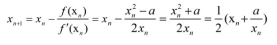

# 367. Valid Perfect Square(E)
[367. Valid Perfect Square](https://leetcode-cn.com/problems/valid-perfect-square/)

## 题目描述\(简单\)

Given a positive integer num, write a function which returns True if num is a perfect square else False.

Note: Do not use any built-in library function such as sqrt.

Example 1:

```
Input: 16
Output: true
```

Example 2:

```
Input: 14
Output: false
```

## 思路

## 解决方法

### 二分

转换为浮点数判断大小

```java
    public boolean isPerfectSquare(int num) {
        if(num<=0) {return false;}
        int low = 1;
        int high = num;
        while(low<=high) {
            int mid = low+(high-low)/2;
            if(mid == num*1.0/mid){
                return true;
            }
            else if(mid > num*1.0/mid){
                high = mid-1;
            }
            else{
                low = mid+1;
            }
        }
        return false;
    }
```

### 二分求左边界

求出小于等于算术平方根的最大值，判断其平方

```java
    public boolean isPerfectSquare(int num) {
        if (num <= 0) {
            return false;
        }
        int left = 1;
        int right = num;
        while (left < right) {
            int mid = left + (right - left + 1) / 2;
            if (mid > num / mid) {
                right = mid - 1;
            } else {
                left = mid;
            }
        }
        return left * left == num;
    }
```

求出大于等于算术平方根的最大值，判断其平方

```java
    public boolean isPerfectSquare1(int num) {
        if (num <= 0) {
            return false;
        }
        int left = 1;
        int right = num;
        while (left < right) {
            int mid = left + (right - left) / 2;
            if (mid >= num / mid) {
                right = mid;
            } else {
                left = mid + 1;
            }
        }
        return left * left == num;
    }
```

### 牛顿迭代法



```java
    public boolean isPerfectSquare(int num) {
        long a = num;
        while (a * a > num) {
            a = (a + num / a) / 2;
        }
        return a * a == num;
    }
```

### 公式法

利用 1+3+5+7+9+…+\(2n-1\)=n^2，即完全平方数肯定是前n个连续奇数的和

```java
    public boolean isPerfectSquare(int num) {
        int i = 1;
        while (num > 0) {
            num -= i;
            i += 2;
        }
        return num == 0;
    }
```

### 内置函数

```java
    public boolean isPerfectSquare(int num) {
        if(num<=0) {return false;}
        return Math.sqrt(num)%1==0;
    }
```


