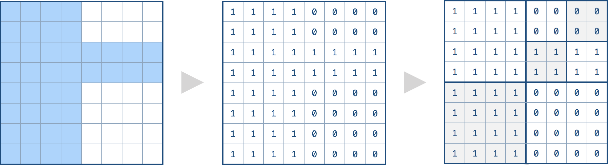

# 427. Construct Quad Tree(M)


[427. 建立四叉树](https://leetcode-cn.com/problems/construct-quad-tree/)

## 题目描述(中等)

我们想要使用一棵四叉树来储存一个 `N x N` 的布尔值网络。网络中每一格的值只会是真或假。树的根结点代表整个网络。对于每个结点, 它将被分等成四个孩子结点**直到这个区域内的值都是相同的**.

每个结点还有另外两个布尔变量: `isLeaf` 和 `val`。isLeaf 当这个节点是一个叶子结点时为真。val 变量储存叶子结点所代表的区域的值。

你的任务是使用一个四叉树表示给定的网络。下面的例子将有助于你理解这个问题：

给定下面这个8 x 8 网络，我们将这样建立一个对应的四叉树：


由上文的定义，它能被这样分割：


 
对应的四叉树应该像下面这样，每个结点由一对 `(isLeaf, val)` 所代表.

对于非叶子结点，val 可以是任意的，所以使用 * 代替。


提示：
- N 将小于 1000 且确保是 2 的整次幂。
- 如果你想了解更多关于四叉树的知识，你可以参考这个 [wiki](https://en.wikipedia.org/wiki/Quadtree) 页面。


```java
class Node {
    public boolean val;
    public boolean isLeaf;
    public Node topLeft;
    public Node topRight;
    public Node bottomLeft;
    public Node bottomRight;

    public Node() {
    }

    public Node(boolean _val, boolean _isLeaf, Node _topLeft, Node _topRight, Node _bottomLeft, Node _bottomRight) {
        val = _val;
        isLeaf = _isLeaf;
        topLeft = _topLeft;
        topRight = _topRight;
        bottomLeft = _bottomLeft;
        bottomRight = _bottomRight;
    }
}
```

## 思路

- 自顶向下
- 自底向上

## 解决方法

### 自顶向下

- 遍历一个方块内的值
  - 若为同一个值，则构造叶子结点
  - 若不为同一值，则递归构造非叶子节点

```java
    public Node construct(int[][] grid) {
        int n = grid.length;
        return construct(grid, 0, 0, n - 1, n - 1);
    }

    public Node construct(int[][] grid, int i1, int j1, int i2, int j2) {
        int base = grid[i1][j1];
        boolean flag = true;
        for (int i = i1; i <= i2; i++) {
            for (int j = j1; j <= j2; j++) {
                if (grid[i][j] != base) {
                    flag = false;
                    break;
                }
            }
        }
        if (flag) {
            return new Node(base == 1, true, null, null, null, null);
        }
        Node node = new Node();
        node.isLeaf = false;
        int n = (i2 - i1 + 1) / 2;
        node.topLeft = construct(grid, i1, j1, i1 + n - 1, j1 + n - 1);
        node.topRight = construct(grid, i1, j1 + n, i1 + n - 1, j2);
        node.bottomLeft = construct(grid, i1 + n, j1, i2, j1 + n - 1);
        node.bottomRight = construct(grid, i1 + n, j1 + n, i2, j2);
        return node;
    }
```

### 自底向上

自顶向下构造叶子结点，自底向上合并叶子结点以及构造非叶子节点

```java
    public Node construct1(int[][] grid) {
        int n = grid.length;
        return construct1(grid, 0, 0, n);
    }

    public Node construct1(int[][] grid, int i, int j, int n) {
        if (n == 1) {
            return new Node(grid[i][j] == 1, true, null, null, null, null);
        }
        int len = n / 2;
        Node topLeft = construct1(grid, i, j, len);
        Node topRight = construct1(grid, i, j + len, len);
        Node bottomLeft = construct1(grid, i + len, j, len);
        Node bottomRight = construct1(grid, i + len, j + len, len);
        if (topLeft.isLeaf && topRight.isLeaf && bottomLeft.isLeaf && bottomRight.isLeaf) {
            if (topLeft.val && topRight.val && bottomLeft.val && bottomRight.val) {
                return new Node(true, true, null, null, null, null);
            } else if (!topLeft.val && !topRight.val && !bottomLeft.val && !bottomRight.val) {
                return new Node(false, true, null, null, null, null);
            }
        }
        return new Node(false, false, topLeft, topRight, bottomLeft, bottomRight);
    }
```

