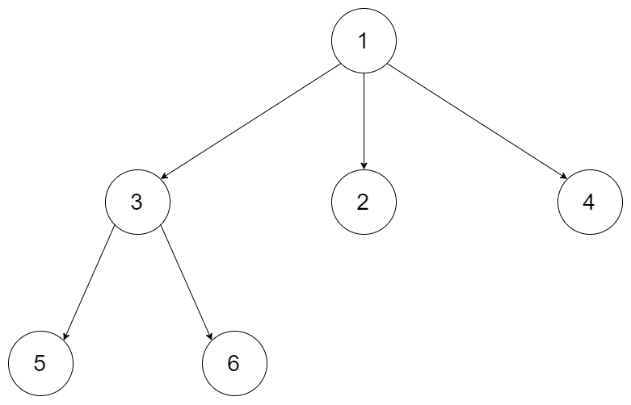

# 429. N-ary Tree Level Order Traversal(M)
[429. N叉树的层序遍历](https://leetcode-cn.com/problems/n-ary-tree-level-order-traversal/)

## 题目描述\(中等\)

给定一个 N 叉树，返回其节点值的层序遍历。 (即从左到右，逐层遍历)。

例如，给定一个 3叉树 :



```
返回其层序遍历:

[
     [1],
     [3,2,4],
     [5,6]
]
```

**说明**:
- 树的深度不会超过 1000。
- 树的节点总数不会超过 5000。

## 思路

层次遍历BFS

## 解决方法

### 迭代

队列实现层次遍历BFS
```java
	public List<List<Integer>> levelOrder(Node root) {
		Deque<Node> queue = new LinkedList<>();
		List<List<Integer>> lists = new ArrayList<>();
		if(root==null) {return lists;}
		queue.add(root);
		while(!queue.isEmpty()) {
			int size = queue.size();
			List<Integer> list = new ArrayList<>();
			for(int i=0;i<size;i++) {
				Node node = queue.poll();
				list.add(node.val);
				for(Node n:node.children) {
					queue.add(n);
				}
			}
			lists.add(list);
		}
		return lists;
	}
```


### 递归


```java
	public List<List<Integer>> levelOrder(Node root) {
		List<List<Integer>> lists = new ArrayList<>();
		if(root==null) {return lists;}
		getLists(lists,0,root);
		return lists;
	}
	public void getLists(List<List<Integer>> lists, int depth, Node pNode) {
		if(depth==lists.size()) {
			lists.add(new ArrayList<>());
		}
		lists.get(depth).add(pNode.val);
		for(Node n:pNode.children) {
			getLists(lists, depth+1, n);
		}
	}
```


