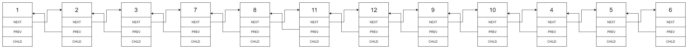

# 430. Flatten a Multilevel Doubly Linked List(M)

[430. 扁平化多级双向链表](https://leetcode-cn.com/problems/flatten-a-multilevel-doubly-linked-list/)

## 题目描述(中等)

您将获得一个双向链表，除了下一个和前一个指针之外，它还有一个子指针，可能指向单独的双向链表。这些子列表可能有一个或多个自己的子项，依此类推，生成多级数据结构，如下面的示例所示。

扁平化列表，使所有结点出现在单级双链表中。您将获得列表第一级的头部。


示例:
```
输入:
 1---2---3---4---5---6--NULL
         |
         7---8---9---10--NULL
             |
             11--12--NULL

输出:
1-2-3-7-8-11-12-9-10-4-5-6-NULL
```

以上示例的说明:

给出以下多级双向链表:


我们应该返回如下所示的扁平双向链表:



```java
class Node {
    public int val;
    public Node prev;
    public Node next;
    public Node child;

    public Node() {
    }

    public Node(int _val, Node _prev, Node _next, Node _child) {
        val = _val;
        prev = _prev;
        next = _next;
        child = _child;
    }
}

```

## 思路

- 递归
- 递归 + 尾结点的获取
- 迭代
- 前序遍历列表化(当前节点，子节点，后继节点)(根左右)

## 解决方法

### 递归

将子节点的链表添加到当前节点的后继，以及将之前的后继节点链接到子链的尾部

```java
    public Node flatten(Node head) {
        Node node = head;
        while (node != null) {
            Node next = node.next;
            if (node.child != null) {
                node.next = flatten(node.child);
                node.child = null;
                node.next.prev = node;
                while (node.next != null) {
                    node = node.next;
                }
                node.next = next;
                if (next != null) {
                    next.prev = node;
                }
            }
            node = next;
        }
        return head;
    }
```

### 递归 + 前驱尾结点

利用头结点的前驱指针保存子链的尾结点，避免了遍历找尾结点的过程，最后需要恢复头结点的前驱指针

```java
    public Node flatten_1(Node head) {
        if (head == null) {
            return null;
        }
        dfs(head);
        head.prev = null;
        return head;
    }

    public Node dfs(Node head) {
        Node node = head;
        while (node != null) {
            head.prev = node;
            Node next = node.next;
            if (node.child != null) {
                Node newHead = dfs(node.child);
                Node tail = newHead.prev;
                node.child = null;
                node.next = newHead;
                newHead.prev = node;
                tail.next = next;
                if (next != null) {
                    next.prev = tail;
                }
                head.prev = tail;
            }
            node = next;
        }
        return head;
    }
```

### 迭代

有子指针，将子链链接到当前节点后继，并将原后继链接至尾部，修改其前驱指针；

时间复杂度较高，过程中有很多重复的遍历过程；

```java
    public Node flatten2(Node head) {
        Node node = head;
        while (node != null) {
            if (node.child != null) {
                Node next = node.next;
                node.next = node.child;
                node.next.prev = node;
                node.child = null;
                Node last = node.next;
                while (last.next != null) {
                    last = last.next;
                }
                if (next != null) {
                    last.next = next;
                    next.prev = last;
                }
            }
            node = node.next;
        }
        return head;
    }
```

### 前序遍历列表化

前序DFS遍历的辅助栈迭代过程，构造前驱后继,清空child
  

```java
    public Node flatten1(Node head) {
        if (head == null) {
            return null;
        }
        Stack<Node> stack = new Stack<>();
        Node node = head;
        Node prev = null;
        stack.push(node);
        while (!stack.isEmpty()) {
            node = stack.pop();
            if (prev != null) {
                prev.next = node;
                node.prev = prev;
            }
            prev = node;
            if (node.next != null) {
                stack.push(node.next);
            }
            if (node.child != null) {
                stack.push(node.child);
                node.child = null;
            }
        }

        return head;
    }

```