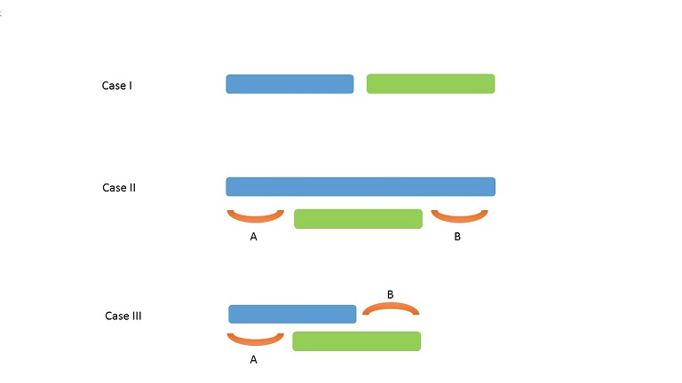
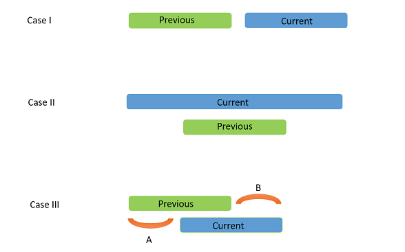

# 435. Non-overlapping Intervals(M)


[435. 无重叠区间](https://leetcode-cn.com/problems/non-overlapping-intervals/)

## 题目描述(中等)

给定一个区间的集合，找到需要移除区间的最小数量，使剩余区间互不重叠。

**注意**:
- 可以认为区间的终点总是大于它的起点。
- 区间 `[1,2]` 和 `[2,3]` 的边界相互“接触”，但没有相互重叠。

示例 1:
```
输入: [ [1,2], [2,3], [3,4], [1,3] ]

输出: 1

解释: 移除 [1,3] 后，剩下的区间没有重叠。
```

示例 2:
```
输入: [ [1,2], [1,2], [1,2] ]

输出: 2

解释: 你需要移除两个 [1,2] 来使剩下的区间没有重叠。
```

示例 3:
```
输入: [ [1,2], [2,3] ]

输出: 0

解释: 你不需要移除任何区间，因为它们已经是无重叠的了。
```

## 思路

- 排序 贪心
- 动态规划

## 解决方法

### 起点升序，计算移除的个数 贪心

遍历时，遇到三种情况



1. 当前考虑的两个区间不重叠：不移除任何区间，将 prevprev 赋值为后面的区间，移除区间数量不变。
2. 两个区间重叠，后一个区间的终点在前一个区间的终点之前：简单地只用后一个区间。这是显然的，因为后一个区间的长度更小，可以留下更多的空间（A 和 B），容纳更多的区间。因此， prevprev 更新为当前区间，移除区间的数量 + 1
3. 两个区间重叠，后一个区间的终点在前一个区间的终点之后：直接移除后一个区间


起点升序排列，向后遍历，若有重叠区间，则去除，保留右区间较小的一个，才能保证后续遍历过程中重叠的更少

```java
    public int eraseOverlapIntervals(int[][] intervals) {
        Arrays.sort(intervals, new Comparator<int[]>() {
            @Override
            public int compare(int[] o1, int[] o2) {
                return o1[0] != o2[0] ? o1[0] - o2[0] : o1[1] - o2[1];
            }
        });
        int i = 0, j = 1;
        int n = intervals.length;
        int count = 0;
        while (j < n) {
            if (intervals[j][0] < intervals[i][1]) {
                if (intervals[j][1] < intervals[i][1]) {
                    i = j;
                }
                count++;
            } else {
                i = j;
            }
            j++;
        }
        return count;
    }
```

### 起点升序，计算保留的个数

起点升序排列，向后遍历，若和之前没有重叠，则保留区间数目 +1 ，否则暂定保留右区间较小的一个；

```java
    public int eraseOverlapIntervals_1(int[][] intervals) {
        if (intervals == null || intervals.length == 0) {
            return 0;
        }
        Arrays.sort(intervals, new Comparator<int[]>() {
            @Override
            public int compare(int[] o1, int[] o2) {
                return o1[0] != o2[0] ? o1[0] - o2[0] : o1[1] - o2[1];
            }
        });
        int count = 1;
        int n = intervals.length;
        int i = 0;
        for (int j = 1; j < n; j++) {
            if (intervals[j][0] >= intervals[i][1]) {
                count++;
                i = j;
            } else if (intervals[j][1] < intervals[i][1]) {
                i = j;
            }
        }
        return n - count;
    }
```


### 终点升序 计算保留的个数

由于上述方法保留时由右区间确定，所以以终点升序；  
此时终点升序排列，若无重叠，则保留区间数目 +1 ；

遍历时，遇到三种情况



1. 当前考虑的两个区间不重叠：不移除任何区间，将 prevprev 赋值为后面的区间
2. 两个区间重叠，当前区间的起点在前一个区间的起点之前：移除当前区间可以给别的区间更多的容纳空间。因此，保留前一个区间不变，更新当前区间
3. 两个区间重叠，当前区间的起点在前一个区间的起点之后：保留前一个区间不变，更新当前区间

```java
    public int eraseOverlapIntervals1(int[][] intervals) {
        if (intervals == null || intervals.length == 0) {
            return 0;
        }
        Arrays.sort(intervals, new Comparator<int[]>() {
            @Override
            public int compare(int[] o1, int[] o2) {
                return o1[1] != o2[1] ? o1[1] - o2[1] : o1[0] - o2[0];
            }
        });
        int count = 1;
        int n = intervals.length;
        int i = 0;
        for (int j = 1; j < n; j++) {
            if (intervals[j][0] >= intervals[i][1]) {
                count++;
                i = j;
            }
        }
        return n - count;
    }
```

### 起点升序 动态规划

dp[i]用于存储存储着只考虑到 第i个第i个 区间范围内（包括其本身），最大可能的区间数

dp[i]=max(dp[j])+1 (j < i)

```java
    public int eraseOverlapIntervals2(int[][] intervals) {
        if (intervals == null || intervals.length == 0) {
            return 0;
        }
        Arrays.sort(intervals, new Comparator<int[]>() {
            @Override
            public int compare(int[] o1, int[] o2) {
                return o1[0] != o2[0] ? o1[0] - o2[0] : o1[1] - o2[1];
            }
        });
        int n = intervals.length;
        int[] dp = new int[n];
        dp[0] = 1;
        int count = 1;
        for (int i = 1; i < n; i++) {
            for (int j = i - 1; j >= 0; j--) {
                if (intervals[i][0] >= intervals[j][1]) {
                    dp[i] = dp[j];
                    break;
                }
            }
            dp[i]++;
            count = Math.max(dp[i], count);
        }
        return n - count;
    }
```

时间复杂度 : O(n^2)

空间复杂度 : O(n)


### 终点升序 动态规划


```java
    public int eraseOverlapIntervals3(int[][] intervals) {
        if (intervals == null || intervals.length == 0) {
            return 0;
        }
        Arrays.sort(intervals, new Comparator<int[]>() {
            @Override
            public int compare(int[] o1, int[] o2) {
                return o1[1] != o2[1] ? o1[1] - o2[1] : o1[0] - o2[0];
            }
        });
        int n = intervals.length;
        int[] dp = new int[n];
        dp[0] = 1;
        int count = 1;
        for (int i = 1; i < n; i++) {
            for (int j = i - 1; j >= 0; j--) {
                if (intervals[i][0] >= intervals[j][1]) {
                    dp[i] = dp[j];
                    break;
                }
            }
            dp[i] = Math.max(dp[i] + 1, dp[i - 1]);
            count = Math.max(dp[i], count);
        }
        return n - count;
    }
```


时间复杂度 : O(n^2)

空间复杂度 : O(n)
