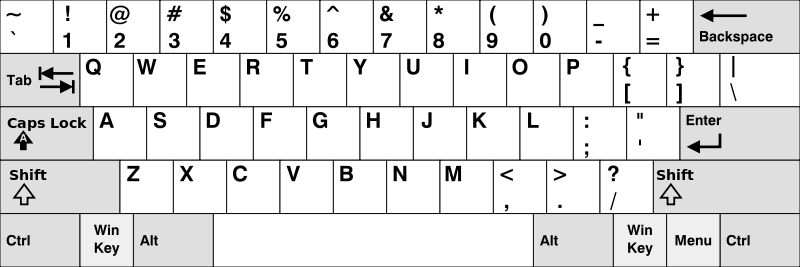

# 500. Keyboard Row(E)

[]()

## 题目描述(中等)

给定一个单词列表，只返回可以使用在键盘同一行的字母打印出来的单词。键盘如下图所示。



示例：
```
输入: ["Hello", "Alaska", "Dad", "Peace"]
输出: ["Alaska", "Dad"]
```

**注意**：
- 你可以重复使用键盘上同一字符。
- 你可以假设输入的字符串将只包含字母。

## 思路

判断构成单词的字母是否处于同一行

## 解决方法

### 遍历判断

逐个单词去匹配是否满足条件即可

```java
    char[][] chars = {
        {'Q', 'W', 'E', 'R', 'T', 'Y', 'U', 'I', 'O', 'P'},
        {'A', 'S', 'D', 'F', 'G', 'H', 'J', 'K', 'L'},
        {'Z', 'X', 'C', 'V', 'B', 'N', 'M'}};

    public String[] findWords(String[] words) {
        int[] map = new int[26];
        for (int i = 0; i < 3; i++) {
            for (char ch : chars[i]) {
                map[ch - 'A'] = i;
            }
        }
        List<String> list = new ArrayList<>();
        for (String word : words) {
            boolean flag = true;
            char[] chs = word.toUpperCase().toCharArray();
            for (int i = 1; i < chs.length; i++) {
                if (map[chs[i] - 'A'] != map[chs[0] - 'A']) {
                    flag = false;
                    break;
                }
            }
            if (flag) {
                list.add(word);
            }
        }
        return list.toArray(new String[0]);
    }
```