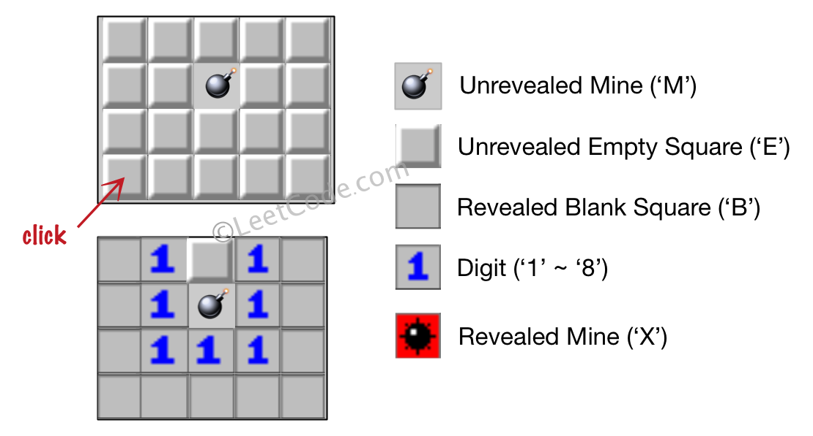

# 529. Minesweeper(M)

[529. 扫雷游戏](https://leetcode-cn.com/problems/minesweeper/)

## 题目描述(中等)

让我们一起来玩扫雷游戏！

给定一个代表游戏板的二维字符矩阵。 **'M'** 代表一个未挖出的地雷，**'E'** 代表一个未挖出的空方块，**'B'** 代表没有相邻（上，下，左，右，和所有4个对角线）地雷的已挖出的空白方块，数字（'1' 到 '8'）表示有多少地雷与这块已挖出的方块相邻，'X' 则表示一个已挖出的地雷。

现在给出在所有未挖出的方块中（'M'或者'E'）的下一个点击位置（行和列索引），根据以下规则，返回相应位置被点击后对应的面板：

1. 如果一个地雷（'M'）被挖出，游戏就结束了- 把它改为 'X'。
2. 如果一个没有相邻地雷的空方块（'E'）被挖出，修改它为（'B'），并且所有和其相邻的方块都应该被递归地揭露。
3. 如果一个至少与一个地雷相邻的空方块（'E'）被挖出，修改它为数字（'1'到'8'），表示相邻地雷的数量。
4. 如果在此次点击中，若无更多方块可被揭露，则返回面板。
 

示例 1：

输入: 
```
[['E', 'E', 'E', 'E', 'E'],
 ['E', 'E', 'M', 'E', 'E'],
 ['E', 'E', 'E', 'E', 'E'],
 ['E', 'E', 'E', 'E', 'E']]

Click : [3,0]

输出: 

[['B', '1', 'E', '1', 'B'],
 ['B', '1', 'M', '1', 'B'],
 ['B', '1', '1', '1', 'B'],
 ['B', 'B', 'B', 'B', 'B']]
```

解释:



示例 2：
```
输入: 

[['B', '1', 'E', '1', 'B'],
 ['B', '1', 'M', '1', 'B'],
 ['B', '1', '1', '1', 'B'],
 ['B', 'B', 'B', 'B', 'B']]

Click : [1,2]

输出: 

[['B', '1', 'E', '1', 'B'],
 ['B', '1', 'X', '1', 'B'],
 ['B', '1', '1', '1', 'B'],
 ['B', 'B', 'B', 'B', 'B']]
```

解释:


 

**注意**：
- 输入矩阵的宽和高的范围为 [1,50]。
- 点击的位置只能是未被挖出的方块 ('M' 或者 'E')，这也意味着面板至少包含一个可点击的方块。
- 输入面板不会是游戏结束的状态（即有地雷已被挖出）。
- 简单起见，未提及的规则在这个问题中可被忽略。例如，当游戏结束时你不需要挖出所有地雷，考虑所有你可能赢得游戏或标记方块的情况。


## 思路

统计一个空方块周围的地雷数目，若周围地雷数目为0，则向四周延伸

- 如果当前点击位置是 'M' ，将它标记为 'X' ，并返回游戏板
- 如果不是，说明点击的是 'E'
  - 计算当前点四面八方是否有地雷
    - 有，算出数量，并将当前点标记为此数量，结束当前方向的搜索
    - 无，将它标记为 'B'，并继续下一个方向的搜索

## 解决方法

### DFS

```java
    int[][] dir = {{0, 1}, {1, 0}, {0, -1}, {-1, 0},
        {-1, 1}, {1, 1}, {1, -1}, {-1, -1}};

    public char[][] updateBoard(char[][] board, int[] click) {
        int x = click[0], y = click[1];
        dfs(board, x, y);
        return board;
    }

    public void dfs(char[][] board, int x, int y) {
        if (board[x][y] == 'M') {
            board[x][y] = 'X';
        } else if (board[x][y] == 'E') {
            int sum = 0;
            int[][] next = new int[dir.length][2];
            int k = 0;
            for (int[] d : dir) {
                int i = x + d[0];
                int j = y + d[1];
                if (i < 0 || i == board.length || j < 0 || j == board[0].length) {
                    continue;
                }
                next[k][0] = i;
                next[k][1] = j;
                k++;
                if (board[i][j] == 'M') {
                    sum++;
                }
            }
            if (sum == 0) {
                board[x][y] = 'B';
                for (int i = 0; i < k; i++) {
                    dfs(board, next[i][0], next[i][1]);
                }
            } else {
                board[x][y] = (char) ('0' + sum);
            }
        }
    }
```

### BFS

```java
    int[][] dir = {{0, 1}, {1, 0}, {0, -1}, {-1, 0},
        {-1, 1}, {1, 1}, {1, -1}, {-1, -1}};

    public char[][] updateBoard1(char[][] board, int[] click) {
        Queue<int[]> queue = new LinkedList<>();
        queue.offer(click);
        while (!queue.isEmpty()) {
            int size = queue.size();
            for (int q = 0; q < size; q++) {
                int[] pos = queue.poll();
                int x = pos[0], y = pos[1];
                if (board[x][y] == 'M') {
                    board[x][y] = 'X';
                } else if (board[x][y] == 'E') {
                    int sum = 0;
                    int[][] next = new int[dir.length][2];
                    int k = 0;
                    for (int[] d : dir) {
                        int i = x + d[0];
                        int j = y + d[1];
                        if (i < 0 || i == board.length || j < 0 || j == board[0].length) {
                            continue;
                        }
                        next[k][0] = i;
                        next[k][1] = j;
                        k++;
                        if (board[i][j] == 'M') {
                            sum++;
                        }
                    }
                    if (sum == 0) {
                        board[x][y] = 'B';
                        for (int i = 0; i < k; i++) {
                            queue.offer(next[i]);
                        }
                    } else {
                        board[x][y] = (char) ('0' + sum);
                    }
                }
            }

        }
        return board;
    }
```