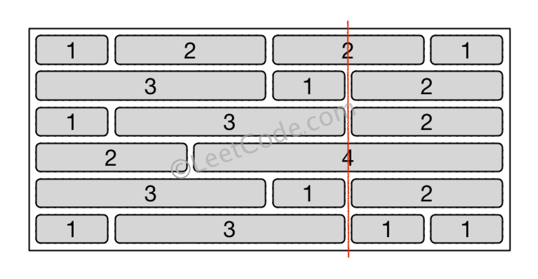

# 554. Brick Wall(M)
 
[554. 砖墙](https://leetcode-cn.com/problems/brick-wall/)

## 题目描述(中等)

你的面前有一堵方形的、由多行砖块组成的砖墙。 这些砖块高度相同但是宽度不同。你现在要画一条自顶向下的、穿过最少砖块的垂线。

砖墙由行的列表表示。 每一行都是一个代表从左至右每块砖的宽度的整数列表。

如果你画的线只是从砖块的边缘经过，就不算穿过这块砖。你需要找出怎样画才能使这条线穿过的砖块数量最少，并且返回穿过的砖块数量。

你不能沿着墙的两个垂直边缘之一画线，这样显然是没有穿过一块砖的。

 

示例：
```
输入: [[1,2,2,1],
      [3,1,2],
      [1,3,2],
      [2,4],
      [3,1,2],
      [1,3,1,1]]

输出: 2

解释: 
```


**提示**：

- 每一行砖块的宽度之和应该相等，并且不能超过 INT_MAX。
- 每一行砖块的数量在 [1,10,000] 范围内， 墙的高度在 [1,10,000] 范围内， 总的砖块数量不超过 20,000。


## 思路


## 解决方法

### 哈希计数

使用哈希表 map 来保存记录 (sum, count) ，这里 sum 是当前行累积的砖头宽度， count 是 sum 对应的穿过砖头数目。

最后，从哈希表中找到最大的 count 值，用这个值求出垂直竖线穿过的最少砖块数

```java
    public int leastBricks1(List<List<Integer>> wall) {
        if (wall == null || wall.size() == 0) {
            return 0;
        }
        Map<Integer, Integer> mapCount = new HashMap<>();
        int maxCount = 0;
        for (List<Integer> line : wall) {
            int sum = 0;
            for (int i = 0; i < line.size() - 1; i++) {
                sum += line.get(i);
                int frequence = mapCount.getOrDefault(sum, 0) + 1;
                mapCount.put(sum, frequence);
                maxCount = Math.max(maxCount, frequence);
            }
        }
        return wall.size() - maxCount;
    }
```

### 桶计数

利用数组存储墙宽累计和所有可能的数量，最后找到最大的 count 值，用这个值求出垂直竖线穿过的最少砖块数

```java
    public int leastBricks0(List<List<Integer>> wall) {
        if (wall == null || wall.size() == 0) {
            return 0;
        }
        int[] bucket = new int[65535];
        int maxCount = 0;
        for (List<Integer> line : wall) {
            int s = 0;
            for (int i = 0; i < line.size() - 1; i++) {
                s += line.get(i);
                bucket[s]++;
                maxCount = Math.max(maxCount, bucket[s]);
            }
        }
        return wall.size() - maxCount;
    }
```

```java
    public int leastBricks(List<List<Integer>> wall) {
        if (wall == null || wall.size() == 0) {
            return 0;
        }
        int total = 0;
        for (int n : wall.get(0)) {
            total += n;
        }
        int size = 0;
        for (List<Integer> line : wall) {
            size = Math.max(size, total - line.get(line.size() - 1));
        }
        int[] bucket = new int[size + 1];
        int maxCount = 0;
        for (List<Integer> line : wall) {
            int sum = 0;
            for (int i = 0; i < line.size() - 1; i++) {
                sum += line.get(i);
                bucket[sum]++;
                maxCount = Math.max(maxCount, bucket[sum]);
            }
        }
        return wall.size() - maxCount;
    }
```